# 
**社交媒体挖掘 - 翻译版**

寻找互联网数据中的故事

Lam Thuy Vo

**中文译者：徐柳青**

**邮箱：<45045590@qq.com>**

**电话：18616020096**

**社交媒体挖掘** Copyright © 2020 by Lam Thuy Vo. 保留部分权利。该作品已根据知识共享许可 **Attribution-NonCommercial-ShareAlike
3.0美国许可证。要查看此许可证的副本，请访问 http://creativecommons.org/licenses/by-nc-sa/3.0/us/或致 **Creative
Commons** 信函，PO Box 1866, Mountain View, CA 94042, USA.

ISBN-10: 1-59327-916-7

ISBN-13: 978-1-59327-916-5

出版者：William Pollock

生产编辑：Meg Sneeringer

封面设计：Gina Redman

开发编辑：Jan Cash and Alex Freed

技术审查者：Melissa Lewis

编审：Rachel Monaghan

排版：Danielle Foster

校对者：Emelie Burnette

索引者：Beth Nauman-Montana

**有关发行，翻译或批量销售的信息，请直接联系No Starch Press，Inc.：**

No Starch Press，Inc.

245 8th Street，San Francisco, CA 94103

phone:
1.415.863.9900；

[info@nostarch.com](mailto:info@nostarch.com) 

[www.nostarch.com](http://www.nostarch.com)

**To má Lua, ba Liem, and anh Luan**

关于作者
========

作者Lam Thuy
Vo是BuzzFeed的一名高级记者，其专业领域处于技术、社会和社交媒体数据的交汇点。她揭示了虚假信息、网络仇恨和平台相关责任等信息。此前，她曾领导团队为《华尔街日报》、美国半岛电视台(Al
Jazeera America)和美国国家公共电台(NPR)的金钱星球(Planet
Money)进行新闻报道，这些报道讲述了美国和整个亚洲的经济故事。她还担任了10年的教育工作者，在此期间开发了新闻编辑室内容的培训项目，为世界各地的记者举办了讲习班，并为克雷格·纽马克·纽约市立大学新闻研究生院(Craig
Newmark CUNY Graduate School of
Journalism)开设了长达一个学期的课程。她还在快闪杂志、翠贝卡电影节互动日、TEDxNYC等大型活动上发表过演讲。

关于技术审核者
==============

梅利莎·刘易斯（Melissa
Lewis）是调查报告中心（Reveal）的数据记者。在加入Reveal之前，她是The
Oregonian的数据编辑，Simple的数据工程师，Periscopic的数据分析师以及Oregon
Health＆Science University的神经科学研究助理。她是PyLadies
Portland和亚裔美国人新闻工作者协会的Portland分会的组织者。

致谢
====

这也许不是"谢谢"，而是对在生命中并以某种方式使我伤心的人们的认可：没有这些痛苦就不会有Quantified
Breakup，一个关于情感弹性的数据可视化的博客。正是这个项目把我的工作推向了新的方向------探索社交媒体数据和quantified
selfies"。在进行这个项目的时候，"No Starch Press"的编辑Jan
Cash来找我写了这本书。

更重要的是，一些人仍然在我的生命中支持着我。感谢má Lua和ba
Liem让我成为一个富有同情心和充满好奇的人，感谢我的兄弟Luan Vo Nguyen
Quang和我的嫂子Tiffany Talsma，感谢他们坚定且多年的支持，感谢Cathy
Deng和Jamica El在我早期于湾区时Python经历中所给予的鼓励，感谢Julia B.
Chan、Lo Benichou、Aaron Williams、Ted Han和Andrew
Tran，感谢他们在一个充满竞争对手的行业中表现出的同志情谊，感谢John
Wingenter、Adrienne Lopes、Vita Ayala、Mariru Kojima和Toyin Ojih
Odutola，感谢他们对我在远离家的时间内给与如同家的照顾，同时感谢我的侄女Elynna
Quynh Vo，她就是未来。

{width="2.9375in" height="2.938888888888889in"}引 言
==============================================================================

我们在短暂的瞬间体验了社交网络，而这些瞬间又往往一去不复返。在**Facebook**上点赞一张照片，在**Twitter**上分享某人发布的帖子，或者在**微信**上给朋友发信息------不管是什么特定的互动，我们都只点一次了，之后就不会再去理会。

但从点击到在线的状态更新，我们的在线生活正被社交媒体公司捕捉，并被用于填充世界上一些最大的数据服务器。今天我们产生的数据比以往任何时候都要多。通过将这些数据作为一个整体来看，我们可以获得对人类行为的深刻理解。我们还可以调查这些数据造成的危害，从检测虚假的在线参与者(例如，自动机器人账户或散播错误信息的虚假个人)，到了解算法如何随着时间的推移将有问题的内容呈现给观众。

如果把这些数据放在一起看，就能发现模式、趋势或异常现象，并有希望更好地理解网上消费和塑造人类体验的方式。这本书的目的是帮助那些想要从简单地观察社交网络到在更大、更有意义的范围内理解数据的人。

什么是数据分析?
---------------

任何数据分析师的主要目标都是从大量信息中获得有用的见解。可以把数据分析看作是访问大量记录的一种方式：可以询问不寻常的单个事件，或者研究长期趋势。**采访**一组数据是一个漫长的过程，会经历各种曲折：需要一些不同的方法来找到问题的答案，同样需要一些不同的会议来了解受访者。

即使问题是简单和集中的，得到答案仍然需要我们做出一些逻辑和哲学上的决定。什么样的数据集可能对检查我们自己的行为有用？我们如何获得这些数据？如果我们想要确定一个**Facebook**帖子的受欢迎程度，是通过某种反馈(喜欢、哈哈、喔等等)的数量、收到的评论数量，还是这两个指标的组合来衡量呢？如果想更好地了解人们在**Twitter**上是如何讨论某个特定话题的，那么对相关推文进行分类的最佳方法是什么?

因此，虽然分析数据需要一定的技术知识，但也是一个创造性的过程，要求以一种有意图的、明智的方式使用判断。换句话说，数据分析既是科学也是艺术。

这本书是给谁看的?
-----------------

这本书是为那些几乎没有编程经验的人写的。鉴于社交媒体、互联网和技术在我们的生活中所扮演的巨大角色，本书旨在以一种简单易懂的方式来探索它们。

通过实践练习，读者将学习编程、数据分析和社交网络的基本概念。

在某种程度上，这本书的目标读者和作者以前的自己一样------对世界充满了强烈的好奇心，但也害怕充满术语的论坛、会议和在线教程。本书将兼顾宏观和微观的方法，着眼于社会网络的生态系统以及编写代码的细节。

编程不仅仅是构建机器人或应用程序的一种方式，也是在一个日益依赖技术的世界里满足你好奇心的一种方式。

使用本书的方式
--------------

为了访问和理解来自社交媒体的数据，需要了解这些数据存储在哪里，如何访问它，以及如何理解它。换句话说，分析来自网络的数据涉及多个步骤：收集数据、研究和探索数据、分析数据。在最后一步中，还将从数据中得出结论，并回答关于最初产生这些数据的人类特性和行为的问题。

考虑到所有这些因素，其中需要特别注意的是：这本书不仅仅是一个代码片段的汇编，这些代码随时可以被插入和使用。虽然这些代码仅仅包含了一些帮助收集和分析来自社交网络数据的脚本，但也是用来教授数据分析过程的基本概念和工具。应当把将这些章节视为对有志于研究特定主题或问题研究人员的指南。作者希望读者能掌握开展自我学习和探索该领域所需的基础知识。毕竟，社交媒体的格局在不断变化，这表明读者需要灵活且不断调整分析方法来理解其产生的数据。

本书是为了优先考虑读者的学习过程，而不是为了代码的优雅。例如，一段代码使用了很多全局变量。虽然这可能不是最有效的编码方式，但是对于Python新手来说，这是一种友好的方式。

至于所涉及的工具，有两个主要的标准：在网上免费获得的工具；入门门槛相对较低的工具。这些工具可以让初学者从简单的项目开始。

本书覆盖的内容
--------------

本书的各章旨在遵循数据侦查的过程。由介绍如何以及在何处从社交网络查找数据开始，并在之后的章节中了解处理、探索和分析数据所需的工具。

**第一部分:数据挖掘**

**第1章:应了解的编程语言**：介绍了前端语言(HTML、CSS和JavaScript)，以及它们在社交媒体数据挖掘环境中的重要性。通过交互式shell中的实践练习来学习Python的基础知识。

**第2章:从哪里获取数据**：解释了什么是API以及可以通过它们访问什么类型的数据，并指导读者访问JSON格式的数据。本章还介绍了为数据分析制定一个研究问题的过程。

**第3章:用代码获取数据**：展示了如何收集从YouTube
API返回的数据，并使用Python将其从JSON重构为电子表格，特别是csv文件格式。

**第4章:收集自己的Facebook数据**：定义了抓取，并描述了如何检查HTML并把其内容变成数据。使用社交媒体公司向用户提供的数据档案展示了如何把数据提取到csv文件中。

**第5章:抓取实时站点**：解释了抓取网站的道德考量，并指导你为一个维基百科页面编写一个抓取器的过程。

**第二部分:数据分析**

**第6章:数据分析导论**：介绍了数据分析中涉及的各种过程，并通过使用Google
Sheets分析来自自动帐户(或机器人)的数据。

**第7章：数据可视化**：在Google
Sheets中制作图表并使用条件格式突出显示数据变化，通过可视化更好地理解数据。

**第8章：数据分析的高级工具**：把从分析Google
Sheets中的数据中学到的概念转移到程序分析的领域。如何在Python
3中设置虚拟环境，如何使用Jupyter
Notebook以及如何使用Python中的Pandas库，探索数据集的结构和广度。

**第9章：在Reddit数据中寻找趋势**：在上一章的基础上展示了如何使用Pandas函数修改数据，筛选数据以及使用基本聚合。

**第10章：测量公众人物的Twitter活动**：解释如何将数据格式化为时间戳，如何使用lambda函数更有效地修改数据以及如何在Pandas中进行采样。

**第11章：何去何从**：列出了成为更好的Python编程者、学习更多有关统计分析以及使用自然语言处理和机器学习来分析文本的资源。

下载并安装PYTHON
----------------

要完成这本书中的练习，读者需要在电脑上设置一些工具。在相关的章节中，作者会帮助完成大多数任务------包括注册谷歌帐户（国内请用xxx账户）和安装Python库。但是，在深入研究本书的内容之前需要在电脑上进行一项设置：安装Python。

 尽管有多种安装Python的方法，但最直接的是访问http://python.org/downloads/下载最新版本的Python。在该网页上可以找到适用于64位和32位计算机的各种安装程序（请继续阅读以了解这两者之间的区别）。

#### 在Windows系统上安装

首先需要确认读者的Windows电脑是64位还是32位的系统，鼠标右击桌面上"我的电脑"，在弹出菜单中点击"属性"，在弹出窗口中显示了Windows系统是64位还是32位。

下载相应版本的Python安装程序后安装。在安装程序的窗口中请遵循以下安装步骤：

1\. 为所有用户选择Install并单击Next。

2\. 再次单击Next将Python安装到C:\\Python3（安装目录可以自己选择）。

3\.
应该会提示您"自定义Python"。在本书的练习中不要自定义，所以再次点击Next。

#### 在macOS系统上安装

首先，找出macOS是64位还是32位，打开Terminal（终端）程序，输入"uname
-a"。在终端中如果显示的"x86_64"则表明系统是64位的，显示"x86_32"是32位的系统。

然后下载相应的安装文件(以.dmg结尾)，然后双击开始安装。会应该弹出一个安装窗口(有时可能要求输入Mac的管理密码)。按照以下说明完成安装：

1\. 在安装窗口中可以看到描述该软件的屏幕(介绍和Read
Me部分)。点击Next，然后Agree软件许可。

2\. 选择主硬盘驱动器名称(例如：HD Macintosh)并单击Install。

当您卡住的时候如何寻求帮助？
----------------------------

学习如何编写代码是一个渐进的过程，在这个过程中你会不断发生错误，但也会从错误中学习到相应的知识。一个丢失的冒号，一个小的拼写错误，一个放错的逗号------这些都可能会让初学者感到困惑和沮丧的小事情。但请不要绝望！每个程序员都会经历这个过程；学习如何发现和消除错误是编程的一部分。

正如提过的那样，社交媒体不断变化的本质意味着我们必须不断地适应------某一天我们可能不得不分析基于文本的反馈，另一天我们可能要看成千上万的图片。换句话说，成为一个好的程序员意味着你必须是一个足智多谋的程序员，一个知道如何寻找帮助你解决遇到的任何问题的人。

首先，有一些特定的方法使用谷歌搜索（国内请使用百度或者必应）来获得更好的编码解决方案。例如以下的搜索公式：

 **编码语言+动词+特定关键词。例如"Python
open csv文件"。**

此公式是对于初学者是一个很好的起点，可以在搜索引擎中找到相关的编码示例或其他人问过的类似问题，其中许多问题可能会发布在Stack
Overflow上，该网站是一个程序员交流解决方案的论坛。当读取搜索结果时可能会看到更多的关键字，并以次改进查询。

接下来是错误消息（error
messages）。对于新程序员来说，最令人难受的事情之一是：小错误都会导致代码无法运行以及模糊的错误消息。当编写包含错误的代码时，Python通常会显示一个错误，并终止代码的运行。下面是尝试连接两个不同数据类型的错误示例---文本和数字(将在第1章讨论数据类型和数学运算)：

Python显示的错误通常是➊末端的错误消息。在本例中是TypeError（类型错误）：只能将字符型str(而不是整数型int)连接到字符型str。若要找到此错误的解决方案，可以复制此错误并将其粘贴到搜索引擎中，如图1所示。

 搜索的结果都是指向某个网站的链接，比如前面提到的Stack
Overflow。阅读所有答案并尝试使用论坛参与者提出的各种解决方案是很有用的。但拥有很多"赞"的帖子可能是最有用的，还可以帮助查看发布问题的人和回答问题的人之间发生的任何对话的信息。如果这还不能解决问题，那么考虑在Stack
Overflow或类似的在线平台上创建一个帐户，并主动向开发人员社区寻求帮助。

*图1：针对TypeError错误的Google搜索结果*

下面的列表描述了让Stack
Overflow和类似论坛的用户来帮助你的最有效的方法，这些方法都是模仿另一本"No
Starch"的书中提供的技巧，由Al Sweigart的《Python自动完成无聊的工作》：

-   说明目的，而不仅仅说做什么。这样可以让开发人员可以查看是否有其他方法可以实现您想要的结果。

-   解释做了什么，已经尝试了哪些方法来解决问题，以及任何其他能让开发人员帮助的相关信息(例如，确保提到正在使用的Python版本和你正在使用的计算机类型)。

-   如果遇到错误，把整个错误消息复制并粘贴到论坛帖子中（但一定要编辑任何标识信息来保护您的隐私和他人的隐私，例如您的全名（如果它也是计算机的名称）或密码，和其他登录详细信息）。要以节省空间的方式将很长的代码片段嵌入到帖子中，如：可以使用有用的平台Paste
    Bin（<http://pastebin.com/>）。

-   还可以参考Stack
    Overflow的便捷指南，找到在如何论坛上提问的其他最佳方法：[*[https://stackoverflow.com/help/how-to-ask/]{.ul}*](https://stackoverflow.com/help/how-to-ask/)。

在网上向陌生人求助可能会让人感到羞愧，但如果注意礼貌地、尊重他人的时间，就能得到很好的结果。

概要
----

我们在互联网上的互动和行为都被社交媒体平台捕捉了。虽然Facebook或Twitter等公司肯定已经找到了综合利用这些数据的方法，但作者坚信应让研究人员和用户自己能够从这些庞大的数据集中发展自己的见解。这本书提供了一个初学者友好的方式来介绍这种数据分析。

作者已经做了十多年的讲师，真的很喜欢看到学生和同龄人取得成功。虽然这本书的范围有限，但仍希望能激起初学者的好奇心，促使他们继续学习。为此，请随意浏览我网站上的大部分教材：[*[https://lamivo.com/tips.html]{.ul}*](https://lamivo.com/tips.html)。

现在言归正传，让我们开始吧!

第一部分 数据挖掘
=================

{width="2.5083333333333333in" height="2.5097222222222224in"}1 应了解的编程语言
--------------------------------------------------------------------------------------------------------

无论我们讨论的是Facebook上的帖子、Tweet还是Yelp上的评论，都需要了解在线平台的结构，以便从中提取信息。为此需要学习编码和web开发的基础知识。

本章向读者概述了web是如何在web语言和数据挖掘工作环境中运行的。了解数据库和web页面如何交互？会帮助我们调查哪些类型的社交媒体数据是在线可用的，以及我们如何获取这些数据。

那么应该从哪里开始呢?对于初学者来说，编写代码的过程可能会有些令人生畏(对我来说绝对是这样！)这是一个充斥着缩略语、技术术语和多种编程语言的世界。浏览所有这些语言可能会让人不知所措，所以首先缩小范围，看看它们扮演的角色。

#### 前端语言

 Web语言大致可以分为两类:前端语言和后端语言。在本章开始，我们将讨论web浏览器用于阅读、解释和呈现我们在浏览器窗口和网站选项卡上看到的视觉元素的三种前端语言:HTML、CSS和JavaScript。这些语言对我们来说很重要，因为它们包含了我们想从社交媒体网站上挖掘的内容。

###### HTML是如何工作的？

我们想要收集的许多社交媒体内容都存在于网站上，而网站是由超文本标记语言(Hyper
Text Markup
Language，HTML)组成的。HTML将构成网站内容的文本和图像结构化，以便浏览器能够呈现或显示用户要查看的内容。HTML代码本身只是一个文本文件，但是当在浏览器中打开HTML文件时，它告诉浏览器把内容格式化并显示为web页面。

Web页面由以html扩展名结尾的文件组成。大多数网站的首页都是index.html，所以当访问一个网站时index.html是浏览器通常寻找的文件。这些文件通常存储在服务器上，服务器就像计算机上的硬盘驱动器，总是处于打开状态，其他计算机可以通过internet访问它。统一资源定位器URL有点像服务器上文件夹的地址。

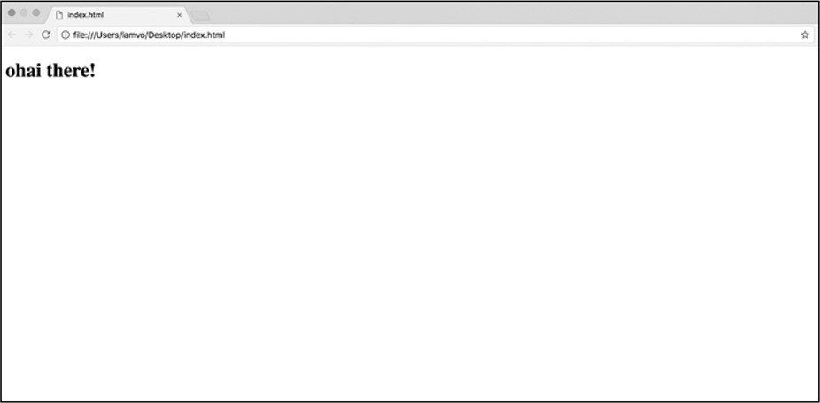 当浏览器访问一个URL时，会下载几行代码，然后以可视的形式进行解释和呈现。一个简单的网站可能只包含一行代码，如图1-1所示。

*图1-1:一个非常基础的网站*

该网站的代码如下：

上述代码示例显示的内容是"ohai there!"，围绕内容的两段文本称为HTML标记。

标记是文本和尖括号(\<\>)的组合，告诉浏览器应该如何组织每种类型的内容。例如，代码示例中的\<p\>和\</p\>标记告诉浏览器该句子是一个段落。HTML标记还可以告诉浏览器标记中的内容是标题、图像还是其他类型。标记和标记中的内容一起称为元素。每个元素通常以开始标记（例如\<p\>）开始，并以结束标记（与开始标记相同）但在第一个尖括号之后以反斜杠（例如\</p\>）结束。开始和结束标记之间包含将在网页上呈现的内容。有些元素（例如\）被称为空元素(void
elements)，不需要结束标记。

 图1-2标记了一个基本的HTML段落元素。

*图1-2：HTML段落元素*

 当在浏览器中呈现图1-2中的元素时，会显示图1-3的样子。

*图1-3：图1-2中的段落元素在浏览器中打开时的样子*

总的说来，HTML标记是告诉浏览器如何构造内容的一种方式，而标记之间的信息告诉浏览器应该在网页上呈现什么内容。

HTML元素也可以嵌套，这意味着一个标记包含一个或多个其他标记及其内容。此功能通常用于对相关元素进行集群。例如，标题和段落可以嵌套在定义了划分的\<div\>标记中。嵌套元素表示\<div\>标记中的标题和段落属于同一类。为了显示嵌套，通常使用缩进------也就是说，在一行代码前面添加空格或制表符---这是可选的，但是可以使代码更清晰。

例如，可以将图1-1中的段落元素放入\<div\>标记中，如下所示：

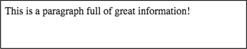 现在，整个段落元素都包含在开始和结束\<div\>标记内。为了显示段落元素是嵌套的，我们还将其放置在与\<div\>标记分开的一行上，并将该行缩进了四个空格。在浏览器中呈现时，嵌套的段落元素应类似于图1-4。

*图1-4:在浏览器中呈现的div和嵌套段落元素*

HTML语言在运行时是忽略缩进的，而\<div\>标记在呈现时是不可见的。这意味着浏览器只呈现段落标记内的内容，因而呈现的外观与图1-3所示相同。

虽然在浏览器中不能实际看到\<div\>标记和其他不可见的HTML结构，但它们很有用，因为它们把网页组织成块。例如组成一条推文的许多部分，每条推文都包含发布者的Twitter信息(用户名、Twitter句柄和Twitter个人资料照片)、时间戳、推文文本、推文的转发次数和收藏的数量。这些部分都聚集在嵌套的HTML标记中。嵌套可能会变得相当复杂，这取决于网站的复杂程度以及有多少元素彼此相关。一些嵌套的元素甚至可以进一步嵌套在其他元素中！

当从网站中挖掘信息时，了解HTML元素中的内容是如何构成的，以及想要查找的特定信息位于何处，将会有所帮助。稍后将重新讨论如何检索嵌套元素来检查推文的HTML结构。首先，需要讨论与HTML紧密相关的CSS。

###### CSS是如何工作的？

到目前为止，所有的例子都是纯文本，但是网站通常由更多的内容组成。例如，推文的文本可能是与显示推文发布日期和时间的文本不同的字体、颜色和大小。您可能想知道浏览器如何知道如何呈现不同颜色、字体和大小的HTML元素？这就是层叠样式表(Cascading
Style Sheets，CSS)发挥作用的地方。

CSS是如何给予HTML颜色、功能和(有些人甚至说)字符？CSS是一种允许我们为不同类型的HTML内容分配特定外观的语言。读者可以将CSS视为一组视觉指导方针，CSS告诉浏览器每个HTML元素在web页面上的外观需要如何呈现。

 例如，只有通过CSS页面才会从图1-4变成图1-5。

*图1-5:在浏览器中使用CSS格式呈现的div和段落元素*

在社交媒体数据领域，CSS通常用于确保以一致的方式呈现元素类型。例如，在推文的时间轴上，每个推文的时间戳都需要以相同的字体、颜色和大小呈现。

有多种方法可以为HTML标记分配CSS样式。一种方法是通过内联CSS，它在创建HTML标记的同一行中分配CSS。您可以在清单1-1中看到一个这样的例子。

*清单1-1:使用内联CSS格式化HTML*

在本例中，属性被添加到\<div\>的标记中。属性是与每个HTML标记相关联的附加信息。属性名位于开始的尖括号\<和标记名(在本例中为\<div\>)之后，在结束的尖括号\>之前。名称后面跟一个等号(=)，然后是属性的内容，它包含在双引号之间(尽管HTML也接受单引号)。属性通常是属于它们所在的标记的特征。

属性被传递给嵌套的HTML元素。在这种情况下，\<div\>标记的样式属性➊我们添加内联CSS,这意味着现在任何内容在\<div\>标记内时必须遵循CSS样式规则中定义样式属性。由于段落元素嵌套在\<div\>标记中，因此段落元素及其内容继承分配给\<div\>的任何样式。

CSS使用属性来改变颜色、字体和其他我们可以在网站上使用的格式选项。属性类似于HTML属性，但是用冒号(:)将属性名与属性值分隔开。例如,在➋样式属性的颜色属性,这决定了我们的字体的颜色（相关教程，请参见https://www.w3schools.com/colors/）。网站使用十六进制颜色，它表示由六个数字和字母组成的颜色。在本例中，\#272727表示深灰色。

向HTML添加CSS的另一种方法是在内部样式表中编写样式规则。样式表是内部的，因为CSS是直接插入到样式标记之间的HTML代码中，\<style\>\</style\>，但是它的格式与标记不内联。

使用内部样式表查看网站时，读者会在这些\<style\>标记内找到类和ID。类是在\<style\>标记中定义的样式规则，可以应用于多个HTML元素。通过使用类，您可以定义一次样式规则，并将其分别应用于每个元素。每个HTML元素可以具有多个类。ID类似于类，您可以在\<style\>标记中定义样式规则，但是ID不能用于多个HTML元素。

清单1-2显示了一个内部样式表的示例，它定义了如何对类和ID进行样式化。

*清单1-2：使用内部样式表将CSS样式分配给HTML*

每个样式规则位于\<style\>标记之间。第一组样式规则位于类内部，该类以英文句点（.）➊和类名称开头。在本例中该类名为my_styles（请注意！名称中没有空格）。类名后跟两个花括号（{}），其中包含该类的样式规则。读者可以看到清单1-2的CSS为my_styles类所应用的任何元素指定了颜色，字体大小，字体粗细和文本阴影。示例中显示的下一条规则创建一个ID，其名称为my_div。ID用井号（\#）标记，后跟ID名称。花括号之间也包了该含ID的样式规则。内部样式表以\</style\>标记结束。

尽管CSS样式规则是在这个HTML中定义的，但这并不意味着它们适用于任何HTML元素。为了格式化HTML元素，需要将类或ID分配给标记。

要做到这一点,我们分配"my_styles"类和"my_div"ID \< div
\>标记的➌类和ID属性。这意味着div元素中的任何内容现在都根据my_styles类和my_div
ID规则进行样式化。

 图1-6显示了这个CSS和HTML创建的外观。

*图1-6:应用于清单1-2中的嵌套div元素的内联CSS样式表*

通常情况下，开发人员在设计网站时需要编写数百(如果不是数千)行CSS代码。当样式规则变得复杂和丰富时，开发人员通常会将它们放入一个称为样式表的单独文档中，并通过外部链接标记(如下所示)加载到HTML页面中：

CSS样式表使用.css后缀名保存并存储在服务器上。外部样式表的格式与内部样式表相同，只是您不需要HTML的\<style\>标记，因为外部样式表不是HTML文件。

以上是关于使一个网站看起来很漂亮的信息。这些现在看起来可能与我们的目的无关，但是CSS很重要，**因为它帮助我们理解web设计师如何在网站上构建重复的元素**。例如，如果设计人员使用一个类来以特定的方式设计Facebook帖子的所有标题，那么查找包含标题的每个HTML元素就会容易得多。

既然您已经了解了网站设计和结构的基础知识，让我们来看一个来自Twitter的示例，它展示了HTML和CSS的实际应用。

######## 如何在HTML和CSS中构造推文

 让我们从Twitter时间轴上的一条推文开始，如图1-7所示。

*图1-7：显示在Twitter时间轴上的tweet示例*

时间轴上的每一项都代表一条推文，每条推文都有一个附加的信息子集。而且，正如您现在可能已经收集到的，每个推文都是使用HTML和CSS组织和呈现的。

当浏览器为用户呈现简洁的视觉效果时，这个网站比我们最初想象的要复杂得多。让我们来看看作为代码行的推文是什么样子的。为此我们需要打开一个漂亮的小浏览器特性，称为开发工具（developer
tools）。这些工具内置在一些浏览器中（如Chrome），也可以作为其他浏览器(如Firefox)的插件使用。我们会用Chrome浏览本书的例子，读者可以从*[https://www.google.com/chrome/]{.ul}*下载。

使用谷歌Chrome，进入一个Twitter时间轴，点击一条推文。在Chrome中访问推文的HTML，可以从Chrome菜单中选择"右上角竖直的**...**
▸ 更多工具 ▸
开发工具"，或者在Windows中按CTRL-SHIFT-I或COMMAND-OPTION-I在Mac上。

这将在浏览器中打开第二个视图，称为Web Inspector。Web
Inspector允许您查看网站下面的代码，如图1-8所示。

将鼠标逐行移到代码上。当你这样做的时候，Chrome应该高亮显示网页中与你的代码相对应的部分。您可以通过单击HTML标记左侧的小三角形来展开或折叠嵌套的HTML。最初的几个标记可能会突出显示整个网站，但对于我们的目的，我们只想看到组成一条推文的代码。当你自己这么做的时候，你需要深入到每个嵌套的标记，直到Chrome只突出显示你要找的网站部分。对于大型复杂的网站，这个过程可能需要一段时间。

*图1-8：在Web检查器中打开一条推文* 

对于本例，我们将直接跳到要查找的内容。单击Web
Inspector内部(不是在Web页面上!)，在Windows上按CTRL-F，在Mac上按COMMAND-F。Inspector窗口中应该出现一个搜索栏。在搜索栏中输入permalink-container，然后回车。应该将您带到一个只突出显示单个推文的div类。

现在您可以看到该推文由嵌套在\<div\>标记中的一堆代码组成，该标记已被分配为类permalink-
container。请注意，该代码是由标记和类组成的，例如到目前为止，我们已经介绍了简单的HTML示例。尽管实际的网站数据看起来很复杂，但是信息却像嵌入在更简单的HTML代码中一样被嵌入到标记中。

让我们更仔细地看看推文的代码。其中有很多信息，但是不要担心！我们把它分解一下，一次看一部分。清单1-3显示了图1-8中推文的压缩版本(因为每个推文可能有600多行代码)。

在Twitter上，每条推文都生活在这样的结构中，在本书的最后您将能够使用代码从成百上千个这样的结构中自动提取您需要的信息。这个例子中的HTML乍一看很复杂，但是您可以通过逐个查看来理解它。

例如,\<div\>标记的类permalink-container包围整个推文➊HTML标记。嵌套在该标记中的是带有类的推文➋的\<div\>以及与该推文相关但未显示的一些信息。其中一些信息用一个容易理解的名字标记，如data-following-you，它告诉浏览器该tweet的所有者是否在跟踪您的Twitter帐户。其他信息（例如data-permalink-path➌）具有不透明的名称，您需要通过一些侦探工作来弄清楚该名称。在这种情况下，data-permalink-path是在推文的https://twitter.com/URL末尾的链接。该代码段的末尾是一个\<
strong\>标记,
该标记使文本变为粗体，并为其指定了类fullname➍。\<strong\>标记的内容是Twitter账户名BuzzFeed。

虽然这些代码最初看起来让人不知所以然，但通过仔细梳理，我们发现了与这条推文相关的重要信息。我们将从社交媒体上挖掘的许多数据也是如此。

*清单1-3:组成单个推文的HTML*

###### JavaScript（Java脚本）是如何工作的？

HTML和CSS与我们的数据收集直接相关，因为它们与我们感兴趣的社交媒体内容密切相关，但是在一个网站中还有一些不断变动的部分，比如JavaScript。

JavaScript是一种编程语言，为网站带来了交互性，可以操纵页面上呈现的元素。JavaScript可以在呈现网页之前或之后动态更改网页。换句话说，使用JavaScript我们可以改变HTML和CSS的属性，甚至在页面上创建新的HTML元素。

接下来看看如何使用JavaScript更改清单1-4中的段落的颜色。

*清单1-4:嵌套在div中的段落*

 这段代码会在浏览器中呈现图1-9所示的样子。

*图1-9:应用了一些样式的段落*

清单1-4中的代码包含一个\<div\>标记，该标记被分配了一个名为my_styles的类和一个名为my_box的ID。使用JavaScript，我们可以利用\<div\>标记中的类或ID选择段落的HTML标记。有了标记的类或ID后，我们就可以使用JavaScript为标记分配新的类或新的样式。

在清单1-4的代码中添加一些JavaScript，它使用ID="my_box"选择HTML元素，如清单1-
5所示。

*清单1-5:使用JavaScript根据ID选择元素并修改其颜色*

JavaScript必须位于\<script\>标记之间，该标记告诉浏览器该标记的内容是用HTML以外的其他语言编写的代码。浏览器需要知道我们使用的是哪种语言，因此我们将\<style\>标记的type属性分配给text
/ javascript➋。

虽然您可能不知道如何阅读JavaScript，但是您通常可以通过阅读它来理解一些内容。让我们尝试一次一次浏览JavaScript。首先我们浏览文档，然后我们使用JavaScript的名为getElementById（）的部分，该部分会告诉您确切的功能（它根据其ID获取元素）。在许多编程语言中，当代码带有括号时，括号外的部分将作用于括号内的内容。在这种情况下，my_box位于括号内，因此我们告诉getElementById（）对my_box起作用。这将在➊处获取具有my_box
ID的div元素。然后，为div分配一个新的CSS样式和颜色。在这种情况下会应用样式"红色"。

 通过这段JavaScript代码，我们现在已经更改了在浏览器中呈现的文本的颜色，使其看起来如图1-10所示，其中深灰色表示红色文本颜色。

*图1-10:使用JavaScript应用于div的样式*

这是JavaScript工作的基本方式。你不需要知道如何写JavaScript的这本书，但你应该明白：这是一个非常重要的组成部分的网页，它有能力改变一个网站的内容，包括我们准备从社会媒体网站收集的内容。

#### 后端语言

正如读者所看到的，当检查社交媒体网站的代码时，很多感兴趣的数据都是红容易找到的，但是还有其他方法可以获得普通用户看不到的数据。这些方法是为程序员开发的，因此为了访问这些数据，读者也需要成为一名程序员，因此需要学习一种后端语言。

后端语言可以创建、更新以及与存储在服务器上的数据库通信。读者可以想象：有一个通过互联网访问的服务器硬盘，这个硬盘是一个很大的物理驱动器，里面包含很多信息，包括：社交媒体数据和所有的HTML和CSS文件，这些文件构成了可以查看在线的网站。后端语言还允许在计算机上创建文本文件或电子表格等文件，也可以把数据直接写入这些文件中。

###### 使用Python

在本书中，使用Python作为后端语言来收集和分析数据。Python是一种开源编程语言，由是由一个社区开发且提供给开发人员免费使用，但也可以用于商业的目的。

本书的目的不是让读者成为Python方面的专家，而是帮助读者理解：基本的编码概念、Python语言如何工作、如何阅读和理解现有的脚本(包含代码的文本文件)，以及如何根据自己的需要修改代码。换句话说，在阅读了这本书之后，读者将不会构建奇特的应用程序，也不会用Python编写复杂的脚本，但是会了解足够多的"危险"，同时可以为自己的目的构建脚本。

无论读者的电脑上是否已经安装了Python，都应该通过Python的官方网站(*[https://www.python.org/downloads/]{.ul}*)下载并安装最新版本的Python（3.7）。

###### Python简介

为了通过使用Python从而达到我们的目的，我们需要理解基本的编码概念，所以接下来的几个练习将向您介绍其中的几个。将每个练习看作是一节词汇或语法课，会让读者离编写完整的"句子"更近一步------在本例中是功能性的Python代码行。

对于这些练习，读者需要在交互式shell中输入几行代码，交互式shell是一个可以阅读和理解Python的接口。首先，读者需要打开命令行接口(command
line
interface，CLI)，这是计算机上允许您运行命令的程序。在mac电脑上使用终端Terminal，可以从Applications文件夹中找到。在Windows上可以使用命令提示符，可以通过"开始"菜单使用命令提示符。

打开命令行接口并在Mac或Windows上输入python3，就可以打开交互式shell。如果看到看起来像三个尖括号(\>\>\>)的提示符，那么说明交互式shell已经打开，如图1-11所示。

 

*图1-11：通过终端Mac的内置命令行接口访问的交互式shell*

现在您的命令行接口窗口知道如何解释Python代码了。首先输入以下简单的命令，然后按回车键：

恭喜你！刚刚写了第一行Python代码。您告诉交互式shell打印出文本"hello!"，其输出应在输入命令后立即显示，如下所示:

读者输入的命令称为打印语句，它打印您在圆括号之间输入的引号内的文本。

除了能够打印文本之外，Python还可以进行数学运算，来尝试一下。在交互式shell中输入这个等式：

在Python中数学方程称为表达式，它是允许使用操作符修改值的一行代码。表达式是编程中最基本的概念之一：它们允许将这些数字之类的东西修改成不同的东西。

在本例中我们获取两个值5和4，并通过一个数学运算符连接这两个值，该运算符对值执行一个操作。在这种情况下，加号(+)是操作符。

每个值都有一个与之关联的类型，称为数据类型。数据类型是信息的类别。例如，数字可能是一种数据类型，而文本可能是另一种数据类型。Python对每种数据类型都有不同的处理，并不是所有的操作符都能处理所有的数据类型，所以需要区分它们。

将要在Python中使用的几种数据类型，包括：整数来表示整数，比如1、2、3、4、5等等。还将使用浮点数，它是包含小数(如1.2和3.456)的数字。当需要使用文本时使用字符串，即"拼接"在一起的字符。字符串包含在双引号(\")或单引号(\')之间。字符串可以包括字母字符、数字、空格和其他符号。例如，"Lam"、"Lam
is a writer"和"123567"都是字符串。

###### 操作数字

Python提供了许多数学运算符。正如读者所能想到的，Python数学运算符包括用于把符号两边的值相加的加号(+)，同时也包含在学校里用过的其他数学符号。

例如，负号(-)从左边的值减去右边的值：

除了加减运算符之外，Python数学运算符还包含一些熟悉的运算符使用了不熟悉的符号。例如，在数学课上乘法使用×乘法符号，但在Python中使用星号(\*)代替：

类似地，除法使用另一个不熟悉的符号：正斜杠(/)，其输出是一个浮点数：

Python还有其他几个数字运算符，但现在尝试一下修改其他的数据类型。

###### 操作字符串

现在不使用Python来操作整数和浮点数，而是尝试操作一些字符串。进入交互式shell并输入:

看到输出了吗！只是使用字符串拼接操作符(+)就将两个字符串拼接为一个字符串了。拼接（*Concatenation*）是将事物结合在一起的行为。

尽管字符串拼接操作符使用与加法操作符完全相同的符号，但这两个操作符是完全不同的，因为它们的操作对象是不同的数据类型。

在Python中任何位于两个双引号或两个单引号之间的都是字符串，即使它看起来像另一种数据类型（比如数字）。例如，如果我们把两个引号之间的数字添加到两个引号之间的另一个数字，Python不会对它们进行运算，而是从它们创建一个新的字符串：

字符串"5"与整数5是不同的，对于字符串"4"也是如此。当这两个值被加号操作时，它们被拼接起来而不是相加。读者应确保很好地掌握了不同的数据类型，因为如果使用不当就会出现错误。例如，如果您尝试在字符串与整数上使用加号（比如"5"+
4），这会导致Python输出一个错误，因为Python不知道使用加法运算符还是字符串拼接运算符。

注意，Python可以交替使用单引号或双引号来表示字符串，但要确保一致：如果字符串以双引号开头，则必须以双引号结束，单引号也是一样。一般来说，最好选定一个（双引号/单引号）并在整个脚本中坚持使用其中的一种。

###### 在变量中存储值

至此，已经了解了表达式如何允许您修改值，接下来我们讨论另一个重要的概念：变量。变量是存储整数、浮点数或字符串等等值的一种方式。可以把一个变量想象成一个带标记的盒子，一旦将值放入该框中，就可以使用标记来引用它们。还可以更改盒子内的值，比如用其他值替换它们。将一段数据放入变量"盒子"中就是为变量*赋值*。

要创建一个变量，需要给变量一个名称。这个名字应该是描述性的，就像给一个装满锅碗瓢盆的盒子贴上"厨房用具"而不是"东西"的标记。在Python中**几乎**可以给变量起任何名字，但是这个名字不能有空格，也不能是已经在使用的变量。例如：不能有两个名称完全相同的变量、不能使用可能与其他Python代码混淆的名称（比如可能被误认为整数的普通数字）。

一旦确定了变量的名称，就可以使用赋值操作符(=)在其中存储值。

例如，要将字符串"Lam"赋值给一个名为name的变量，在交互式shell中输入name、赋值操作符和要赋值的值"Lam"，如下所示:

现在，已经让交互式shell中的name变量存储值"Lam"。与前面的示例不同，这里不应该有任何输出。

要打印出存储在变量中的值，需要在print()函数中输入变量名，而不是字符串值：

变量name存储"Lam"，因此print()函数只输出字符串值。

我们也可以在表达式中使用变量来代替字符串值，如下面的代码所示：

Python接受字符串"My name is"，并将其与存储在name变量中的值拼接到一起。

还可以通过给变量赋值来改变变量中存储的内容。让我们一步一步地看看这是如何工作的：

在第一行中，将字符串"Lam"分配给name。然后将它打印在一个表达式中，结果是字符串"My
name is
Lam"。接下将变量name的值改变为"Rosa"。如果使用与前面相同的print()命令，Python将使用当前的存储值并打印"My
name is Rosa"。

另外，我们还可以把数字存储在变量中，并在变量中执行数学运算:

首先，将整数10赋给initial_age变量。然后再将浮点数20.5分配给time_passed变量。在第三行使用加号将分配给initial_age的值与分配给time_passed的值相加。因为对存储在变量initial_age和time_passed中的两个数值进行了加法操作，所以结果是30.5。

正如这些示例中所展示的，我们可以为变量分配不同的数据类型------变量可以包含字符串、浮点数和整数。[变量在从社交网络收集数据点或值方面扮演着重要的角色]{.ul}。例如，我们可以从网站收集每个数据点，将其临时存储在适当的变量中，然后将每个数据点写入电子表格。

###### 在列表中存储多个值

除了存储一个值之外，一个变量还可以以列表的形式存储多个值。列表是可以容纳多种其他数据类型的Python数据类型。在Python中创建列表需要在两个括号(\[
\])之间输入要存储在列表中的值，这些值用逗号(，)分隔。尝试在交互式shell中创建一个列表，如下所示：

还可以将列表存储在变量中，方法是将该变量赋值为列表值，就像将其赋值为字符串值一样。在交互式shell中，创建如下列表：

通过使用print()命令打印列表：

列表也是处理不同数据类型的好方法，比如整数和字符串的混合：

上图中显示，第一个变量numbers存储一个整数和浮点数列表(0、2.6和7)，而第二个变量tweet_statistics存储一个整数列表(536和301)和一个字符串("New
York")。

当我们从社交网络获取不同类型的数据时，包含不同数据类型的列表非常有用。例如，我们可能想将喜欢的某条推文的发布者的Twitter句柄存储为列表。我们还可以在列表中存储与推文相关的统计信息。例如，存储在变量tweet_statistics中的值列表可以表示收藏的数量(536)、转发的数量(301)和与推文关联的位置("New
York")。

无论我们查看哪种类型的数据，列表都可能是我们用来存储数据的一种方式。当我们开始收集数据时，熟悉列表可以极大地帮助我们。

###### 调用函数

在前面的练习中了解到Python具有转换能力。通过表达式可以访问和修改数据。这本身就非常强大，但更强大的是Python能够比人类更快地重复一个操作。

设想计算一个Facebook页面已经发布的帖子数量。手动计算单个页面上的每个帖子是一回事，但如果要计算10、100甚至1000个Facebook页面上发布的帖子总数，可能会花费您数小时、数天甚至数周的时间！如果你写了一个Python脚本用于对页面进行计数，就可以重用相同的脚本计算任意数量的页面和文章，更好的是Python能够数的帖子与手工操作相比几乎是瞬间完成的。

为了利用这种能力，我们需要Python的函数。函数就像一组可以反复执行的指令（这点与菜谱有点相像）。

比如做一个苹果派。如果你自己做一个苹果派，可能不需要进行指导，但如果不得不做一打苹果派时就需要别人的帮助，就会需要把制作过程写下来作为对他人的指导。这样就不管有多少帮手，他们都可以按照说明来做，那么就不必向每个人单独解释如何制作菜谱中的菜了。

函数就像写下的一组操作过程，一旦完成一组指令就可以执行这个函数，并且无论执行多少次都可以，当然也可以让其他程序按照指令执行。

想要执行一个函数，需要写出函数的名称，然后是开括号和闭括号。在括号中，指定函数应该修改哪个值或变量。放在函数括号内的数据称为参数。例如：一直使用的print()命令是一个名为print的函数，它将字符串作为括号中的参数。

从讨论Python的内置函数开始。当我们在我们的计算机上安装Python时，有一组函数是由许多创建和维护它的人开发并集成到Python中的。我们可以立即使用这些函数，比如print()命令。

另一个内置函数是len()，它度量值的长度。例如，我们可以使用len()来测量字符串的长度，如下所示：

这段代码计算字符串中的字符数(包括空格)。当我们执行函数(也称为调用函数)时，它返回整数9，这意味着字符串中有9个字符。

我们也可以测量值列表的长度。让我们创建一个名为apples的列表，并使用len()函数来计数列表中有多少项：

在本例中，我们的列表中有两个字符串:"honeycrisp"和"royal
gala"。当我们对苹果调用len()函数时，它会返回整数2。

内置函数涵盖了Python中的许多基本任务。对于更长的内置函数列表，Python社区在https://docs.python.org/3/library/functions.html上提供了一个有用的页面。

###### 创建函数

要创建自己函数（即声明一个函数）在交互式shell中输入以下内容：

在Python中使用关键字def定义函数，def向Python发出要编写一个函数的信号。在def之后就是函数的名称(在本例中为write_sentence)，并在其后面直接添加括号。如果想要函数包含参数，只需在括号中输入参数名。参数代表在该函数中需要修改的对象。

冒号(:)表示以下缩进行的所有内容都是函数的一部分。在像HTML这样的web语言中，缩进是可选的，但是在Python中缩进是必需的。缩进是通过在行的开头使用TAB键或四个空格来实现的，告诉Python代码的哪些部分是分组在一起的。

Python将把所有缩进的内容与函数的指令关联起来，直到遇到一行未缩进的代码。一旦Python遇到未缩进的行，它就知道它已经到达了函数的末尾，并将继续代码的下一部分。

在缩进代码中定义了一个名为new_sentence的变量，然后使用加号与字符串"is my
favorite kind of
apple."组合一个新字符串。我们将这个表达式的结果存储在变量new_sentence中，然后打印new_sentence。

定义函数与调用函数是不同的。记住函数就像配方，所以定义一个函数就像把配方写下来。但是，如果不按照你的食谱中的步骤使用真正的食材，会无法享用一顿美味的大餐！因此，最后但并非最终，我们需要通过传递要修改的参数来调用新函数。

给write_sentence()函数传递"honeycrisp"字符串作为参数：

函数的强大之处在于，不仅可以对一个字符串执行函数，还可以对任何其他字符串执行函数。接下来我们运行这个函数两次，每次使用不同的字符串作为我们函数的参数：

上图中所示：可以使用带有不同字符串的函数来反复创建新语句。

我们现在已经发现了函数的强大功能------一组可以多次重用的指令。然而，即使您现在可以创建一个按需执行的函数，但在希望使用它的每个实例中调用该函数仍然是一件繁琐的事情，特别是在需要使用它数百或数千次的情况下。接下来，您将了解另一个允许自动多次运行代码的概念：循环。

###### 使用循环

*循环*可以多次执行某个操作。在案例中使用循环遍历列表并为每个项执行一个操作。为此会使用一个for循环。

为了说明循环的力量，让我们重新看看我们的苹果派配方。假设有四个苹果，我们需要削每一个的皮。如果有一个机器人可以帮助我们做家务(哈！未来就在眼前！)，我们可以编写一个for循环来指示机器人遍历一桶苹果并为每个苹果削皮。也许可以给机器人助手这样的指令：*对于桶里的每一个苹果，削掉它的皮！*

在实际的机器人语言(Python)中，必须遵循一个公式来创建一个for循环。结构看起来更像这样：

让我们运行一个Python示例，看看这个循环是如何工作的。首先需要定义要循环或迭代的列表。然后需要通过告诉Python要循环哪些列表：

正如刚刚叙述的，首先定义循环或迭代的列表---在本例中是两个字符串，然后是for循环。为了遍历列表中的每个项目，需要将项目临时存储在一个变量中，把apples列表中的每一项都存储在变量apple中来做到这一点。

与函数类似，for循环后面通常跟着一组指令。该指令将对列表中的每个项目执行指令所代表的操作。与函数一样，for循环也使用冒号来告诉Python指令何时开始，并使用缩进来告诉Python哪些代码属于循环。

在循环中，将变量apple连接到另一个字符串，并将结果字符串存储在名为new_string的变量中。然后，指示代码打印刚刚创建的新字符串。

for循环对列表中的每个项一次执行一个相同的指令，因此交互式shell打印出两个新的字符串。首先，for循环将apple变量赋给苹果列表中的第一项，因此apple是字符串"honeycrisp"。然后，for循环执行其中的代码，它输出第一个字符串"我正在剥蜜酥"。这是for循环的一次迭代。一旦for循环完成了第一次迭代，它将检查苹果列表中是否有更多的项目，如果有，它将把apple分配给下一个项目。在这种情况下，这是字符串"皇家节日"。然后，for循环再次运行其中的代码，输出"我正在剥离皇家庆典"。这是循环的第二次迭代。for循环将继续向下运行项目列表，并运行每个项目的代码，直到它用完为止。因为apple只包含两个条目，所以for循环在两次迭代之后完成循环。

在web上收集数据时经常会使用循环。当我们以编程方式在线获取数据点时，把诸如标题或时间戳之类的数据放入一个列表中，并通过使用该列表遍历来对每个数据点运行函数。例如，任何给定推文的时间戳都可以存储为类似于2019-01-22
06:58:44这样的长字符串，因此可能需要编写一个函数来将日期与发布时间分开。通过使用循环可以在每个日期上进行需要的操作，这样就不用手动对每个时间戳进行分割了。

###### 使用条件语句

最后但不是最终，我们谈谈逻辑。循环可以帮助我们自动遍历大量数据并对每一个数据执行操作，但是每一个操作都是相同的。当遇到不应该被相同对待的数据时，脚本应该如何写呢？这就是条件语句的用武之地。

条件语句告诉Python根据是否满足条件运行代码。最常用的条件语句之一是if子句，它告诉Python如果一个条件为真，那么它应该做一件事。如果不满足此条件，则使用else子句告诉Python运行其他一些代码。if子句可以单独使用，但else子句必须与if子句搭配使用。

通常把条件与逻辑运算符一起使用------这些符号允许程序判断一个条件是真还是假。例如，在数学课上可能用大于号(\>)来表述逻辑运算。例如，语句5
\>
9表示"5大于9"。因为5实际上并不大于9，所以这种说法是错误的。Python中的逻辑运算符以类似的方式工作，有些运算符的符号存在不同之外。例如，当在数学中测试相等性时使用单个等号(=)，但是因为Python对赋值语句使用单个等号，所以在Python中检查两个值是否相等的操作符是两个等号(==)。

表1-1包含可以与条件语句一起使用的操作符列表。

*表1-1:逻辑运算符*

+------------+---------------------------+---------------------------+
| **运算符** | > **做什么**              | > **例子**                |
+============+===========================+===========================+
| ==         | 如果运算符左右两          | ("pie" == "cake") is not  |
|            | 侧的值相等，则返回true。  | true.                     |
+------------+---------------------------+---------------------------+
| !=         | 如果运算符左右两侧        | ("pie" != "cake") is      |
|            | 的值不相等，则返回true。  | true.                     |
+------------+---------------------------+---------------------------+
| \>         | > 如果运算符左侧的值大    | (4 \> 10) is not true.    |
|            | 于右侧的值，则返回true。  |                           |
+------------+---------------------------+---------------------------+
| \<         | 如果运算符左侧的值小      | (4 \< 10) is true.        |
|            | 于右侧的值，则返回true。  |                           |
+------------+---------------------------+---------------------------+
| \>=        | 如                        | (4 \>= 10) is not true.   |
|            | 果运算符左边的值大于或等  |                           |
|            | 于右边的值，则返回true。  |                           |
+------------+---------------------------+---------------------------+
| \<=        | 如                        | (4 \<= 10) is true.       |
|            | 果运算符左边的值小于或等  |                           |
|            | 于右边的值，则返回true。  |                           |
+------------+---------------------------+---------------------------+

现在您已经了解了if子句和条件语句工作原理的基础知识，让我们来看一个示例。如果食物变量包含"pie"，我们将告诉Python给我们一些pie，或者在食物不等于"pie"时打印其他东西。首先，将字符串"pie"分配给变量food。然后输入if操作符和一个条件。在本例中，条件是food
== \" pie
\"，这意味着条件是变量food的值为\"pie\"后跟冒号:。if子句使用缩进来表示作用域，就像函数和循环一样。使用TAB键缩进if子句后面的行。现在，如果符合条件food
== \" pie
\"，那么冒号后面的任何缩进代码都被认为是Python执行的内容的一部分。在本例中，如果food
== \" pie \"，那么Python将打印字符串\" Give me some pie!
\"。然后，使用操作符else和冒号，我们告诉Python如果不满足条件food == \"
pie
\"，它应该做什么。同样，使用TAB键写出这些指令，这样Python就知道缩进的代码包含了在初始条件不满足时应该执行的指令。在本例中，我们希望Python打印字符串"I
\'m not hungry"。

在交互式shell中运行这段代码时，它应该打印字符串"Give me some
pie!"因为(if food==\"pie\")是符合判断条件的。

在社交媒体上获取的数据可能不规则，如果代码不能处理特殊情况就会导致错误。if语句是将"最坏情况"构建到数据收集脚本中以处理这些情况的较好方法。假设使用Python来收集包含100个不同Facebook组的列表的描述数据。由于Facebook管理员不必为所有的组编写描述信息，所以有些组可能有信息，而有些则没有。如果使用for循环遍历整个组列表，那么Python将为每个组查找描述，即使有些可能没有描述。这可能会混淆Python脚本的输出。在这些情况下，使用条件语句来指示Python是很有非常有效的操作：if（如果）组有一个描述数据就应该收集该信息，else（否则）就应该记录一个通常的字符串，如"这个组没有描述"来代替描述数据。

#### 概要

这本书涉及了很多领域，显然读者不可能成为每一种web语言的专家（前端或者后端）。本章希望能够帮助读者理解web语言的基本工作方式。在很多时候，学习一门编程语言就像学习一门口语：首先必须学习一些最常见的单词和语法，然后才能扩大词汇量，从而变得更加流利。可以把刚刚了解的函数名和HTML标记视为编码语言的词汇表，把条件语句、循环和if子句等概念视为语法。这些基础会帮助您阅读在接下来的章节中编写的脚本，随着一个示例到另一个示例，读者能够在此基础上变成一个*更流利*的程序员。

在下一章中探索作为数据源的应用程序编程接口(API)，您会使用新获得的Python知识从YouTube
API请求和访问数据。

{width="2.508462379702537in" height="2.51in"}2 从哪里获取数据
---------------------------------------------------------------------------------------

当使用社交媒体时，我们的行为会留下痕迹。Facebook上的点赞，Twitter上的转发，Instagram上的一颗心------每一个动作都代表着互联网某处记录的一个数据点。通过用户同意这些公司的服务条款，允许他们存储这些数据，反过来这些公司也可以向公众提供数据。

这些公司允许第三方通过应用程序编程接口(API)访问这些数据宝库。API就像社交媒体平台和希望从中获取信息的开发人员之间的中间人。

在本章中以YouTube为例，更详细地解释什么是API，以及可以从中获取哪些类型的数据。

#### 什么是API？

API是Application Programming
Interface的缩写，即应用程序编程接口。从最基本的层面上看，API是允许程序员访问其他开发人员代码的接口。一些程序员使用API访问在线平台上的数据，这样他们就可以制作自己的应用程序。例如，第三方开发者可以使用官方的Instagram应用程序的API，该API允许用户使用非官方的应用程序向他们的Instagram
Feed发布图片。换句话说，Instagram
API允许开发者将自己的代码连接到Instagram管理其帐户的用户。

正如稍后即将讨论的，API还允许开发人员使用脚本（一个与web上的服务器和数据库通信的程序）来请求数据。

为了更好地理解API，采用一个例子进行类比。例如：你是餐馆的顾客，API就像一个服务员，它给你一组选项、帮你点餐、取餐，然后拿给你。当然餐厅老板决定菜单上有哪些什么菜肴。餐厅老板还控制着菜肴的摆放和分量。菜单详细说明了你可以点哪些菜肴，这些菜肴的名字，以及这些菜肴的一半构成份。

就我们而言，社交媒体公司代表餐馆老板，开发人员(或客户)代表食客，菜单上的菜代表我们试图收集的数据。客户端是我们用来上网的任何技术，就像浏览器、手机、桌面的一个应用程序。

Facebook或Twitter这样的公司是否提供API完全取决于：可以通过一个或多个API提供数据，也可以选择不提供任何数据。而且，即使公司允许第三方访问其数据存储，它通常也会限制可用的数据，并可以随时更改共享的数据。公众对隐私问题的愤怒、旨在保护人们数据的新法律法规、以及涉及社交媒体公司的新闻事件，都对公司是否提供数据的决策产生了影响。一些公司甚至可能对访问他们的数据进行收费。

要了解一家公司通过其API向开发人员提供了哪些信息方法是通读该公司的文档，然而文档是说明手册的一种时髦称谓而已。令人非常不愉快的是：文档并没有被标准化。即使是最有经验的研究人员也会感到迷失方向，尤其是当他们刚开始编写代码。这在一定程度上是因为文档通常是针对应用程序开发人员，而不是研究人员、营销人员或其他非开发人员。

查找一家公司提供哪些可用信息的最佳方法是简单地搜索该公司在谷歌（国内是Baidu）上的API。

#### 通过API获得数据

现在已经大致了解了API的工作方式，接下来研究如何使用API获得数据。

如前所述，第三方一般使用脚本从API请求数据。这些脚本通常是文本文件，由计算机之类的机器执行或运行。可以将把脚本想象成一个为您执行任务的小机器人。这个机器人可以与API通信，向API请求数据、读取接收到的数据、并根据数据创建电子表格。

脚本通常通过URL与API通信，如同访问网站时使用的URL。使用URL与API通信被称为基于URL的API请求(API调用)。与大多数其他URL一样，可以把API调用粘贴到任何浏览器中，浏览器将返回您请求的基于文本的数据。当使用脚本进行API调用时，脚本将接收浏览器中显示的信息。

以谷歌的YouTube
API为例。您可以使用这个API来访问大量数据，包括YouTube频道的描述数据或在一段时间内接收到的访问量。通过在URL中包含数据，可以告诉API需要调用哪些数据。对于本练习，我们将请求BuzzFeed
Tasty YouTube页面上发布的帖子的数据提要。为此使用如下API调用：

https://www.googleapis.com/youtube/v3/search?channelId=UCJFp8uSYCjXOMnkUyb3CQ3Q&part=snippet
。

URL的每个部分都有不同的用途。其中有两种类型的字符串构成了一个API调用：一种是base，它表示正在使用的API；另一种是各种参数，它告诉调用希望获取哪些数据并传递有关您的信息(即请求信息的一方)。在之前的类比中，base类似正在用餐的餐厅，参数是可以选择的单个菜单项目。

 

此例中的API基于*https://*[*www.googleapis.com/youtube/*
。](http://www.googleapis.com/youtube/%20。%20)该API把浏览器或Python脚本定向到谷歌的YouTube
API上。调用的下一部分是一个参数，该参数告诉谷歌需要使用的API版本。社交媒体网站经常更新，当网站更新时API也随着更新。版本由一个正斜杠与base分隔开。在本例中我们希望使用API的v3版本(由于这些版本经常更新，您应该参考文档以确保使用的是最新版本)。下一个参数是search，该参数指定搜索YouTube的视频。

接下来指定要搜索的内容。此例中需要寻找来自BuzzFeed
Tasty频道的视频，该频道的YouTube频道ID为UCJFp8uSYCjXOMnkUyb3CQ3Q。一般在YouTube频道URL的末尾找到频道ID。例如，Tasty频道的URL为：https://www.youtube.com/channel/UCJFp8uSYCjXOMnkUyb3CQ3Q。通过输入参数的名称channelId来调用频道ID参数，具体为在channelId后面跟一个等号(=)和长的频道ID：channelId=UCJFp8uSYCjXOMnkUyb3CQ3Q。

现在有了一个URL地址，完成对API进行第一次调用的而准备。在下一章中通过Python脚本进行此调用，但是现在只需将API调用粘贴到浏览器中。此步操作可以立即看到API的响应。完成该操作后，浏览器应该返回清单2-1中的信息。

*清单2-1:API调用在浏览器中返回的代码，读者的响应可能看起来略有不同*

API响应的结构是JavaScript对象标记(JSON)，这是API用来传递数据的格式。在接下来的页面中会更详细地讨论JSON。

仔细查看该API返回的JSON数据发现单词error，error表示发生了问题，代表该API无法从BuzzFeed
Tasty频道获取请求的帖子。

处理代码的过程中经常需要阅读和理解错误（error）消息。作为一个初学者可能会觉得把大部分时间都花在了测试和修复代码上而没有实际的产出。但是在找到正确方法之前还是会犯错误，一旦经验积累起来后，就很容易改正这些错误。

大多数情况下错误消息提供了关于出错原因的线索。如果更仔细地检查API错误的响应，可以看到API返回了一个"消息"和一个错误通知"未经过身份验证的使用超出了每日限制"，继续使用需要注册。（Daily
Limit for Unauthenticated Use Exceeded. Continued use requires
signup.）"

若要修复这个错误需要一个"API密钥"，这是一种将标识自己API的方法。YouTube和其他有API的网站想要知道谁在使用他们的API，所以有时会要求你注册开发者证书，这是开发者用来获得API访问权限的一种形式。凭证类似于用户名和密码。作为获取API使用权限的交换，社交媒体公司会跟踪用户，以防有人滥用API。

###### 获取一个YouTube API密钥

对于YouTube等社交媒体网络，通常可以在该平台的网站上获取密钥。现在开始尝试从YouTube获取密钥。如果要注册Google的YouTube开发者密钥，首先需要注册一个Google帐户。如果没有请在*https://www.google.com*上创建一个。完成此步骤操作后，登录并导航到Google为开发人员设置的单独页面：*https://console.developers.google.com/apis/credentials
。*

 请按照谷歌的说明创建凭证，特别是API密钥。

完成创建一个通用API密钥后，密钥的默认名称是"API密钥"，可以通过双击密钥名称来重命名。本例中被重命名为"数据收集密钥"。

有了密钥之后，在浏览器中导航到Library页面。谷歌提供了各种各样的API，因此需要启用对所需的特定API的访问。在浏览器中导航到YouTube数据API
v3并单击Enable。至此可以通过API密钥访问YouTube了。

该API密钥连接到您的谷歌帐户，它的作用类似于允许您访问谷歌API的用户名和密码。所以应像对待其他用户名和密码一样对待API密钥。以往编写并发布脚本到代码共享平台(如GitHub)的开发人员会不小心在网上发布他们的密钥。如果犯了同样的错误，就会产生严重的后果。如有人可能会滥用您的密钥，导致在将来无法访问该API密钥代表的服务。

###### 使用凭证检索JSON对象

获得用户凭证后就可以使用URL再次访问API。尽管每个API都不相同，但是通常API会要求您将API密钥直接输入到API调用中。如果发现之后使用其他API不是这种情况，那么应查看该API的文档找出在何处输入凭证。对于Google的YouTube
API可以在原始API调用指定的参数之后，将API密钥作为其自己的参数添加到URL中。输入以下URL，用获得的API密钥替换\<YOUTUBE_API_KEY\>：https：//www.googleapis.com/youtube/v3/search？
channelId = UCJFp8uSYCjXOMnkUyb3CQ3Q＆part = snippet＆key =
\<YOUTUBE_API_KEY\>。

至此应该收到一个包含数据的API响应！清单2-2是API调用在浏览器中返回数据的示例。因为BuzzFeed页面是不断变化的，你的数据看起来应该会不同，但返回的数据结构应该是一样的。

*清单2-2：YouTube API返回的示例数据*

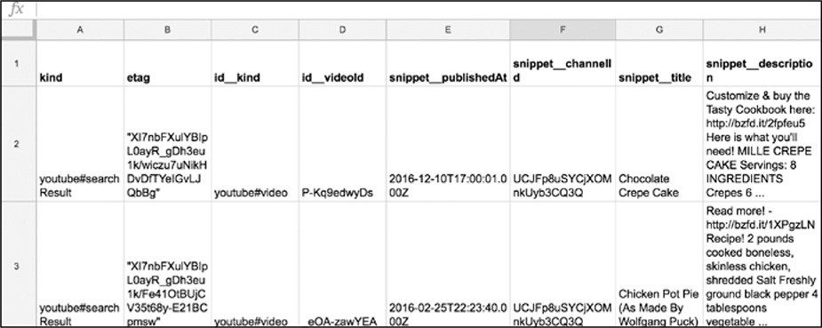 查看返回代码后可以注意到，API响应仍然是JSON。也许有些让人不知所措，但是可以将JSON数据转换成一种更熟悉的格式---表格（图2-1所示）。阅读API响应中的一些字符串，能看到数据是来自BuzzFeed
Tasty YouTube频道的五个视频的快照。

*图2-1：JSON数据转换成表格格式*

刚开始接触是，JSON格式的数据看起来感觉非常混乱、非常复杂，所以把每个部分一一分解后就可以更好地了解数据的结构。JSON数据总是存储在两个大括号({})之间。每个post都存储为JSON对象，每个对象中的数据点存储为**键-值对（*key-value
pairs*）**。如第一个post包含以下数据点：

冒号前的字符串被称为键*key*➊,冒号后的字符串是一个与键*key*关联的值*value*➋。键*key*代表了数据的类型------可以将这个键*key*看作表格列的标题。值*value*包含实际数据，如：字符串、整数或浮点数。在API文档中可以查阅到这些数据点是哪种数据类型。在本例中键*key*被称为"*publishedAt*"，根据YouTube的文档，该键*key*描述了一个帖子或评论创建的时间和日期。本例中的值*value*（"*2016-12-10T17:00:01.000Z*"）是一个用UTC格式格式化的时间戳。UTC是一种将日期和时间信息存储在一个字符串中的标准化方式。

API返回哪种数据完全取决于提供数据的社交媒体平台。这也意味着社交媒体平台决定了返回数据的键值。例如，谷歌决定调整发布文章的日期和时间*publishedAt*代替*日期date*或*published_on*。顺便提一句，这是谷歌及其API的特有风格（译者说：改用Baidu吧！Baidu的风格更加夸张）。

*清单2-3：YouTube上一个名为"Chocolate Crepe Cake"的视频片段*

如清单2-3所示，每一个YouTube视频信息存储一组花括号{}➊之间,每一个JSON对象是由一个逗号分开➌。在这些大括号中有四个键("publishedAt"、"chann"、"title"、"description")和它们所关联的值("2016-12-10T17:00:01.000Z"，"UCJFp8uSYCjXOMnkUyb3CQ3Q"，"Chocolate
Crepe Cake"，"Customize & buy the Tasty Cookbook here:
http://bzfd.it/2fpfeu5 Here is what you'll need! MILLE CREPE CAKE
Servings：8 INGREDIENTS Crepes 6
..."，respectively)，这些键和值与前面的示例一样是成对显示的，每一个键-值对之间采用逗号分隔➋。

再次查看清单2-2中原始代码的部分片段(参见清单2-4)。

*清单2-4：重新访问YouTube API返回的示例数据*

清单2-4中显示所有的推文都嵌套在一对方括号(\[\])中。(注意，上面的清单2-4在本书中被截断了，虽然您应该能够在API调用的结果中看到开括号和闭括号，但是只能在这些页面中看到开括号。)所有这些数据的前面依次是字符串"items"，然后是冒号。这表示键"items"包含一个数据点列表------在本例中是BuzzFeed的Tasty
YouTube频道的视频。"items"键值对存储在另一组大括号({})之间，大括号组成整个JSON对象。

至此，完成了如何从API请求数据的过程，以及如何读取返回的JSON响应，接下来看看如何调整返回的数据以满足我们的需要。

###### 使用数据回答研究问题

可能已经注意到，API调用返回的数据在视觉上相当稀疏。如果不指定需要的数据类型，API会只返回基本信息以及提供默认数据点，这不是我们想要的数据。例如，清单2-5中包含清单2-2中API调用返回的一个视频的信息。

*清单2-5：API调用的示例响应，仅包含关于视频的基本信息*

此数据项对应于图2-2中BuzzFeed中Tasty频道上的视频。

 

*图2-2：清单2-5所示的视频截图*

在线视频中显示的数据比通过API接收到的数据要多，如：观看和评论的数量。这些信息以及更多的信息都可以通过API获得，但是需要考虑想要获得的数据类型以及想用它来回答什么问题。具体来说需要做两件事。首先，需要为研究设定目标。设定研究目标可能是**最重要**但在现实过程中考虑最少的步骤，对研究有一套清晰的问题或假设会告诉你如何收集数据。其次，应当查阅API文档，看看是否有需要的数据来满足研究目标。

采用这种方法的一个很好的例子是BuzzFeed新闻的故事"Inside the Partisan
Fight for Your News Feed"
(https://buzzfeed.com/craigsilverman/inside-the-partisan-fight-
for-your-news-feed)。本文作者与Craig Silverman，Jane Lytvynenko，Jeremy
Singer-Vine组成的项目组通过Facebook的Graph
API从452个不同的Facebook页面收集了400万篇帖子。总共收集了数百万的数据点，这些数据点通过简单地分析不能无法找到任何有意义的模式或趋势。为此首先需要缩小想要使用的信息的范围。

由于越来越多的新闻机构依靠Facebook这样的第三方来接触他们的受众，作者的项目深入研究了新老机构在Facebook上是如何相互比较的。项目组决定分析[左倾]{.ul}和[右倾]{.ul}新闻机构的受欢迎程度（世界上哪有那么多左右之分呢？本文不谈论政治，作者也仅仅是用此项目当作一个事例。），受欢迎程度分析基于这些新闻机构的追随者数量和每个页面所获得的参与度(反应和评论)。将数据缩小到两个类别后就可以画出随时间变化的信息，如图2-3所示。

 

*图2-3：BuzzFeed News分析了左倾和右倾Facebook页面的表现*

从上图中可以看到：随着时间的推移，左倾的Facebook页面的参与度在不断增加。为了找到研究问题的答案，不仅需要访问信息，而且还需要过滤信息。

如果想要对BuzzFeed的"美味频道"(Tasty
channel)的内容在一段时间内的受欢迎程度进行类似的分析，首先需要考虑的是：可能有助于回答这个问题的数据类别。例如，有多种方法来衡量一个视频的受欢迎程度，如：观看、喜欢、不喜欢和评论等等的数量，然后决定要用哪种方法。

 在某些情况下，社交媒体平台帖子的视觉布局是决定如何回答研究问题的好方法。例如，图2-4可以告诉我们在BuzzFeed的"美味频道"(Tasty
channel)的流行度分析中使用了哪些数据。

*图2-4：在清单2-5中看到的文章的注释截图*

要理解BuzzFeed内容的性质，最好的方法可能是看它的视频属性(如：每个视频的标题和描述)。例如，可以使用观看次数和支持或反对票数来衡量一个视频的受欢迎程度。最后但并非最终，可以使用视频时间戳来确定哪些内容在一段时间内表现良好。

如何访问上述提到的数据呢？通过查看API文档确定哪些信息是否可用。正如上节中提到的，像谷歌这样的庞然大物提供了许多API和各种文档集。我们对YouTube的数据API感兴趣，它的文档位于https://developers.google.com/youtube/。每个API的组织方式不同，因此您需要阅读开始使用的任何API的介绍或概述。在介绍如何使用谷歌的YouTube
API之前，先回顾一下关于它的一些基础知识。

###### 优化API返回的数据

可以使用各种参数进一步缩小范围或指定希望收集的信息的种类。打开YouTube的API文档(https://developers.google.com/youtube/v3/docs/search/list)，向下滚动到Parameters表。左列按名称列出参数，右列提供描述和使用指南。在查找数据时，请阅读每个参数的概述同时找到与想要访问的信息类型相匹配的参数。假设把API的结果缩小到只包含之前提到的cake词的视频。为了优化API调用，使用参数q
(query的缩写)，然后输入正在搜索的术语。这意味着您将在浏览器中输入(https://www.googleapis.com/youtube/v3/search?channelId=UCJFp8uSYCjXOMnkUyb3CQ3Q&part=snippet&key=YOUR_API_KEY&q=cake)。

把这个调用拆开分析。第一部分类似于在本章前面所做的第一个API调用。正在访问搜索API
*search*?并通过参数*channelId*指定我们希望将搜索限制在BuzzFeed
Tasty频道的视频中。接下来像之前一样输入API键，然后使用&表示我们要添加一个参数q，然后使用等号(=)指定API返回的搜索词cake。当在浏览器中输入这个API调用时，应该会得到一个JSON响应，其中只包含带有单词cake视频的描述或标题。

恭喜您！现在已经了解了如何使用参数来定制API的数据请求。

#### 概要

理解如何从API调用中访问特定的数据是理解技术和概念上的重要任务。虽然每个API都有自己的参数、限制和身份验证过程，但希望本章为读者提供了工具，可以成功地导航至每个API所需的各种方法。在下一章中，将向您展示如何使用Python脚本访问和优化数据。

{width="2.508462379702537in" height="2.51in"}3 用代码获取数据
---------------------------------------------------------------------------------------

在第2章中了解了如何通过浏览器调用API来访问特定的数据。接下来学习如何通过Python脚本进行这些调用，以及如何读取数据、存储数据并将其写入文件。

在之前的Python的shell交互模式有助理解Python是如何工作的。但是，随着向更复杂的Python应用发展，需要改变方向并开始使用文本编辑器来编写Python脚本。

可以在预装在电脑上的免费文本编辑器中编写脚本，比如Mac上的TextEdit或Windows上的WordPad，但最好是在为开发人员设计的文本编辑器中编写和编辑代码。这些文本编辑器有语法高亮显示。作者推荐的一个很好的免费文本编辑器是Atom（[*[https://atom.io]{.ul}*](https://atom.io/)）。

#### 编写第一个脚本

现在可以写脚本了！从整理文件开始。在一个容易记住的地方创建一个文件夹，将其命名为python_scripts。对于Mac和Windows，建议将其保存在"文档"文件夹中。然后打开文本编辑器，创建一个空白文件(在Atom的菜单中选择File
▸ New file)。

将该文件保存到python_scripts文件夹(在Atom的菜单中选择File
▸)，文件名为youtube_script.py。文件扩展名.py告诉文本编辑器文本文件中的语言是Python。

在为文件命名时，有一个好的经验法则：使用所有小写字母，并确保该名称描述了脚本的实际功能。不应在脚本的文件名中使用空格或以数字开头。所以，如果文件名很长，可以使用下划线或破折号来分隔单个单词，而不是空格(就像youtube_script.py)。Python语言是大小写敏感的，所以使用不同的大小写或拼写错误来引用同一个文件会导致错误。

在youtube_script.py中输入以下代码，然后保存：

接下来，打开一个命令行接口，如同在第1章中使用它来访问Python交互式shell。命令行接口允许使用代码行来浏览计算机的文件，可以将文件从一个文件夹移动到另一个文件夹，创建和删除文件，甚至通过它们访问internet。命令行接口也可以运行脚本。

###### 运行脚本

像第1章那样打开命令行接口，使用Mac终端或Windows命令提示符,然后在命令行接口中切换至包含脚本的目录或文件夹。在Mac电脑上，可以运行ls命令(list的缩写)来查看你在硬盘上的位置。在Windows上，您可以运行dir（directory的缩写）命令。当运行这些命令时，命令行接口就会列出它当前所在目录中的文件和/或文件夹，如图3-1所示。

现在需要切换至前面创建的文件夹python_scripts中。如果习惯于使用图标来切换文件夹，那么一开始可能会遇到一些问题。要在命令行接口中访问文件夹，不是通过单击图标来完成，需要指定一个filepath（文件路径），文件路径是指向想要访问的文件的文件夹路径。在Mac上通常是用斜线分隔的文件夹的名称；在Windows上通常是硬盘驱动器的名称，后面跟着用斜线分隔的文件夹名称。例如，如果将python_scripts文件夹保存在Mac或Windows的Documents文件夹中，那么者个文件夹的路径应该分别是Documents/python_scripts和C:\\Documents\\python_scripts。如果文件夹保存在其他位置，还可以在Finder
(Mac)或File Explorer
(Windows)中导航到的目标文件夹并复制窗口中显示的路径至命令行接口中。

 

*图3-1：当前目录的清单*

通过命令行接口切换至一个文件夹，可以使用cd命令(代表change
directory)，然后是文件夹的路径。例如，如果文件夹存储在Mac上的Documents文件夹中，请运行以下命令：

在Windows中请运行如下命令：

进入包含Python脚本的文件夹后，需要使用另一个命令来运行脚本。在Mac的命令行接口中输入以下命令：

在Windows中输入：

在Mac上，命令python3告诉命令行接口，要运行一个用Python(版本3)编写的脚本，而youtube_script.py是希望命令行接口运行的文件的名称和扩展名。

在命令行接口运行脚本后应该看到：

该脚本执行了在前一节中输入的print()函数。既然已经了解了如何运行脚本，那么编写一个可以完成想做事情的脚本。

#### 规划脚本

无论是使用Python还是其他程序语言编写的脚本都将执行一系列任务。第一次开始写脚本的时候，通过列出这些任务的描述来帮助组织想法，这种做法被称为伪代码。伪代码使用脚本的注释来完成，注释是脚本中一些为您或其他阅读代码的人编写且计算机是不会运行的文本。也可以把伪代码看作一个待办事项列表，在之后的编码中提醒自己在编写代码的每个部分时应该做什么。这些注释还可以当作描述性的注释，帮助其他人理解脚本的功能。

编写一个脚本的开始步骤是在脚本中列出一个待办事项列表。在youtube_script.py文件中使用hashtag(\#，井号)创建注释，如清单3-1所示。

*清单3-1：在脚本中执行的步骤的伪代码*

每个hashtag都告诉Python该行中的文本解释为注释，清单3-1在三行中有三个注释。编写一个脚本时，需要导入一些库，这些库是预先打包好的代码文件。然后打开一个基于url的API调用，并像在第2章中那样读取响应。最后，在电子表格中存储返回的数据，以便进行分析。

经过编写伪代码的步骤就生成了一个大纲，接着就是在每个注释后面添加执行注释功能的代码。

#### 库和PIP

作为一名数据侦探，在漫长而肯定成功的职业生涯中，不必编写所有用到的函数。如前所述，Python属于开放项目，意味着许多开发人员编写的函数可以免费使用。大多数(如果不是全部的话)程序员依赖于其他人编写和发布的供其他人使用的代码，这就是所谓的编程库。使用Python处理更复杂的任务时，需要安装和使用这些编程库。

Python中一共有两种库：

> ●
> Python标准库：其中包含Python附带的一组工具，在计算机上安装Python时默认包含这些工具。

● 第三方库：只有在我们的计算机上安装了它们之后才能使用。

首先讨论Python中自动安装的库，这些库是由Python开发人员编写的。下面是一些最常用的库示例：

**csv库**
允许我们读写csv文件，可以作为Excel电子表格或谷歌工作表打开。CSV表示逗号分隔的值，这是格式化数据的常用方法。

**json库** 让Python能够读取json格式的数据。

**datetime库**
使得计算机能够理解及转换日期格式，并可以根据需要重新格式化日期格式。

在使用库之前需要导入，就像阅读电子书之前先要下载到平板电脑上一样。在Python中加载一个库，使用关键字import，然后指定库的名称，比如csv。例如，要将csv库加载到交互式shell中，需要输入以下内容：

使用自更广泛的Python社区的Python库有点棘手。这些库中的大多数都可以在PyPI（Python软件包索引Python
Package
Index；https：//pypi.python.org/pypi）上找到，在该站点上可以浏览其他人上载的供公众使用的库的描述和代码。

获得这些库的最简单方法是通过pip，pip库旨在帮助开发人员管理其他库。您可以按照https://pip.pypa.io/en/stable/installing/上的说明安装pip。

完成安装pip后就可以使用它安装PyPI上列出的任何库。若要安装一个库需在命令行接口中输入如下命令（用PyPI上列出的名称替换library_name）：

以下是在本书中使用的一些PyPI库：

> **requests：**使用URL打开网站；
>
> **beautifulsoup4：**阅读网站的HTML和CSS代码；
>
> **pandas：**能够解析数百万行数据、修改数据、应用数学并导出分析结果。

通过在命令行接口中一个接一个地运行以下命令来安装这些库，每个命令后面都按回车(在安装库时，确保已经连网了)。

在阅读本书的练习时会研究到这些库的使用方式。

经过以上的步骤眼睛明确了如何访问库，接下来就是需要在脚本中部署这些库。回到之前的Python脚本youtube_script。进入伪代码的一部分，其包含了关于导入所有需要的库的注释。使用前面提到的包含在Python安装包中的两个库json和csv，还要使用刚刚安装的requests库。将清单3-2中的代码输入到youtube_script.py中。

*清单3-2：导入脚本中需要的库*

可以看到代码中使用了关键字import来加载每个库。现在进入任务列表中的下一个任务：打开URL进行API调用。

#### 创建基于URL的API调用

通过刚导入的requests库进行API调用，如清单3-3所示。

*清单3-3：使用请求库进行API调用*

首先创建一个URL,通过创建变量api_url并将它分配给一个类似于第二章我们使用的URL➊。设置URL后，可以使用requests库连接到internet，进行API调用，并接收API的响应。

要从库中访问函数，通过使用库的名称来引用它------在本例中是requests。然后，通过在函数前面加上一个句点，将函数链接到库名。在本例中使用的是函数get()，该函数接受一个URL字符串作为参数，并向该URL发出请求。在Python中，通过输入库的名称后跟句点，最后是函数名来调用属于某个库的函数。例如，get()函数是请求库的一部分，因此编写requests.get()来调用它。

因为把要访问的URL字符串存储在变量api_url中，所以把变量api_url直接传递给get()函数。requests库为提供了许多接收响应的选项，这里仅仅使用了默认的参数（即：除了必要的参数外，其他都采用函数内置的默认值）。接下来把API响应存储在api_response➋变量中。

最后但并非最终，从json库调用load()➌函数,通过json.loads()➌把纯api_response文本翻译成json键和值对。load()函数的默认输入是文本格式。但在默认情况下，requests库返回的是一个HTTP状态编码，该状态编码通常是一个编号的响应，比如200表示一个正在运行的网站，404表示一个没有找到的网站。本列中需要访问的是API响应文本，是响应数据的JSON呈现，因此可以在api_response变量后面加上一个句点，然后是选项.text。整个结构就成为:json.loads➌(api_response.text)。这就把API调用的响应转换为Python脚本的文本，就可以把文本解释为JSON键和值对了。在本章的下一节中会更加仔细地研究这行代码，并讨论它的作用。

在上述脚本中使用了很多描述性变量。这样处理有助于把脚本分解成能够清晰理解的部分。

#### 把数据存储在表格中

伪代码待办事项列表中的第1项和第2项已经完成。现在进入下一个步骤：从JSON中检索要放入表格中的数据点。此步骤会使用csv库，在这之前需要明确如何创建.csv文件并把信息写入其中。在youtube_script脚本中输入清单3-4中的代码。

*清单3-4：在.csv文件中输入的代码*

此段代码中通过open()函数➊创建csv文件，该函数在Python中通过给定的参数打开或创建一个csv文件。open()函数接受两个字符串作为参数，每个字符串之间用逗号分隔。第一个参数是要创建或打开的csv文件的名称，在本例中为"youtube_videos_posts.csv"。第二个参数指定是要读取文件("r")、写入文件并删除文件中之前的所有内容("w")，还是只是向文件添加更多内容("a")。在本例中创建了一个全新的文件，所以采用的是("w")参数。虽然open()函数中open的本意是打开文件，但是该函数可以检查需要创建的文件名称与第一个参数匹配的文件是否已经存在。如果open()函数找不到，Python会知道创建一个新的csv文件。接下来给该文件分配给一个变量名，以便在代码中引用该文件。

从代码中可以看到在with语句使用open()函数，而不是使用等号（=）将文件直接赋值给变量。因为with语句打开一个文件，并在完成修改后自动会关闭该文件。通过编写关键字with，然后是open()函数来构造with语句。然后在变量名后面使用这个单词，如：csv_file，在后面的代码中使用它来引用打开的文件。与其他Python语句一样，with语句以冒号结束。在冒号之后应用缩进对代码进行编辑形成Python能够理解的代码段，该代码段详细描述了要在文件上执行的操作。当Python执行了这些操作，with语句将关闭文件。

接下来使用csv库的writer()函数打开csv文件,gai函数允许将数据写入文件中➋。为了简单起见本例中从只写一行数据开始。writer()函数需要一个csv文件作为参数，所以传递给它csv_file。将所有这些都存储在csv_writer变量中后，使用csv_writer.writerow()函数写入数据行，该函数接受一个字符串作为参数列表➌。第一行数据应该是表格的标题列表，描述每行包含内容的类型。

至此就生成了一个带标题的表格，接下来可以从API响应中获取数据并将其写入csv文件了。

对于这个任务，通过第一章中提到的for循环。JSON数据以包含各种数据点的大括号的形式出现，而每个数据点以键和值对的形式出现。之前使用了for循环来遍历列表中的数据，现在使用一个循环遍历与每个post相关联的数据，同时使用每个数据点的键访问数据值。

为此，需要了解JSON数据在Python中是如何组织的。回到代码的前面，加载的JSON数据如清单3-5所示。

*清单3-5：加载的JSON数据*

因循环需要遍历项目列表。在本例中把所有YouTube视频的列表作为JSON对象。之前在脚本中存储这些帖子到变量videos➊中，那么使用for循环来选择videos中的数据，但是为了访问想要的post信息，需要浏览JSON对象的结构并查看load()函数的作用。

###### 把JSON数据转换为字典形式

当Python使用json.load()函数加载JSON数据时，把JSON数据转换成Python字典。字典（dictionary）类似于列表（list），但字典不是简单地存储多个值，而是以键-值对的形式存储值。通过一个例子来观察字典是如何存储数据的。

打开交互式Python shell，然后输入以下内容：

上面的代码显示，现在使用变量的名为cat_dictionary。然后创建了一个包含键名cat_name和location的字典，并分别将它们与值Maru和Japan配对。按下ENTER之后交互式shell就会将此字典分配给变量cat_dictionary。到目前为止，一切顺利。但是如何访问每个数据项呢?

应明确一点：在Python字典中每个键都与一个值相关联。因此，要访问用键存储的数据值，首先需要键入字典的变量的名称，然后键入键名作为方括号内的字符串。例如，要访问存储在关键字"cat_name"中的字符串"Maru"，需要输入以下内容：

通过以上的例子所表达的方式可以使用脚本访问存储的JSON数据。

###### 回到Python脚本中

每个网站都有被处理成键值对的JSON对象，但不是每个网站都使用相同的键名或整个JSON结构。在第2章中，看到YouTube的JSON组织如清单3-6所示。

*清单3-6：YouTube的JSON数据结构*

在YouTube的项目中,所有数据都包含键"item"➊中。通过导航到键"items"的值访问视频信息，方法是使用方括号和引号选择：videos\[\'
items
\'\]。可以对Python字典使用双引号或单引号，因此"items"与'items'相同。

将清单3-7中的循环添加到的脚本中。

*清单3-7：使用for循环把数据写入csv文件*

首先创建一个if语句，指示代码仅在API调用确实返回视频项时才收集信息。如果API调用不返回JSON结构的键"items"，则get()函数将返回None(可以在达到YouTube允许收集数据的极限时中断脚本的运行，防止发生错误)➊。然后缩进代码并创建一个for循环访问post数据，使用videos.get("items")➋。循环创建完毕后就可以遍历每个视频并将其数据点存储为列表。有了数据点列表后，就可以将完整列表写入csv文件中。应将每个数据点精确地匹配在脚本前面创建的表格标题的顺序，不然数据无法正确设置。也就是说列表需要按之前定义的顺序排列视频的发布日期、标题、描述和缩略图URL。

由于每个post也被组织到一个字典中，可以通过它的键选择每个值来创建列表：video\[\"snippet\"\]\[\"publishedAt\"\]。然后把值放在列表➌中。最后但并非最终，使用writerow()➍函数把每一行写表格中➍,是当我们写表格标题。运行脚本时，for循环将为JSON对象中的每个post运行以上程序。

#### 运行完成的脚本

完成的脚本应类似于清单3-8所示。

*清单3-8：功能脚本*

恭喜！您已经完成了一个从API中获取数据的正式脚本。

保存此脚本，然后按照第46页中"运行脚本"的方式运行。完成运行脚本后，应该在与脚本相同的文件夹中找到一个名为youtube_videos.csv文件。在表格程序中打开该文件时，表格程序应该显示类似于图3-2的YouTube视频数据。

 *图3-2：将表格文件上传到类似于谷歌Sheets的电子表格程序后的效果*

虽然这个脚本只适用于YouTube
API，但演示了编写可从其他平台获取数据脚本所需的基本概念。进行基于URL的API调用、读取和访问JSON并将其写入csv文件是许多数据收集和web开发任务重复使用的核心技能。

#### 处理API分页

之前的章节讨论了通过一个API调用收集数据的一些基本知识，但是查看刚刚创建的电子表格，就会注意到csv文件中只包含少量文章的数据。

这就是无处不在的社交媒体数据带来的问题！如果一次请求所有想要的数据，会造成YouTube网站的服务器不堪重负，甚至可能导致页面或服务器崩溃。为了防止这种情况发生，许多API提供者都采用了减慢数据抓取过程的方法。

YouTube限制了通过分页请求的数据，分页将数据划分为多个JSON对象。可以把分页想象成电话簿，里面有成千上万条记录。当通过API分页请求数据时，就好像翻阅电话薄。

在本练习中，需要进一步研究YouTube的JSON对象。之前通过使用posts\[\"data\"\]来使用键\"data\"访问。如果更仔细地查看JSON对象，会发现在所有post数据之后的第二个键，称为"paging（分页）"，如清单3-9所示。

运行脚本时，只检索键"items"中页面上的内容，因此要访问更多结果，需要打开下一页。如清单3-9所示，API响应呈现了更多的JSON数据，可以通过键"nextPageToken"访问这些数据，并包含了另外两个字典。

通过使用"nextPageToken"密钥提供的令牌来访问下一个页面。如何使用这个值？每个API处理分页的方式不同，因此应该参考YouTube
API文档。从文档中了解到要跳转到下一页，需要向API
URL添加一个名为"pageToken"的新参数，并将"nextPageToken"键提供的值分配给它。修改原先的脚本后如清单3-10所示。

*清单3-9：JSON对象中的分页数据*

首先介绍一个名为has_another_page的变量,其分配的值为True➊。使用这个变量来检查是否有另一个可以获取数据的页面。这是许多开发人员在条件语句中使用的技巧，就像在第1章中学习的if子句一样。好像if语句一样，使用while➋循环需要一个条件。While循环直到给条件是为False才能退出。在while语句中使用has_another_page变量，当到达数据流的末尾并且没有页面时，将其切换为False➎。脚本的前几行与我们在清单3-8中编写的代码相同，不同之处在于现在将它们嵌套在while循环中。当while循环第一次运行时，它在第一个JSON页面上收集数据，这与之前代码产生的效果一样。

完成对第一个页面上JSON中每个数据对象的遍历后，就检查JSON是否包含键"nextPageToken"的值。如果不存在键"nextPageToken"，那么就不需要加载其他页面了。如果键"nextPageToken"存在,那么存储字符串("nextPageToken")的视频链接至变量next_page_url➌中。这对应于数据项"nextPageToken":"CAUQAA"（在清单3-9的"nextPageToken"中）。使用这个URL执行另一个API调用➍，并将响应存储在posts变量中。加载完下一页数据后，返回循环的开头并收集下一组数据。

这个循环将一直运行到JSON输出的末尾（也就是"电话簿"的末尾）。一旦API不再显示videos\["nextPageToken"\]的值，表示已经到达了最后一页。也就是说，应当把变量has_another_page赋给False➎并结束循环。

在本练习中介绍的内容对初学者来说是很有帮助的，所以如果需要重读的话不必太过担心。本列中需要记住的主要概念是：分页通常是如何工作的？以及作为开发人员如何处理它们？因为数据提供程序限制了使用每个API
URL可以获得的数据量，所以必须以编程方式"leaf（翻阅）"允许访问的不同数据页面。

*清单3-10：从其他页面收集数据的脚本*

#### 模板：如何使代码可重复使用

我们已经做了来这里的目的：获得了想要的数据------而且很多！但是现在需要采取额外的步骤，以可重用的方式清理代码。换句话说，就是对代码进行模块化，或者将脚本转换成可以反复使用的模块。

这是什么意思呢？我们希望脚本不仅可重复使用，而且应当足够灵活从而能够适应不同的场景。要模块化脚本，首先要看看在重复使用脚本时要改变哪些部分。

模块化需要更改的可能是凭证(比如：代码交给其他人使用)、也许是想要访问的YouTube频道以及想要收集的数据类型。在紧迫的期限内工作时经常进行重复的任务，或者倾向于大量试验我们想用于研究的信息时，模版化程序就变得极其有用。

###### 在变量中存储可变值

一种使代码更灵活的方法是将参数设置为在脚本开头定义的变量中。这样，所有可更改的代码片段都组织在一个容易找到的地方。一旦定义了每个变量，就可以将它们重新连接起来，形成API调用。请查看清单3-11，看看这是如何工作的。

*清单3-11：模块化脚本以供重用*

在脚本的顶部定义两个变量：channel_id➊存储感兴趣的YouTube频道，youtube_api_key存储API密钥➋。还可以看到脚本把API
URL分解为各个部分。第一，定义了API的基础部分，由于这部分都是相同的，所以将其存储在变量base➌中。然后把API的字段参数作为单独的字符串输入，并把它们存储在变量fields
➍中。接下来把youtube_api_key连接成一个字符串，该字符串存储在一个名为api_key
➎的变量中。

最后，把这些片段重新组合成一个长字符串，组成基于URL的API调用➏。这样就允许在将来修改部分API调用，以备我们想向查询添加其他参数或使用不同的凭据访问API。

###### 在可重用函数中存储代码

另一种模块化代码的方法是将代码包装成一个可以反复调用的函数，如清单3-12所示。

*清单3-12：将代码放入make_csv()函数*

在清单3-12中把所有代码封装到一个名为make_csv()的函数中，该函数接受参数page_id。正如在第1章中所提到的，函数是在代码中安排一系列步骤的一种方式，让我们可以在以后通过调用函数重复运行这些步骤。首先，声明make_csv()函数并指定想要的任何参数➊，然后在函数中输入包含想要功能的所有代码。想要包含在make_csv()中的所有内容都需要缩进到函数声明中，这样才能让Python知道哪些代码是函数的一部分。至此完成定义了make_csv()函数，就可以通过调用它的名称并在函数的括号中传递一个参数来执行它。

可重用的最终脚本应该如清单3-13所示。

import csv

import json

import requests

> channel_id = \"UCJFp8uSYCjXOMnkUyb3CQ3Q\"➊
>
> channel_id2 = \"UCpko\_-a4wgz2u_DgDgd9fqA\"➋
>
> youtube_api_key = \"*XXXXXXX*\"
>
> def make_csv(page_id):➌
>
> base =
> \"https://[www.googleapis.com/youtube/v3/search?](http://www.googleapis.com/youtube/v3/search)\"
> fields = \"&part=snippet&channelId=\"
>
> api_key = \"&key=\" + youtube_api_key
>
> api_url = base + fields + page_id + api_key
>
> api_response = requests.get(api_url)
>
> videos = json.loads(api_response.text)
>
> with open(\"%syoutube_videos.csv\" % page_id, \"w\") as csv_file:
>
> csv_writer = csv.writer(csv_file)
>
> csv_writer.writerow(\[\"publishedAt\",\"title\", \"description\",
> \"thumbnailurl\"\])
>
> has_another_page = True
>
> while has_another_page:
>
> if videos.get(\"items\") is not None:
>
> for video in videos.get(\"items\"):
>
> video_data_row = \[ video\[\"snippet\"\]\[\"publishedAt\"\],
> video\[\"snippet\"\]\[\"title\"\],
> video\[\"snippet\"\]\[\"description\"\],
> video\[\"snippet\"\]\[\"thumbnails\"\]\[\"default\"\]\[\"url\"\]\]
>
> csv_writer.writerow(video_data_row)
>
> if \"nextPageToken\" in videos.keys():
>
> next_page_url = api_url + \"&pageToken=\"+videos\[\"nextPageToken\"\]
>
> next_page_posts = requests.get(next_page_url)
>
> videos = json.loads(next_page_posts.text)
>
> else:
>
> print(\"no more videos!\")
>
> has_another_page = False
>
> make_csv(channel_id)➍
>
> make_csv(channel_id2)➎
>
> *清单3-13：完整的模板脚本*

使用变量channel_id➊和channel_id2➋存储脚本中最有可能改变的部分。然后定义make_csv()函数，其包含想要运行的代码➌。现在可以传递变量channel_id➍和channel_id2➎到make_csv()函数中并运行。

还有两件事需要注意。首先，YouTube限制了免费账户每天可以调用的API数量，这就是所谓的速率极限（rate
limit）。使用这种API调用，每个频道只能获得几百个视频，因此如果一个频道有比通过免费帐户获得的更多视频------可能需要使用不同的API凭证来获取第二个频道的数据。其次，在线生成的内容可能包含不同种类的特殊字符（例如：表情符号或不同语言的字符），这些字符可能很难被特定版本的Python所理解，或者如编程人员所说：难以编码。在这些场景中，Python可能会返回一个UnicodeEncodeError，这表明Python在读写方面发生了错误。

 

虽然在Mac电脑上运行脚本时没有遇到这样的错误，但Windows电脑似乎对通过API调用获取的内容进行了编码。由于API调用返回来自任何给定平台的一些最新可用数据，所以对API调用的每个响应都特定于来自API提供者的最新信息。也就说如果遇到与试图通过这个API访问内容相关的错误，那么需要找到与该特定内容紧密相关的解决方案。为了确保收到正确的结果，可以为要收集的数据指定编码方式。清单3-14显示了脚本的一个小修改，此修改可解决一些特定类型数据的问题。

*清单3-14：帮助检索正确结果的修正脚本*

在这段代码中，把encode()函数添加到通过不同键访问的三个值中：video\["snippet"\]\["title"\]➊，video\["snippet"\]\["description"\]➋和video\["snippet"\]\["thumbnails"\]
\["default"\]\["url"\]➌。在encode()函数的括号内，指定了要使用哪种编码方法来更好地处理数据。在本例中，使用一种称为utf-8的通用编码类型（utf代表*Unicode
Transformation
Format*（Unicode转换格式），其中8是指定使用8位值对信息进行编码）。应当注意的是，虽然此方法可能会解决一些编码问题，但由于每个错误都是针对您试图收集的内容，因此可能需要阅读其他潜在的解决方案。（在https://docs.python.org/3/howto/unicode.html上找到有用的教程。）

创建了模板代码后，就可以把它用于任何想要的YouTube频道。现在可以对多个页面或者使用不同的凭据（若使用API获取数据）运行make_csv()函数。在运行函数时唯一要做的就是更改与变量channel_id、channel_id2或变量youtube_api_key关联的字符串。

在完成实现目标的脚本之后，模块化代码是一个很好的编程实践。把代码模块化可以改进代码，重复运行所编写的任务，也可以与其他人共享脚本------因为我们使用了其他人的代码，所以为什么不做出回报呢？

#### 概要

本章展示了API是工作的过程，以及如何使用脚本从API中挖掘数据。API是收集数据的基本工具之一。知道如何利用API以及如何修改脚本比脚本本身更加重要，因为脚本可能很快就过时了。社交媒体公司提供数据的方式一直在变化------可能会实施新的政策来限制数据访问，就像Facebook在2015年关闭对朋友数据的访问一样。或者社交媒体公司可能会改变他们允许用户与API交互的方式，比如Instagram在2013年停止访问其照片流。

想要了解有关脚本的更多信息，请访问https://github.com/lamthuyvo/social-media-data-scripts，其中包含用于收集社交媒体数据的脚本、有关如何使用这些脚本的说明以及指向其他资源的链接。

在下一章中，读者将看到如何从Facebook获取数据并将其转换成计算机可以理解的格式。

{width="2.508462379702537in" height="2.51in"}4 收集自己的FACEBOOK数据
-----------------------------------------------------------------------------------------------

社交媒体正在成为我们生活和记忆的数字金库；它的服务器存储了我们的行为历史，使我们能够以惊人的精度记住重要事件。许多社交媒体平台允许我们以数据文件或HTML网页的形式下载我们的社交媒体历史档案。这些档案可能包含我们的Facebook时间轴上的帖子，互相发送的消息，或者曾经发过的每一条推文。

在本章中，将要学习如何使用Python使用自动抓取工具从可下载的Facebook档案中获取数据。抓取工具遍历包含想要收集信息的每个HTML元素，然后提取这些信息，将其成行结构后把每一行数据写到一个列表或电子表格中。但这次我们会使用一种稍微不同的方法来填充电子表：在将数据写入csv文件之前，使用一个数据字典来构造数据。这是一种非常有用且被广泛采用的组织数据的方法，这种方法将扩展在前一章中使用的csv库的知识。

#### 自己的数据源

从注册账号的那一天开始，大多数社交媒体公司就开始存储关于你的数据。一般可以通过在Facebook和Twitter时间轴或Instagram
feed上向后滚动来查看这些数据。

尽管大多数平台允许用户下载大量个人数据，但人们往往不清楚这些数据档案有多完整。如同社交媒体公司希望通过API公开发布多少数据一样，这些公司也决定了他们希望向用户发布多少数据以及哪些数据。最重要的是，要弄清楚如何下载关于自己的数据存档时有点困难：下载选项可能隐藏在用户设置的小字中，并且在视觉上通常不显著。

对数据归档的访问因平台而异，可能是粒度非常小的，也可能在时间轴上非常稀疏的。2018年5月，欧盟(EU)的《一般数据保护条例》(General
Data Protection
Regulation，简称GDPR)生效，要求世界各地的公司保护用户的隐私，部分方法是让它们对自己的数据拥有更多控制权。尽管这些法律的出台主要是为了让欧盟(EU)的用户受益，但许多社交媒体公司已经为欧洲或非欧洲的任何人创建了更容易的途径来下载和查看自己的数据。

在本章中，只使用可下载的社交媒体档案中公开的数据。在本章中将会了解到web抓取（scraping），即从web收集和存储数据的过程。每个网站都有自己独特的数据挑战。出于本教程的目的，我们将研究如何从Facebook获取数据，Facebook提供各种格式供我们分析。如果你没有Facebook账户，读者可以在这里找到一个样本文件：[[*https://github.com/lamthuyvo/social-media-data-book*](https://github.com/lamthuyvo/social-media-data-book)。]{.ul}

#### 下载自己的Facebook数据

首先，需要下载数据。许多社交媒体网站上都有下载关于自己档案的说明，但这些说明可能深藏在网站的某处。找到存档的一个简单方法是把这个公式输入搜索引擎：平台/语言+动词+对象。例如，要找到你的Facebook档案，可以搜索"Facebook下载档案"或"Python抓取Facebook档案"。

通过以下步骤下载Facebook档案：

1\. 单击任何Facebook页面右上角的向下箭头并选择Settings。

2\. 在左边的侧边栏，点击Facebook信息下面的一般帐户设置。

3\. 导航至"下载信息"并单击View。

4\.
打开浏览器新页面后，其中有一个选项可以创建包含存档的文件。保持默认设置(日期范围：我所有的数据；格式：HTML；媒体质量：中等)，单击创建文件。

接下来会提示输入你的帐户凭证（用户名、密码），然后Facebook应该将发送一个可下载文件的链接。

归档文件应该以ZIP格式下载。将此文件解压至本项目的文件夹中，打开目录后会看到多个文件和文件夹在一个名为facebook-\<yourname\>的文件夹中。在作者的例子中，这个文件夹叫做facebook-
lamthuyvo。

用浏览器打开标题为index的文件。在菜单的左侧可以看到下载信息(广告、消息、好友等)的类别，在右侧可以看到帐户信息的概览，如图4-1所示。

 

*图4-1：Facebook档案页面*

这个文件夹包含了一个更完整的存档，比在网上滚动你的Facebook账户时看到的更加完整。在这个文件夹中，可以找到你在Facebook上注册的所有电话号码、Facebook用来标记你和你的朋友的面部识别数据的相关代码，以及你在过去三个月里点击的广告等信息。档案页面应该能让你了解Facebook为自己的目的存储的关于你的活动和在线状态的信息类型。

#### 查看数据并检查代码

为了介绍抓取的过程，将从查看在过去三个月点击的广告开始。

抓取的通常过程如下：

> 1\. 查看web浏览器中信息的可视显示。
>
> 2\. 检查包含此信息的代码。
>
> 3\. 指示抓取工具从这段代码中获取信息。

首先，在Facebook档案中的ads文件夹中打开advisters_you\'ve_interactivated_with.html，这个页面包含在过去三个月点击的每个广告的标题和时间戳。

查看了广告数据之后，就到了第二步：检查代码。为了完成这一点，使用Chrome的内置开发工具（提示：第一章）。当Web
Inspector打开时应能突出显示刚刚右键单击的广告的代码。图4-2显示了Chrome中的Web
Inspector视图。

 

*图4-2：Chrome的Web Inspector视图*

Web页面是HTML文件，其中包含HTML标记中使用CSS
id和类样式设计的信息。当一个页面呈现重复的内容时（比如：新闻提要中出现的文章或数据归档中列出的广告商），该页面可能会使用相同的HTML标记和CSS类来显示信息片段。为了获取这些HTML标记中包含的数据，必须识别和理解这些模式。

###### 结构化信息并输出数据

在本例中，所有的广告都在一个\<div\>标记中，该标记具有class属性"\_4t5n"和role属性"main"。清单4-1包含的HTML代码显示了一个Facebook广告示例。

*清单4-1：Facebook广告的示例代码*

清单4-1包含一个以类"\_3-96"和"\_2let"描述的HTML\<div\>标记（注意！一对引号中的每个类都由一个空格分隔）。这个\<div\>标记包含用户点击的Facebook广告的标题。第二个类\<div\>的标记包含时间戳，指示用户点击广告的时间。

如果基于这个HTML创建了一个电子表格，可能的情况如图4-3所示。

 

*图4-3：收集了一些数据后生成的电子表格示例*

在表格中采用了广告（*advertisement*）和访问时间（*timeaccessed）*标题来对数据进行分类和结构化。应当注意的是，有很多方法可以做到这一点；可以只选择查看广告的标题，或者将时间戳分隔为*date*和*time_of_day*列。数据收集是一个创造性的过程，找到的解决方案总是取决于正在处理的特定项目和数据。

图4-3中的表格是通过直接从web页面手动复制数据创建的。虽然可以手动抓取网页数据，但可以想象这样会花很多时间和精力。因此几乎所有的web抓取都是自动完成的。在下一节中，介绍使用Python设置一个自动抓取工具。

###### 自动化抓取

与脚本一样，可以把抓取工具看作一个小机器人，该机器人将为读者执行重复的任务。如同在第3章中使用的脚本一样，抓取工具获取数据并将其放入表格中。与第3章中的脚本不同，抓取工具是从HTML页面而非API响应中获取数据。

与JSON不同，HTML数据的处理有点难度，因为HTML不是以友好的方式结构化数据的。那么，制定一个计划会有助于我们确定网站的哪些部分最适合作为数据进行结构化。与在API脚本中所做的一样，首先将任务列表写成伪代码，如清单4-2所示。

*清单4-2：计划脚本*

接下来导入所需的库，见清单4-3。

*清单4-3：导入库*

对于这个案例，需要两个库：csv(内置于Python中)和Beautiful Soup。Beautiful
Soup可以让抓取工具阅读和理解HTML和CSS。

因为Beautiful
Soup没有内置于Python中，所以需要在使用之前单独安装。可以使用pip命令安装：*pip
install beautifulsoup4* (beautifulsoup4指的是Beautiful
Soup的第四个版本)。库安装完成后，理解和使用该库的最佳方法是查阅其文档：<https://www.crummy.com/software/BeautifulSoup/bs4/doc/>。

Beautiful
Soup安装完成后就可以使用了。通常，Python不能处理HTML中的标记（tags），所以用Python打开一个HTML页面时，信息只是一长串字符和空格：

Beautiful
Soup从HTML和CSS代码中提取有用的数据，并将其转换为Python可以处理的对象------这一过程称为解析。可以把Beautiful
Soup想象成x射线护目镜，它能让抓取工具通过HTML编码语言进行查看，并将注意力集中在真正感兴趣的内容上(以下代码中用粗体表示)：

使用Beautiful
Soup将HTML代码转换成一个列表，其中包含每个广告的名称和它被访问的时间。在包含存档的文件夹中创建一个文件，并将其保存为ad_scraper。然后在ad_scraper.py中设置代码的基本结构（见清单4-4）。

*清单4-4：创建一个空列表并打开*

第一步，创建变量rows➊，用于保存数据。然后创建变量foldername➋，用以保存文件夹的名称（数据所在的目录名），这样在未来如果抓取别人的归档➌可以很容易地修改脚本。然后打开HTML文件并将其信息存储在变量page➍中。

最后，传递page至
BeautifulSoup➎()函数中。这个函数将HTML解析为可以使用的元素列表；具体的讲，BeautifulSoup()函数把页面转换成一个BeautifulSoup对象，这样库就可以区分HTML和其他内容。传递给Beautiful
Soup()的第二个参数是"html.parser"，这个参数告诉BeautifulSoup将页面处理为html。

#### 分析HTML代码以识别模式

在本章的前面看到每个广告名都包含在带有类"\_3-96"和"\_2let"的\<div\>标记中。与广告相关联的时间戳存储在具有类"\_3-94"和"\_2lem"的\<div\>标记中。

在清单4-1中某些类（如："\_3-96"）可用于其他\<div\>标记，例如包含Clicked
Ad一词的副标题。由于使用类来为可以重复使用的\<div\>元素设置样式，因此需要确定对于要抓取的信息类型而言唯一的CSS类和标记。也就是说，需要能够指示脚本仅从包含有关Clicked
Ad的信息\<div\>标记中获取内容。如果告诉脚本在不指定类的情况下从\<div\>标记中获取信息，则由于\<div\>标记可用于页面上的多种内容类型，因此最终会生成很多无关的信息。

###### 抓取想要的内容

为了得到想要的内容，先要添加一些代码来选择包含想要获取的所有广告名称和时间戳的父（外部）标记。然后进入父\<div\>标记并逐个搜索每个含有广告的相关信息的子\<div\>标记（见表4-5）。

清单4-5：使用BeautifulSoup选择特定的\<div\>

先找一个包含类_4t5n➊的\<div\>标记，从清单4-1可以知道将包含所有想要抓取的广告信息。soup是前面代码中解析的HTML，通过将find()函数应用到soup来查找这个标记。然后把这个函数的结果赋给变量contents（使用等号）。

若需查找具有特定类的\<div\>标记，find()函数需要两个参数。第一需要知道在寻找哪种HTML标记。在本例中是\<div\>标记，通过字符串"div"指定（确保在单词div周围保留引号）。

 但是，如果仅使用soup.find("div")就会检索所有带有"div"参数的HTML代码，那么脚本就不会返回正确的\<div\>标记的内容。这样，抓取工具会遍历整个HTML文件，找到每个\<div\>标记，然后只返回找到的最后一个。

为了找到具有类"\_4t5n"的\<div\>标记，需要将第二个参数class="\_4t5n"传递给find()函数。指定\<div\>标记使用的类有助于获取感兴趣的\<div\>标记中的内容。

遍历所有广告的\<div\>，选中每个包含需要信息的\<div\>标记，然后把这些\<div\>标记包含的内容存储在列表中。在BeautifulSoup中可以使用find_all()函数来做到这一点。使用find_all()返回带有uiBoxWhite类的每个\<div\>标记。该函数以列表形式返回结果，并将其存储在变量ad_list中。

###### 提取内容

有了广告信息列表后，就可以获取每个广告的标题和时间戳了。通过使用for循环遍历ad_list中的每个\<div\>标记并提取其内容。清单4-6显示了如何在Python中执行此操作。

*清单4-6：提取HTML中\<div\>标记的内容*

第一步，写一个引入for循环➊的声明。"for item in
ad_list:"表示逐项遍历列表项，将当前项存储在变量item中，然后在for循环后面的行中运行指定的流程。在本例中，item包含一个带有uiBoxWhite类的\<div\>标记。

第二步，抓取一个含有类"\_2let"的\<div\>标记，并将其存储在变量advert➋中。此处不仅仅使用find()；还通过在行尾调用get_text()函数将另一个函数链接到find()函数。Python以及Beautiful
Soup之类的库允许通过在一个函数的末尾调用另一个函数来修改它的结果，这个过程称为**链接**（chaining）。在本例中，find()函数允许我们获取一个类似一下编码的\<div\>：

然后，应用get_text()函数获取\<div\>标记内包含的文本：

重复以上过程，从含有类"\_2lem"的\<div\>标记➌中提取时间戳信息。刚才让抓取工具干了一大堆活！现在重温一下HTML代码，这样就知道抓取工具刚刚解析了哪些信息：

总结一下：抓取工具先找到包含所有广告的\<div\>标记➊，将每个广告信息变成一个列表项➋，然后遍历每个广告信息，从每个嵌套的\<div\>标记中提取其title（标题）➌和timestamp（时间戳）➍。

#### 将数据写入表格中

至此，明确了如何使用抓取工具来获得想要的信息。但还没有告诉小机器人如何处理这些信息。这就是csv文件可以提供帮助的地方------现在是时候让抓取工具把它所读取的数据转换成人类可以阅读的表格形式了。

###### 构建行列表

与利用API获取数据一样，需要指示脚本将每一行数据写入表格中。但是这次是通过创建一个Python字典实现这一点，这个数据结构允许我们将特定的数据点(值)分配给特定的数据类别(键)。字典类似于JSON，因为字典把一个值映射到一个键。

最简单的字典如下所示：

在本例中，使用一对花括号（{}）定义了一个名为row的变量。字典中的数据在花括号中(此处添加了一些换行符和空格以使字典更清晰)。

在字典中，值以键-值对的形式存储。在本例中，有两个键"key_1"和"key_2"，每个键都与值"value_1"和"value_2"配对。每个键-值对由逗号分隔，让它们成为两个不同对的列表。可以将键想象成电子表格中的列标题。在本例中，字符串key_1表示列标题，value_1是该列中的一个单元格。这个结构是不是看起来很熟悉，因为这就是JSON数据的结构。在某些方面，可以将Python字典视为JSON格式结构化数据的蓝图。

回到具体示例中，为数据创建一个字典并将其添加到csv文件中（见清单4-7）。

*清单4-7：把数据写入csv文件*

键"advert"和"timeaccessed"➋是字符串，表示想要收集数据中表格的列标题。每个键都与一个变量配对：键"advert"与变量advert一起使用，"timeaccessed"键与变量timeaccessed一起使用。回想一下，在前面使用这些变量来临时存储使用Beautiful
Soup从每个HTML元素提取的文本。在变量row➊中存储该字典。

有了row之后，就可以把它与其他行一起存储。这就是在脚本顶部定义的rows变量发挥作用的地方。在for循环的每次迭代中，使用append()函数➍向列表rowszh中添加数据行。使用这种方法从每个列表项获取最新的值，把这些值分配给适当的键，并把键和值追加到rows变量中。整个过程可以在每个循环中累积新的行数据，从而确保提取所有点击过的广告信息，同时确保把这些数据填充到rows中，最后把这些数据写入csv文件中。

###### 写入CSV文件

最后但不是最终，需要打开一个csv文件并将每一行写入其中。如前所述，这个过程有点不同于在第3章看到的。此处使用DictWriter()函数代替csv库提供的简单writer()函数，DictWriter()知道如何处理字典数据。这可以避免由于粗心导致的错误，比如：意外地交换列值。

清单4-8显示了创建csv文件的代码。

*清单4-8：把数据转换为csv文件*

首先，创建并打开一个新文件facebook---\<lamthuyvo\>-all-advertisers.csv➊，该文件名包含csv文件的文件夹的名称。然后打开csv文件并将其引用为csvfile。接下来创建一个名为fieldnames➋的变量用以存储字符串列表（见清单4-7）。此处非常重要，因为使用DictWriter()函数➌让Python写入基于字典的数据。DictWriter()函数要求参数fieldnames才能知道csv文件的列标题，以及应该访问数据行的哪些部分。换句话说，在fieldnames变量中列出和存储的字段名表示希望DictWriter()函数写入csv文件中的数据部分。

然后,使用writeheader()函数➍写入csv文件的第一行（每一列的标题）。因为writer已经知道了前一行的字段名，就不需要指定任何东西。现在csv文件应该如下样子：

剩下的过程就是添加数据。通过遍历rows中的每一行➎,可以把每一行的数据写入表格➏。

最后，把所有的部分组合在一起，完成的脚本应如清单4-9所示。

*清单4-9：完整的抓取工具脚本*

代码看上去不错，运行一下试试看！

#### 运行此脚本

在本章的开头，把名为ad_scraper.py的脚本保存在包含Facebook存档的同一个文件夹中。现在可以像运行任何其他Python脚本一样运行它了。在命令行接口中切换到特定的文件夹。对于Mac用户，运行以下命令：

对于Windows用户，运行一下代码：

运行脚本后，抓取工具应该会浏览过去三个月中您点击过的每个广告，并且应该能看到一个文件名以all-advertisers.csv结尾的文件。该文件中包含存档页面advertisers_you've_interacted_with.html中列出的每个广告的标题和时间戳。这些数据将帮助您更好地了解您在Facebook上的行为。例如，可以使用这个csv文件来了解被点击广告的日期或月份。或者，可以调查可能多次点击过的广告。

本章中的示例代表一个非常简单的Web抓取版本：抓取的HTML页面是可以下载的页面（不是必须通过连接到互联网才能打开的页面），而且从该页面抓取的数据量不大。

如同抓取归档文件一样，对简单的HTML页面进行抓取是对Web抓取的基本原理的很好介绍。希望，本练习帮助您过渡到抓取更复杂的网站（无论是托管在网络上且经常更改的网页），或结构复杂得多的HTML页面。

#### 概要

通过本章学习了如何从Facebook档案库中检索HTML页面，以便查找HTML代码中的模式，这些模式可以将页面上看到的信息构造为数据。学习了如何使用Beautiful
Soup库在HTML页面中进行读取、识别并获取包含要收集的信息的\<div\>标记，使用字典将这些信息存储在数据行中，最后使用DictWriter（）函数将其保存为csv文件。但更重要的是，学习了如何从网页中提取信息并将其写入数据文件，然后将其输入各种分析工具（例如Google表格）或Python的网络应用程序（例如Jupyter
Notebook）中，这两种工具会在后面的章节中介绍。这意味着现在已经锁定在网页中的信息，并将其转换为更易于分析的格式！

在下一章中，以在本章中学到的东西为基础，应用类似的过程来抓取Internet上的网站。

{width="2.508462379702537in" height="2.51in"}5 抓取实时站点
-------------------------------------------------------------------------------------

从数据侦探的角度来看，每个在线内容都是要收集的信息宝库。联想一下一系列的Tumblr帖子，或在Yelp上列出的商家评论。在每一天中，使用在线帐户的人都会产生越来越多的数据，这些数据显示在网站和应用程序上。因此，**一切都是数据，正等待结构化**。

上一章中讨论了如何通过网络页面抓取数据，或使用HTML元素的标记和属性从中提取数据。在本章中我们从Facebook下载的数据文件中提取数据。

#### 凌乱的数据

网站是为使用它们的人而创建的，而不是为想要挖掘其数据的人而创建的。因此，许多网站具有使消费者更易于阅读和使用它们的功能，但对于数据侦查目的而言不是理想的选择。

例如，Facebook帖子中有4532个反馈，可能会显示**4.5K**反馈的缩写标签。而且，Facebook经常不显示完整的时间戳和数据，而是仅显示帖子创建前几个小时的数据。尤其是在社交媒体平台上，通常会优化在线内容以使其有用和有趣，但不一定具有完整的信息。

就我们的目的而言，这意味着收集的数据可能是不规则，凌乱的，甚至可能是不完整的。这也意味着需要寻找一些方法来处理网站的结构才能获取信息。

您可能想知道为什么在可能有API的情况下，要花这么多精力来获取数据？在某些情况下，无法通过API提供在实时网站上易于访问的数据。例如，Twitter允许在滚动源时查看三个月的数据，但仅允许通过API访问大约3200条推文。在Facebook上，可以通过API获得与公共团体和页面相关的数据，但可能与填充新闻推送的数据不同。

在BuzzFeed的一篇报道中，分析了凯瑟琳•库珀(Katherine
Cooper)和林赛•林德(Lindsey
Linder)在Facebook上发布的2367条新闻，展示了他们的网络世界有多么不同。库珀和林德说：在Facebook上，他们的政治分歧导致了激烈且丑陋的争吵，这在线下交谈时不会发生。查看各自的推送有助于理解每个女人的信息世界是由其帖子出现频率最高的人塑造的(见图5-1)。

这些信息是为每个Facebook账户量身定制的，意识是说只能通过查看Linder和Cooper的Facebook新闻推送才能获得。

   

*图5-1：Linder和Cooper的feeds上显示最多的帖子*

#### 数据抓取的伦理考虑

社交媒体公司根据他们认为合适的商业利益、用户隐私问题和其他原因来设置数据限制。在某种程度上，抓取是绕过这些限制的一种方法。

然而，不应轻率地决定是否要抓取一个网站。在未经允许的情况下从网站上抓取信息或重新发布被抓取的数据可能违反了公司的服务条款，并可能导致被禁止登录该平台，更严重的情况是可能导致法律诉讼。

那么什么时候可以从网站获取数据呢?

从实时站点抓取数据的决定以及如何构造Web抓取工具都需要考虑多种因素。数据记者罗伯托·罗查（Roberto
Rocha）在他的博客文章"关于网络爬虫的道德"（https://robertorocha.info/on-theethethics-of-web-scraping/）中列出了四个可以作为良好指导原则的问题：

> 1\. 能拿到这些数据吗?
>
> 2\. 可以重新发布这些数据吗?
>
> 3\. 是否超载网站的服务器?
>
> 4\. 能用这些数据做什么?

当然我们不是第一个，也不会是最后一个有兴趣从网站上搜集信息的人。考虑这种情况，社交媒体公司可能会制定相关政策，这些政策通常以两份文件的形式发布：

● 机器人排除协议（译者注：通常包含在网站的robots.txt文件中）

● 服务条款

接下来，从robots.txt文件开始，深入研究这两个政策。

###### 机器人排除协议

机器人排除协议是一个文本文件，通常托管在平台的服务器上。可以通过输入网站的网址（例如http://facebook.com/），然后将robots.txt附加到末尾来找到该文件，例如：<http://facebook.com/robots.txt>。

许多网站和平台的所有者使用此文档来处理web机器人（以自动方式浏览web的程序和脚本），更简单地说不是人类在浏览网站信息。这些机器人通常也被称为"爬虫"、"蜘蛛"，或者一个更有诗意的词"网络漫游者"。机器人排除协议文件以标准化的方式构造，基本上就像web机器人试图访问网站的规则一样。

在现实中不是所有的抓取工具都遵守这些规则。垃圾邮件机器人或恶意软件可能会无视该协议，但这样做会冒着被从平台上踢出的风险。确保我们尊重每个网站的规则，这样就不会被踢出了。

一个基本的*robots.txt*文件如下所示：

其结构如下：

术语User-agent是指定规则适用于谁。在示例中的user-agent是\*，这意味着该规则适用于任何机器人。Disallow意味着机器人不能抓取列出的目录或文件夹。在本例中，正斜杠(/)指定机器人不能抓取网站根文件夹中的任何内容。根文件夹包含网站的所有文件，意思是说这个robots.txt文件禁止所有机器人抓取网站的任何部分。

这并表示不可能从该站点获取数据。仅仅说明该站点不支持抓取，如果抓取可能会给站点的所有者带来麻烦。

robots.txt文件也可以有更详细的规则。例如：Facebook的robots.txt文件包含专门适用于名为Googlebot的User-agent的从句(见清单5-1)。

*清单5-1：Facebook更复杂的robots.txt*

该文件为Googlebot的机器人不允许访问Facebook网站的任何部分，包括URL的facebook.com/ajax/、facebook.com/album.php、facebook.com/checkpoint/等。

###### 使用条款

网站的使用条款文件可以查明网站所有者是否允许机器人抓取他们的网站。使用条款可能会指定允许web机器人做什么，或者如何重用来自网站的信息。

社交媒体用户生成的数据对提供这些在线服务的公司非常有价值。我们的共享行为、浏览和搜索历史记录允许平台为用户建立数据配置文件并推销产品。多数社交媒体公司都有明确的经济动机，从而不允许其别人收集这些数据。

社交媒体公司还必须保护用户的数据和隐私。如果垃圾邮件机器人或其他有问题的机器人收集用户信息，可能会离间平台与用户，导致用户远离公司所提供的服务。出于这两个原因，以及其他各种原因，社交媒体公司非常重视它们的使用条款。

#### 数据抓取的技术考虑

除了web抓取的道德考虑之外，还有一些技术因素需要斟酌。在前一章中，从下载到本地机器的web归档文件中提取数据。表明没有使用我们的脚本连接到互联网，也就没有访问实时网站。

使用抓取工具打开一个网站后，就应该考虑会对承载内容的服务器造成哪些影响。每次打开一个网站，都是在访问服务器上的信息。每个请求都需要网站的脚本来获取数据：将数据转换成HTML格式，然后传输到浏览器。每一步动作都要花钱（就像在手机上传输几兆字节的信息要花我们的钱一样）。

在浏览器中打开一个网站，等待它加载，然后像人类用户那样滚动是一种情况。让一个机器人在几秒钟内打开1000个网站是另一回事。可以联想一下，一个服务器必须同时处理上千次这样的传输。可能会在这些请求的速度和权重下崩溃---换句话说，服务器将超载。

这也表明，当完成一个抓取工具或机器人，应该放慢其运行速度，指示其每次打开页面后等待几秒钟再打开另一个页面。在本章后面编写抓取工具时，您会看到如何实现这一点。

#### 抓取数据的原因

最后但并非最终，思考需要信息的理由对于我们的抓取过程非常有帮助。没有可靠的方法可以避免与拥有和运营平台的公司、希望搜集的网站以及人们发布的内容发生冲突，但如果决定请求社交媒体公司允许从他们的网站中获取数据，或者决定自己承担风险，那么应该确定是否有周密考虑过的理由。

对搜集信息的原因有透明且清晰的认识可以帮助社交媒体公司决定是否允许你继续。例如，为科学项目研究社交媒体上的数据是一个很好的理由，而出于商业目的抓取社交媒体的数据则可能因其行为而面临法律后果。有很多因素会影响到法律对信息抓取行为的规定，位置、公司或组织的位置、发布内容的版权、抓取的平台的服务条款、数据收集可能引发的隐私问题------所有这些都必须是你想搜集信息时决策过程中的一部分。每一个数据收集的案例都是不尽相同的，在开始编写代码之前应该确保完成了法律和伦理的研究。

记住这些道德和技术上的考虑，现在开始从一个实时网站抓取数据。

#### 从实时网站抓取数据

在本例中，将从维基百科中获取一份女性计算机科学家的列表，维基百科中有一个robots.txt文件，允许良性的机器人获取其内容。

如图5-2所示，被抓取页面的URL为https://en.wikipedia.org/wiki/Category:Women_computer_scie
ntists。

 

*图5-2：维基百科（Wikipedia）的女性计算机科学家名单*

如同在前几章中所做的，通过加载所需的库开始编写脚本。打开文本编辑器（译者注：或者已经习惯的IDE），然后将新文件wikipediascraper.py保存至一个文件夹中。接着将清单5-2中的代码输入到该文件中。

*清单5-2：设置脚本*

在脚本中导入了在前几章中使用过的csv、requests和beautifulsoup4库。之后的代码与之前的脚本相同：为rows分配一个空列表值，并在稍后将向其添加至其中。

接下来就应该打开一个在线网站了。这个过程与第2章中通过URL打开API推送时所做的非常相似，但是这次是打开包含想要获取信息的维基百科页面。把清单5-3中的代码输入到Python文件中。

*清单5-3：从URL检索内容*

第一个变量url➊，一个字符串，其包含想打开的URL地址。接着是变量page➋，使用requests库的get()函数获取web站点。之后，使用content➌属性从page中获取web站点的HTML内容。最后使用Beautiful
Soup的HTML解析器来解析HTML内容。

###### 解析页面内容

如同处理Facebook档案中的HTML页面一样，需要分析包含希望通过Python脚本获得的内容的HTML标记。

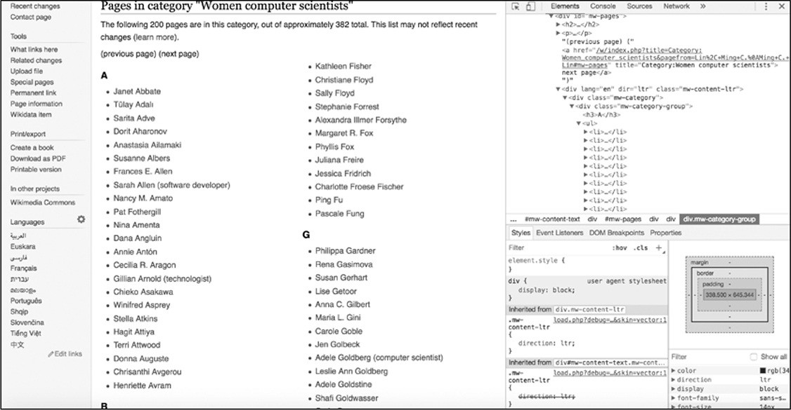 与前一章中相同，使用Web检查器，检查器能够隔离相关代码。在本例中，通过Web检查器找到一个由维基百科作者和编辑组成的女性计算机科学家列表，如图5-3所示。

*图5-3：通过浏览器进入想要抓取的维基百科页面，打开Web检查器*

如上图所示，计算机科学家的名字被细分为按字母顺序显示的姓氏排序的列表。在浏览器中该列表被扩展到两个web页中。可以通过单击next
page链接访问第二个页面。

要显示哪些元素包含想要抓取的内容，可以右键单击列表中要抓取的名称，然后在web检查器中查看相应的HTML代码。同时可以检查在收集数据时可利用的模式。

右键单击"A"组中的一个名称，并在下拉菜单中选择"Inspect"选项。这样会改变Web检查器内部的视图：HTML视图应该跳转到选择的"A"组中包含名称的代码部分，并突出显示包含名称的标记。网站代码可能很长，其包含数百个HTML标记，Inspect可以在网站的HTML页面中找到在页面上看到的特定元素。如果不能理解Chrome的web检查器的话，可以把它想象成在地图上的"在这里"标记。

找到了"A"组中的一个名称在HTML中的位置后，就可以开始检查包含"A"组中所有其他名称的HTML标记结构了。通过滚动代码到父\<div\>标记\
，选中该标记后在web页面就会突出显示相应部分（图5-4所示），该标签保存以"A"开头的姓氏列表。

 

*图5-4：突出显示字母"A"下的女性计算机科学家列表的父标记*

右键单击父标记并选择Edit as
HTML，就可以复制和粘贴父标记以及嵌套在父标记内部的每个HTML标记（图5-5所示）。

 

*图5-5：选择Edit as HTML*

把刚刚复制的代码粘贴到文本编辑器中的空文件中，这些代码应该与清单5-4中显示的内容相同。

*清单5-4：没有缩进的维基百科 HTML*

从这些HTML代码中可以看到，网站上的HTML代码通常很少或没有缩进或空格。这是因为浏览器从上到下、从左到右读取每行代码。不同代码行之间的空格越少，浏览器读取它们的速度就越快。

然而，这种简化的代码比缩进的代码更难让人阅读。使用空格和制表符允许程序员指示代码不同部分中的层次结构和嵌套。由于大多数web页面为了迎合浏览器而消减或最小化代码，所以有时需要对其进行反向操作。若代码是缩进的，那么就能够更容易阅读和理解包含所需信息的HTML元素的层次结构和模式了。

网路上有许多免费工具可在HTML代码中重新引入缩进和空格，包括Unminify（http://unminify.com/）。只需要复制缩小的HTML，将其粘贴到该工具提供的窗口中，然后单击按钮即可（见清单5-5）。

*清单5-5：带有缩进的维基百科代码*

如清单5-5中所示，HTML页面内容包含类mw-category-group➊的父\<div\>标记，在\<h3\>➋标记内包含字母表中的字母，在\<ul\>➌标记包含无序列表，\<li\>➍标记包含所有姓氏以\<h3\>标题中指定的字母开头的女性（在本例中为A）。还存在指向每个女性的维基百科页面链接名称的\<li\>标记➎。

###### 把页面内容存储在变量中

根据对以上HTML代码的了解，回顾一下打开页面后需要做的事情：

1\. 从第一页中获取所有无序的名称列表。

2\.
从每个列表项中提取信息，包括女计算机科学家的姓名以及她的个人资料的链接和她所属的字母。

3\. 基于此信息创建一行数据，并将每一行写入csv文件。

 图5-6中的表格是根据这些说明来构造数据样子。

*图5-6：可以帮助我们构建抓取工具的表格模型*

> 我们用脚本依据字母表抓取，回到Python脚本文件中，并输入清单5-6中的代码：

*清单5-6：使用Beautiful Soup检索HTML代码*

在这段代码中，使用find()➊函数查找包含类mw-category的\<div\>标记。这是包含想要抓取的全部内容的\<div\>标记（与在前面通过Web检查器查看页面时看到一样）。将该值（即包含所有列表的整个HTML块）分配给变量content。下一行将包含类mw-category-group➋的所有\<div\>标记放入变量all_groupings中。此处使用函数find_all()来完成，该函数根据指定的特性在HTML中搜索元素，并创建搜索到的全部元素的列表。给find_all()函数传递两个参数：字符串"div"，
希望find_all()找到什么类型的HTML元素；以及类参数"mw-category
group"。这就是说让find_all()函数获取具有类"mw category
group"的每个\<div\>，并创建搜索到的列表。变量all_groupings会包含一个HTML元素列表，其中含有按字母顺序排序的名称列表，以及每个妇女姓氏的第一个字母。

接下来就可以按字母顺序遍历每个列表，并从每个列表中收集名称。把清单5-7的代码输入到Python文件中。

*清单5-7：使用for循环收集每个名称*

第一步编写一个for循环➊，用来遍历刚添加到变量all_groupings中的每个分组。然后，使用grouping.find()函数收集无序列表标记\<ul\>➋中的内容，并将所有收集到的内容放入变量names_list中。接下来，我们再次使用grouping.find()函数收集标题标记\<h3\>➌的内容。代码grouping.find（"h3"）包含所有标记\<h3\>，但对于csv文件只需要与每个标题关联的文本，使用get_text()函数提取属于每个组的内容。最后但并非最终，获取\<ul\>无序列表中的每个列表项标记\<li\>。由于把所有\<ul\>分组存储在names_list中，因此可以直接在变量names_list➍上直接使用find_all()函数。至此完成获取字母和所有相关名称列表的操作了。

脚本的最后一步是创建一行信息，其中包含名称、链接和连接到每个名称的字母（清单5-8）。

*清单5-8：把每个名称的信息分配给变量，创建写入csv文件的行数据*

脚本中的代码开始变得有些复杂了：在一个循环中嵌入另一个循环。首先，必须循环浏览每个字母表。清单5-8中的代码中是在清单5-7的循环中编写另一个for循环➊。在清单5-8的嵌套循环中，循环遍历存储在当前变量alphabetical_names中的列表项标记\<li\>中的每个字母名称。

每个\<li\>列表项标记都包含一个名称，使用属性text➋提取该名称。此列表项还包含链接，使用其他两个功能来获取这些链接。使用find()函数➌获取锚标记\<a\>。find()函数有两个参数：第一个参数是想要查找的标记（对于锚标记是一个"a"）；第二个参数是可选的，表面不必总是向其传递参数。可选参数具有默认值，可以在需要时更改。在这种情况下，可选参数是href，默认情况下通常将其设置为值False。通过设置href
=
True➌告诉函数仅在标记具有href属性或链接的情况下才获取锚标记。如果不传递可选参数，则find()函数将默认获取每个锚标记。

将检索到的锚标记存储在变量anchortag内，该变量现在会包含检索到的锚标记中的所有信息。通过访问锚标记的href值获取标记内的链接信息，该值是作为属性存储在标记内。使用包含字符串"href"➍的方括号来获取href属性。然后创建一个字典来构造收集到的数据（清单5-9）。

*清单5-9：创建一个字典存储数据*

每次for循环迭代时都会创建一行数据。在代码的第一行中，使用在第➊行中打开并在第➌行中关闭的大括号为变量row分配一个字典。然后在字典内为每个键（name➊，link➋和letter_name➌）分配一个值，这些值保存了在先前脚本中收集到的数据。最后把数据行附加到列表变量rows➍中。

到目前为止，您编写的脚本应类似于清单5-10。

*清单5-10：编写的整个脚本*

如果只想从一个页面收集数据，那么这个脚本就可以完成想要的任务了，但是如果需要从几十个甚至几百个页面收集数据，那么该脚本就达不到要求了。还记得之前一直强调：应该编写可重用代码吗？在本练习中终于有了一个用例！

###### 使脚本可重复使用

现在有了一个脚本，这个脚本可以在一个页面上抓取每位女性计算机科学家的名字。但是这个页面只包含想要抓取名字的一半内容，因为女性计算机科学家有很多，维基百科不得不把这个列表分成两个网页。

若要获得完整的列表，需要从下一页获取其余的名称。通过将刚刚编写的所有代码包装成一个可以重用的函数来实现这一点（清单5-11）。

*清单5-11：将脚本放入函数中进行重用*

要在脚本文件中重新生成清单5-11，首先要从当前脚本中删除以下代码：

因为需要在多个url上运行代码，所以不再需要单独为url变量赋值。

接下来让Python创建一个名为scrape_content()➊的函数，其参数是url。然后之前的代码➋组成scrape_content()函数。scrape_content()函数中的所有代码都与清单5-10中的代码相同，只是现在这些代码缩进的在函数内。(如果使用的代码编辑器没有对代码进行自动缩进，可以使用TAB键进行缩进。)在➋中可以看到使用requests.get
()打开一个了url，此处的变量url是指在定义函数中制定的参数url➊。

简单地说只是给Python提供了一个用于在调用函数scrape_content(url)时需要执行操作的指令手册。用一个实际的url替换url参数，然后脚本就能打开该url并进行抓去。例如，要在维基百科页面上运行该函数，只需在脚本中添加以下行：

然而，需要多次运行这个函数。如果仅仅在一个或两个url上运行该函数，那么就没有很大的问题，但需要在数百个url上运行它，那么需要稍微修改一下脚本代码。可以通过创建一个包含多个URL字符串的列表来实现，这样就可以遍历这个列表，然后为每个链接运行函数。为此，在清单5-11的代码之后将清单5-12中的代码添加到脚本中。

*清单5-12：使用循环在URL列表上运行该函数*

变量urls➊是一个容纳两个字符串的列表：第一个是含有上半部分女性科学家名字的维基百科页面url；第二个url链接保存剩下的名字。然后编写一个for循环，通过对每个在urls➋中的url运行scrape_content()函数➌抓取数据。如果想在更多的维基百科列表页面上运行抓取工具，只需将这些页面作为添加到列表urls即可。

至此已经将所有数据放入了变量rows中了，是时候把数据转换为电子表格输出了。要实现这个要求，只需把清单5-13中的代码行添加到脚本中。

*清单5-13：从收集的数据创建csv文件*

之前,使用open()函数打开csvfile➊语句来创建和打开一个文件名为all-women-computer-scientists.csv的csv文件。因为之前来收集数据是使用的是字典，因此需要指定表格的标题名称列表➋,然后使用csv库的DictWriter()函数➌生成writer，最之后采用writer的writeheader()方法➍向第一行写csv文件的列标题。

最后，只需要遍历rows➎中的每一行，然后把每一行写入表格中writer.writerow()➏。

###### 练习文明的抓取方式

至此已经完成了编写一个能够有效收集数据的工作脚本。但是有两件事应该考虑添加到这个脚本中：第一使抓取工作透明清晰；第二避免承载数据的服务器超载。

首先，为抓取攻击提供详细的联系方式。如果出现任何问题，正在被抓取网站的所有者可以联系你。在某些情况下，如果抓取工具正在造成麻烦，你的PC会被从该网站上踢下来。如果网站所有者能够联系到你，并告诉你调整你的抓取工具，那么就能够继续在哪个网站上的数据抓取工作。

第二，在脚本中导入的库requests附带了一个有用的参数headers，可以在使用requests访问web页面时调整这个参数。该参数接收一个Python字典作为输入，该字典用于保存对于网站所有者来说很重要的信息。将清单5-14中的代码添加到脚本中，同时用您自己的信息替换作者的信息。

*清单5-14：在脚本中添加header参数*

清单5-14中的代码必须放在脚本的导入运行库之后，因为需要加载requests库才能用到。由于headers是预设置的变量，并且不会在脚本运行时更改，所以可以将headers放在靠近脚本顶部的位置，最好就在导入库的代码之后。用还有headers参数的语句page
= requests.get(url, headers=headers)替换原代码page =
requests.get(url)。这样每次你想要对某个网址进行数据抓取时就能够提示网站所有者（或管理者）您的信息。

分配给headers变量的信息是通过脚本打开URL时与服务器交换的信息。正如您看到的，所有这些信息再次以JSON的形式构造（也可以说是Python的字典格式），这些字符串分别表示键（"user-agent"，"
from"）和值（"Mozilla/5.0 (Macintosh; Intel Mac OS X 10_12_6)
AppleWebKit/537.36 (KHTML, like Gecko) Chrome/65.0.3325.162
Safari/537.36","Your name <example@domain.com>"）。

首先，向网站所有者提供有关正在使用的用户代理(user-agent)类型的信息。虽然对于机器人来说该信息不是必要的，但可能会使抓取工具打开通常无法在网络浏览器之外打开的网站。抓取工具还可以使用计算机已经安装的其他浏览器来访问网站。用户代理报头(user-agent
header)可以传递抓取工具用于在浏览器中打开页面时浏览器功能的信息（在此示例中，没有进行这样的操作，但这对于编写其他机器人是一种有用的习惯）。要了解还使用了哪些其他用户代理，可以在网上找到各种在线工具，包括此处的一种：[*[https://www.whoishostingthis.com/tools/user-agent/]{.ul}*](https://www.whoishostingthis.com/tools/user-agent/)。

然后指定键from➋的值内容，可以把您的姓名和电子邮件地址当作联系信息写入其中。最后就是在requests.get()使用这个头文件参数➌。

最后但并非最终，还应该避免让承载正在被抓取网站的服务器负担过重。这种情况经常发生在抓取工具连续快速打开多个页面时，其原因是没有在每个请求之间暂停一下。

为此，使用一个名为time的库（属于Python的标准库），该库能够实现脚本运行时进行暂停的功能。将清单5-15中的代码添加到脚本中。

*清单5-15：在脚本的代码中添加暂停*

使用time库之前,先要把库导入➊。然后使用time库中的sleep()函数➋，这样就可以实现让抓取工具实现暂停的功能。sleep()函数接受一个数字（表示中断的时间，以秒为单位）作为参数，该数字可以是整数，也可以是浮点数➋。在示例的脚本代码中是指示其等待2秒后再抓取数据。

将本章的所有代码片段拼接在一起，这个脚本应该如清单5-16所示。

*清单5-16：完整的抓取脚本*

保存完整的抓取脚本后，再运行和测试该脚本之前，请确保计算机已连接了互联网。打开命令行接口，在其中切换至包含该该脚本的文件夹，然后根据所使用的Python版本在命令行接口中运行以下命令之一。在Mac上，使用以下命令：

在Windows机器上，请运行一下代码：

抓取脚本运行完成后会在包含wikipediascraper.py文件的文件夹中生成一个csv文件。

#### 概要

总而言之，本章中的实践不仅让读者体验到了抓取的力量，也提醒了抓取行为可能产生的道德后果。**仅仅因为你有能力做某事并不意味着你可以随心所欲地去做。**阅读本章之后，读者应该掌握了***负责任***地收集数据所需的所有知识。

第二部分 数据分析
=================

{width="2.508462379702537in" height="2.51in"}6 数据分析导论
-------------------------------------------------------------------------------------

过去的几章致力于寻找和收集数据。但是现在我们有了数据，接下来应该做什么呢？本章会帮助您理解如何进行简单的数据分析。

在很多情况下，术语数据分析描述了一个非常基本的行动：采访一个数据集。与任何采访一样，向该数据集问问题。有时，这些问题并不是特别复杂，比如：某一列从最大到最小值排序。在其他的时候问题可能非常复杂，需要通过运行多个分析来回答。

本章将向读者介绍通过*表格（Sheets）*进行数据分析的基本概念，*表格（sheets）*是一个Google基于web的程序，谷歌帐户持有人可以免费访问。本章中讨论的大多数特性也可以在Microsoft
Excel中找到。

虽然在本章中使用的许多方法和工具可以很容易地在Python中实现相同的功能，但是对于初学者来说，在专注于编写代码之前，应先专注于分析的概念步骤。换句话说在以代码形式执行数据分析之前，在类似于Sheets或Excel的程序中进行数据分析有助于对于数据分析概念的理解。为此，在本章中会将使用各种分析方法来检查两个Twitter帐户的活动，并逐步介绍数据分析过程。

#### 数据分析过程

在介绍数据分析过程之前，先要理解一个概念（或者说是假设）：数据集是可靠的事实集合，可以像接收这些数据一样使用它来进行研究。通常认为数据集只是汇总数据，但对汇总数据的发现过程会变得相当混乱，对分析问题或其他原始数据（未处理的数据）数据库的答复也可以千差万别。

美国人口普查局等组织提供的数据表通常已把成千上万的原始数据条目中进行了清理，处置和汇总，其中许多数据条目可能包含数据科学家努力解决的不一致之处。例如，在一张列出人们职业的简单表格中，这些组织可能已经解决了不同但本质上等效的回答，如"attorney"和"lawyer"（都指代律师）。

同样地，在本书中看到的来自社交网络的数据原始数据可能相当不规则，而且很难处理，因为这些数据是由真正的人提供的，每个人都有独特的怪癖和发帖习惯。必须对这些数据进行总结后，才能发现趋势和异常，然后回答提出的问题。这种处理并不一定非常复杂和非常困难；通常仅仅需要我们完成一些简单但相当乏味的任务。

在分析数据的过程中涉及到几种主要的方法。在这一章中看到的内容改编自阿曼达·考克斯Amanda
Cox和凯文·奎利Kevin
Quealy在纽约大学的数据新闻学课程：http://kpq.github.io/nyu-data-journalism-2014/classes/sort-filter-aggregate-merge/。

> **修改**（**modifying**）和**格式化**（**formatting**）：数据几乎从来都不按照需要的格式来组织的。通过修改和格式化，可以更容易地比较数据中的值。
>
> **聚合**（**aggregating**）：可以通过对格式化的数据应用简单的数学运算来查询数据，这步骤称为聚合。聚合数据可以是在数据列中查找所有值之和的形式，也可以表示对给定值的实例进行计数，例如名称在电子表格中出现的频率。
>
> **排序**（**sorting**）和**过滤**（**filtering**）：有时只想问数据，在任何给定的列或类别中最大或最小值是什么？一般通过对数据进行排序和过滤来回答这些基本问题。例如，通过按降序按钮对电子表格进行排序，就可以轻松地在表格的顶部看到最大值。通过过滤可以找出哪些行共享特定值。
>
> **合并**（**Merging**）：比较两个数据集的最有效技术之一是将它们合并，或将它们组合为一组。

概括地说，这些方法可能不是很直观，但在本章中会使用这些方法来调查和更好地理解两种类型的Twitter用户的活动：自动机器人帐户的活动和人类的活动。

#### 机器人识别

社交网络上既有通过社交媒体与朋友联系的真人，也有通过代码控制自动账户的机器人。机器人按照脚本的指示发布内容，这些机器人并不是全部用来制造混论或者实时网络诈骗，比如：一些自动账户会发布令人愉快的俳句，而另一些则会向你发送新闻机构的最新头条。

 在本章中将会学习如何使用谷歌Sheets来检查Twitter帐户的社交媒体数据，这些数据所属的账户已经被数字法医研究实验室的专家确认为机器人。然后将这些数据与真实社交媒体用户的活动进行比较。

本章中的分析与的BuzzFeed News分析非常相似，BuzzFeed
News通过识别Twitter机器人可能显现的各种特征来识别自动账户。图6-1展示了BuzzFeed制作的两个图表，该图标用来说明机器人和人类活动之间的区别。

*图6-1：两张图表显示了2017年人类活动与异常活跃机器人之间的对比*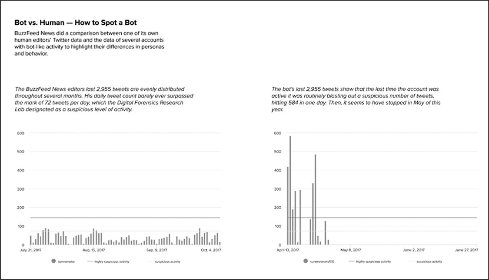 

某些人出于经济或政治动机，使用机器人进行在线辩论，并引导对话转向特定的话题。在最坏的情况下，大量的机器人可以用来夸大有多少人持有某种观点。

虽然没有绝对可靠的方法来识别虚假或欺骗性的在线参与者的身份，但最能用于说明如何识别机器人的迹象之一是：一个账户发出的推文超出了人类的能力范围。所以在本实验中，查看机器人和真人的日常活动水平。通过导入、清理、格式化和分析从Twitter帐户\@sunneversets100收集到的帖子的数据集，进行此项实验过程。在此过程中会熟悉谷歌Sheets提供的工具。

#### GOOGLE SHEETS入门

为了使用Google
Sheets，需要注册一个Google帐户。如果之前没有注册相关账户，则可以通过https://accounts.google.com/SignUp免费注册一个。完成注册后通过浏览器导航至Google云端硬盘（<https://drive.google.com/>）。

如何组织数据非常重要！与编写代码一样，数据分析可能需要多次尝试才能正确，而且可能会需要多个步骤才能完成分析（即：回答问题）。因此，组织数据不仅是为了整洁，也是为了准确。数据越有组织，就越容易跟踪分析的步骤，修改分析方法，并在未来重现分析过程。

首先在Google
Drive中创建一个文件夹，此文件夹用来存储与数据分析相关的所有文件。提示：将每个项目都放在一个文件夹中是一个很好的习惯。与脚本中的注释类似，创建不同文件和文件夹是帮助进行分析的一种方式，这些文件和文件夹就像对未来的自己提示当时思维过程的注释。文件夹和注释允许我们和其他人更容易地复制工作，并且可以补充我们为记录数据分析步骤而编写的任何其他注释。在Google
Drive新建一个文件夹步骤是：选择New（新建）▸ Folder（文件夹）。

接下来就是在弹出框中命名新建的文件夹。对数据文件夹和文件有一个明确的命名约定是确保我们和观察者都能清楚地理解文件夹用途的好方法。项目的命名约定由您自己决定，但是要保持一致。作者通常使用日期和一些显示文件夹内容的关键字来命名文件夹，比如:mmddyyyy-related-keywords。在本练习中，可以使用这个约定并将新文件夹命名为04062019-social-media-exercises。

现在创建一个新的电子表格文件。如果还没有在新文件夹中创建表格文件，可以通过Google
Drive的左侧导航栏中创建。

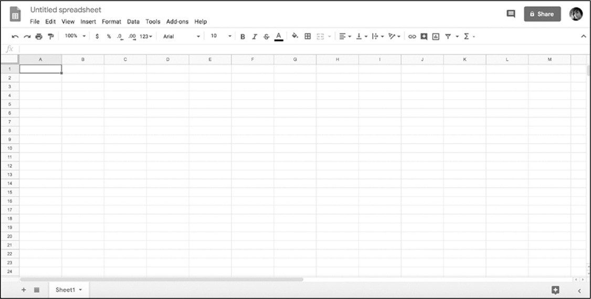 通过选择：**New** ▸ **Google Sheets** ▸
**Blank
Spreadsheet**创建一个空白的电子表格。完成操作后在浏览器中会弹出一个新选项卡，新电子表格会在新选项卡中被加载(参见图6-2)。如果之前使用的是微软Excel，新选项卡中的样子会感到非常熟悉。

*图6-2：空白表格*

使用与04062019-social-media-exercises文件夹相同的约定命名表格文件：04062019-tweet-analysis-\@sunneversets100。

接着就是用数据填充该表格。在本练习中使用用Twitter
API下载的来自\@sunneversets100的数据填充。这些数据是Python脚本收集的，可以在https://github.com/lamthuyvo/social-media-data-scripts/找到有关Python脚本的详细信息。数据从API收集后以csv文件的形式保存，csv文件格式是Google
Sheets能够识别的文件之一。（读者也可以直接下载数据文件：https://github.com/lamthuyvo/social-media-data-book）

若要导入文件，请通过如下操作：**File** ▸ **Import** ▸
**Upload**。当出现提示时，选择上载（**Upload**）功能，切换至含有@
sunneversets100数据的文件夹，然后上载csv文件。

Google Sheets会要求您选择导入选项。选择导入位置（**Import
Location**），分隔符类型（**Separator
Type**），然后转换数字（**Numbers**）和日期（**Dates**）。然后选择"替换当前工作表（**Replace
Current
Sheet**）"作为导入位置------这就是使用Twitter数据填充当前空白工作表的步骤。由于数据格式为csv文件，因此选择逗号作为分隔符。还可以让Google
Sheets自动检测分隔符，这样操作一般也能正常导入。最后，当Google
Sheets要求将文本转换为数字和日期时，请选择**No**。

无论是在Google
Sheets，Python或任何其他工具的使用过程中，了解文本转换（**text
conversion**）在进行数据分析时是非常重要的。同样，格式化（在Google
Sheets中指的就是"转换文本"）在进行编程时也需要认真的对待。

诸如Google
Sheets之类的软件可以识别字符串（字符串：string，文本格式：text）与其他类型的数据（例如整数：integer，浮点数（数字）：float或日期时间：time）之间的差异。尽管可以根据值的书写方式确定值是代表日期，数字还是单词？但是大多数软件和编程语言无法自动执行此操作，因此通常需要进行复杂的猜测。如果要在导入选项"将文本转换为数字和日期"下选择"是"，则Google
Sheets会进行处理，即尝试猜测哪个值是数字，日期或单词。猜测字符串应该是那种类型的数据，在数据分析中一般不让工具自动处理。如需要将邮政编码解释为文本而不是数字，因为尽管邮政编码仅包含数字，但其作用类似于区域的标签。但是，如果把确认邮政编码是那种数据类型的步骤留给Google
Sheets，则可能会把邮政编码转换为数字，可能导致信息的丢失（如：以零开头的邮政编码会丢失第一位数字0）。所以当涉及猜测时应尽量少用自动化程序，除非自动化得出的结果是完全符合要求的。

 当完成了前面所有的步骤之后，就会形成一个类似于图6-3的电子表格。

*图6-3：在表格中导入不更改类型的数据*

#### 修改和格式化数据

为了有效地使用Google Sheets中的函数，需要让Google
Sheets能够正确地识别每个数据列的数据类型，为此要对数据列进行格式化。在开始更改表格之前，首先备份原始的、未更改的数据集。此步操作在进行数据分析时非常重要，可以在接下来的分析过程中发生错误时能够回到原始的数据状态。

由于人类的不可靠性，在分析过程中须反复检查数据操作和计算过程，所以发生问题时应确保可以回到原始的数据集。虽然Google
Sheets和其他谷歌产品一样能够自动跟踪文件的变化(见**File ▸ Version
History**)，但也应该保留一份格式容易理解数据的备份，这样就可以在分析时用于参考。当需要查看数据最初的样子时，就不用调出旧版本的表格了。

解决上诉问题最简单的方法就是为数据分析的每个步骤创建一个工作表的副本，并对其重命名（命名规则可参照之前的方式）。当从数据集中创建、更改或删除值或整个列并感觉到错误时尤其有用。因为对数据的破坏性修改后可能很难撤销，因此通过多个工作表跟踪分析步骤从长远来看可以使整个分析过程变得可靠。

 接下来开始对Google
Sheets进行操作，首先转到工作表的底部，双击sheet1
选项卡，把sheet1修改成一个描述内容的名称。这是在本例中重命名的第一个工作表原始数据（**raw
data**）。然后复制工作表：单击工作表名称旁边的箭头，并从弹出的菜单中选择**duplicate**（复制），见图6-4。

*图6-4：复制表格*

复制完成后会产生第二张表，把新的表格重命名为"**step 1: modify and
format"**。此表就是用于更改格数据类型的表格。在"**step
1**表格"中，通过点击列标题上方的字母，选择包含每个推文特性的列（大部分时候，人们感兴趣的值是B列中的时间戳timestamp），当选中后整列应突出显示为蓝色。然后选择**Format**
▸ **Number** ▸ **Number**，如图6-5所示。

此步骤操作会把该列中的每个值从字符串转换为数字。（对retweets列重复此操作）

 

*图6-5：电子表格格式化选项*

之前从API获得的时间戳的粒度非常细，该时间戳显示了Twitter是如何构造和存储数据的。一般来说数据粒度越细越好，这样就可以各种方式聚合数据：可以看到发送推文的确切时间或者查看发布推文的日期。但是，要运用这些不同类型的数据前需要格式化这些数据。

之前提到过：数据分析通常包括将数据转换为正确格式的乏味且有时让人难受的过程。特别是对于人类创建的数据，需要先清洗数据，然后才能比较值。例如，之前收集的推文文本数据，在分析前需要解析同一单词的各种拼写（例如，"gray"对"grey"）或删除拼写错误和错别字。对于通过代码或由机器人收集的数据，可能需要通过将数据分为不同的部分或找到不同的组合方式来修改数据。以数据的时间戳数据为例，应将一条推文的发布日期与发送日期分开。

现在快速回顾一下任务：分析机器人的Twitter活动，用以区别于人类活动。通过查看可疑帐户\@sunneversets100每天平均发推文次数来进行识别。专家曾说过：与人类发推文相比，机器人活动频率异常高。根据数字取证研究实验室的说法，每天发送推文72次以上非常可能是机器人，而每天发送推文144次以上可以认定是机器人了。完成数据的格式化后，就可以使用表格来确定\@sunneversets100的活动水平是否可疑了。

当前数据中的时间戳数据同时显示发布推文的日期和时间，如：2017-05-01
05:43:57。通过计算原始数据中给定日期出现多少次，就可以获得每日发布的tweets
@ sunneversets100的计数。为此将使用一种称为透视表（pivot
table）的功能。但是使用数据透视表之前，必须创建一个仅包含每个推文发布的日期数据列。那么就需要删除时间戳中有关时间的信息，仅保留日期信息。

分割文本（现在表格中的时间戳仍是以文本格式存在）的一种简单方法是使用Data菜单下的Split
Text to Columns
Tools。该内置工具通过在列值中查找特征找寻文本的模式，然后一句该模式把值分成两列。这些模式可以类似包括用逗号分隔的姓和名（如"Smith,
Paul"），也可以包括用空格分隔的日期和时间。

进行分割文本操作之前需要在created_at列的右侧创建一个空白列。右键单击created_at列上方的字母，然后从菜单中选择"**Insert
1 right**"。然后在使用"Split Text to Columns
Tools"工具时，不会覆盖其他数据。选中包含时间戳数据的列，然后选择"**Data**"▸"**Text
to Columns**"。

Google
Sheets会通过弹出菜单提示选择分隔符（separator），默认为"自动检测"，但是由于可以确定分隔日期和时间的部分是一个空格，因此直接选择"空格"。完成操作后会把数据中空白的左侧值保留在当前列中，把数据中空白的右侧值保存至新建的列中。

此工具最适用于为纯文本格式的数据。回想一下在第一次导入数据时，Google
Sheets要求将文本转换为数字和日期时选择了"No"。这样就确保了每个数据单元格都被解释为字符串而不是数字或日期。在本例中，最好在把数据格式化为其他数据类型之前，保留数据值的字符串格式然后再进行格式化操作。

为了让Google
Sheets知道如何解释数据类型，经常需要重新格式化整个列。如果把数据值格式化为日期（例如created_at列中的日期），那么该数据值只能使用"日期（一种特殊的数据类型）"的功能。同样，只能对已经格式化为数字的数据值执行数学运算。

在更改电子表格中其他数据值格式之前，先对刚刚生成的两列数据进行重命名（日期列命名为date，时间列命名为time）。完成重命名之后就可以计算在一天之内推送推文的频率了。

#### 聚合数据

通过之前的操作（导入数据、修改数据、格式化数据）之后，就完成了数据分析的必要且基本的步骤。在准备好数据之后，就可以进行下一步操作：**聚合数据**（也称之为：汇总数据）。在Google
Sheets中可以使用两个功能实现数据的聚合：数据透视表和公式。

###### 使用数据透视表汇总数据

如果读者使用过Microsoft
Excel之类软件，应该数据透视表是一个非常强大的工具，那么在Google
Sheets也是。数据透视表能够汇总大量详细数据并以各种方式对其进行分析。例如，计算术语在列中出现的次数，或者根据日期或类别计算数值的总和。换句话说，数据透视表可以在易于浏览的介面中鸟瞰大量资料。要实现上述的功能，需要创建一个汇总表，该表包括有关原始数据的统计信息，例如某个列中某个值出现的总次数。

现在使用数据透视表在Twitter数据集中找到每个日期的频率。由于数据集中的每一行代表有关单个推文的信息，因此特定日期出现的次数也代表在任何给定日期\@sunneversets100帐户推送的推文数量。

进行此项分析时，先要选择要包含在数据透视表中的数据。选中"step
2"中的所有数据，然后在菜单中选择"**Data**"▸"**Pivot
Table...**"（见图6-6），并在要求插入数据透视表的位置时选择选项表。完成之后会在Google
Sheets中看到一个名为"***Pivot Table 1***"的新表。

*图6-6：在"Data"菜单中创建数据透视表* 

在***Pivot Table 1***表的右侧，Google
Sheets提供了许多选项来填充数据透视表，在本例中用日期进行填充。

选择**Rows**▸**Add**，然后从下拉菜单中选择date列，Google
Sheets会为数据集中出现的每个日期创建一行。然后需要告诉数据透视表如何对日期进行汇总（如：计数等）。

本例中需要计算每个唯一日期发送了多少次推文。单击**Values**▸**Add**，然后再次选择date列，然后选择希望Google
Sheets对数据执行的汇总类型。此时有两个选项可能符合分析要求：COUNT和COUNTA。由于COUNT仅适用于数字格式的数据，因此选择COUNTA。一般来说，可以把COUNTA视为可以计数任何东西的工具。

 完成上述操作后，数据透视表就显示出数据集中每个日期发送推文的次数（图6-7）。采用数据透视表就可以对\@sunneversets100帐户进行初始评估。之前提到过，一天发送推文72次以上的帐户是可能时机器人，而发送144次以上的帐户是基本可以确认时机器人。那么现在的问题：该帐户是否存在每天发送72次以上的情况呢？是否有发送144次以上的情况？
通过查阅数据透视表可以看到，在最繁忙的一天该帐户发布了586次推文，这表面\@sunneversets100账户在24小时内大约每2.5分钟发布一次推文，乍听起来好像是一个普通人只想与世界分享想法的事情。

*图6-7：使用COUNTA生成的数据透视表来查找每个日期的出现频率*

###### 使用公式进行数学运算

在刚刚的操作中仅仅使用数据透视表来回答一个关于数据的重要问题：一个特定的Twitter帐户每天发推文的频率是多少？从汇总的数据中可以看到机器人在推特上发送推文的次数相对于人类用户来说是非常的高。但是人们在Twitter上发送推文的行为每天都在变化。即使一个账户一天发72次或更多的推文，也并不一定意味着这个账户可能是机器人。

如果还需要找出该帐户每天发送推文的平均数量，那么就要使用一个新特性来回答该问题------公式（formulas）!

一般来说，可以把公式看作是Google Sheets中内置的函数。Google
Sheets通过等号（=）区分普通数据和公式。所有公式均由等号，函数名称以及括号组成，例如"=lower（A2）"。

如果在Excel或工作表中使用公式，那么就已经在做基本的编码（code）了。与Python函数一样，公式有严格的规则（即语法），接受参数并允许基于这些规则和参数之间的交互创建新值。

比如第1章中查找字符串的长度的Python函数len()：

Google Sheets也有公式**len**实现同样的功能。

在写入该公式的Google
sheets的单元格中会显示9，这个9代表了刚才字符串的长度（空格也算一个字符）。

在Google
Sheets中可以把单元格作为参数传递给公式。要使用一个单元格作为参数的方法是使用单元格在电子表格中的坐标（列字母和行号：可以在电子表格的顶部和左侧找到）。

在第一列的第二个单元格（也就是：在列A和行2中）中输入apple
pie。通过把刚才公式中的"apple
pie"替换为单元格坐标A2来显示这个字符串的长度(注意！在使用单元格坐标时不使用引号，这点与Microsoft的不同)：

还可以把多个单元传递给某些公式。选择多个单元格的语法根据要选择的单元格而改变。

回到数据分析案例，想要找到@
sunneversets100帐户发布的平均帖子数。可以使用恰当命名的=average()公式来执行此操作。

average()公式可以接收一组单元格并得出这些单元格值的平均值。该公式可以选择单个单元格或范围内的单元格。例如，通过向average()公式传递一个单元格列表（每个单元格坐标之间用逗号隔开），就可以获取数据透视表中所有单元格的平均值：

使用average()公式更方便的方法是使用冒号选择一系列连续的单元格。选择的范围是从在冒号之前指定的单元格开始至冒号之后指定的单元格中的所有单元格。

要获得单元格B2至B15的平均值，可以直接使用如下方式：

要选择整个列时就不需要指定行号：=average(A:A)，对于整行也是一样：=average(2:2)。Google
Sheets还可以从同一文件的不同工作表中选择单元格，方法是：用引号和感叹号指定工作表名称（=average("sheet1"!A:A)）。

选择单元格的最后一种方法是使用鼠标。在一个空单元格输入等号（=）写入公式，然后进入括号内后用鼠标选择要输入的公式的单元格即可。在此步骤的练习中使用"=len()"公式作为示例。输入公式后，使用鼠标选择要传递给该公式的单元格。这边选择刚刚输入字符串"apple
pie"的单元格A2，"回车Enter"之后就能看到在单元格A2的字符串的长度9。

解了公式的工作原理后，回到Twitter分析中并应用所刚刚学到的知识。打开数据之前创建的透视表，然后把公式=average(B2:B15)输入到一个空单元格中。按下回车键后就可以看到\@sunneversets100帐户每天的平均推文数量为212，这个平均值仍然非常高。

Google
Sheets包含很多类似的公式。例如，如果在一个单元格中输入公式=sum()并选择一列数字，就可以得到这些值的总和。

公式的优点是：可以把公式复制并粘贴到多个单元格中，这样就可以对几列或几行数据执行相同的操作。Google
Sheets还能进行智能复制和粘贴。要查看其工作原理，请返回到"*step 1: modify
and format*"工作表。

假设要测量电子表格中每条推文的长度。在H列的右侧创建一个包含每个推文文本的新列，然后把公式=len(H2)输入到单元格I2中，然后把该公式粘贴到I2之后的所有行中，Google
Sheets就能给出每个推文的长度。发生这种情况是因为Google
Sheets并不只是复制公式的实际字符，还因为Google
Sheets具有内置的逻辑可以更改与应用公式的单元格有关的公式参数。

本书并不涵盖Google Sheets提供的所有公式，但是应牢记一个便捷工具：Google
Sheets检测到正在使用公式时显示的小帮助程序窗口。当开始输入公式时该窗口会自动弹出，通常会显示有关该公式采用的参数类型的信息、提供有关如何使用该公式的示例、并说明该公式输出的数据（图6-8）。

使用数据透视表和公式就可以执行数据分析的简单操作，只需单击几下即可回答有关数据集的问题。更重要的是也可以通过其他多种方式回答数据查询问题。

 

*图6-8：Google Sheets弹出式公式帮助器窗口*

#### 排序和筛选数据

至此知道了如何导入、修改和汇总数据，下一步是对结果进行排序和过滤，以便对数据进行排名或分离操作。

从最大到最小（或反之亦然）对数据进行排序是一种为结果分配层次结构的好方法。在本章的案例中，可以对数据透视表中的数据进行排序，以便了解可疑的机器人帐户发送推文最多的一天的发送频率。要实现排序功能的一种方法是通过使用汇总结果创建一个新工作表并将整个工作表更改为*filter*（过滤器）视图。

首先通过拖动鼠标选中数据透视表的结果。高亮显示单元格后，右键单击其中一个高亮单元格并选择copy(或Mac使用快捷方式CMD-C,
PC使用CTRL-C)来复制所选内容。

然后创建一个用于对数据透视表数据进行排序的新工作表。通过使用一个名为*paste
special（在Microsoft
Excel中"选择性粘贴"）*的方法用数据透视表的结果填充这个工作表。

因为直接在Google
Sheets中复制会将公式和数据透视表的功能复制到新的表格中，所以就无法修改数据透视表中的实际值。不过Google
Sheets可以根据公式和数据透视表的结果粘贴值。右击新表的第一行和第一列的单元格，选择**Paste
Special** ▸ **Paste Values Only**（仅粘贴值）。当使用Paste
Special粘贴这些值时，这些值会被删除任何格式。这表明复制并粘贴到新单元格中的日期可以格式化为整数型字符串。若要重新格式化为日期，可以使用鼠标选中包含日期的单元格，右击其中一个高亮的单元格，然后选择**Format**
▸ **Number** ▸ **Date**。

 现在选中要转换为*filter*视图的数据，选择当前工作表中的所有数据的最简单方法是单击第一列旁边和第一行上面的空白矩形。接下来，单击过滤器图标旁边的小箭头(看起来像一个漏斗)，选择Create
New filter View(图6-9)。

*图6-9：Google Drive中筛选视图选项*

Filter
View（筛选视图）工具可以访问每个列的各种功能，比如根据值或条件过滤数据(如：只显示大于100的值)，还可以对数据进行排序。这个工具不会修改数据集------只会改变显示数据的顺序或者数据的哪些部分是可见的(当过滤值时不会删除值，这些值只是在应用过滤器时被隐藏了)。

在使用筛选视图工具前，先了解一下筛选视图工具的选项。在筛选视图中通过单击每个列标题旁边的三角形，可以对电子表格进行筛选。可以在每个列中选择和取消选择值，并根据是否包含某个值隐藏或显示行。

如果只对数据的一个子集感兴趣，筛选就非常有用了。筛选通常用于根据最小或最大阈值或特定时间段来分离原始数据。筛选视图工具的选项还可以帮助我们对数据集提出更具体的问题。例如在推文的分析中，可能只对至少有100个转发的推文感兴趣，或者希望查看某个特定月份内发布的推文。

筛选视图工具还可以根据条件筛选值------这是在前面学习Python时讨论过的概念。Google
Sheets的筛选视图工具中内置了许多方便的条件，可以根据相当简单步骤筛选数据。如按照Condition
Cell Not Empty选项来选择筛选器后表格会只显示有数据的单元格(图6-10)。

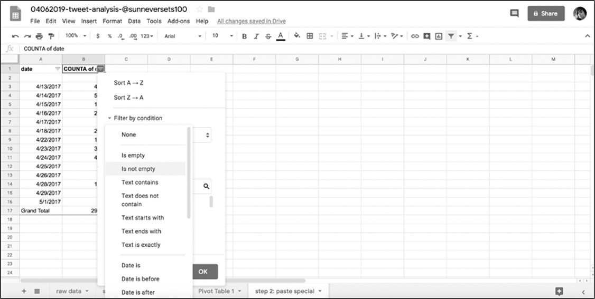 

*图6-10：Google Drive上的筛选选项*

最后，使用Sort A→Z（升序排序）和Sort
Z→A（降序排序）选项对数据进行排序。Sort
A→Z：从最小的数值到最大的，从最早的日期到最近的日期，或按字母顺序从A到Z。Sort
Z→A按降序对数据进行排序，与升序相反。

对数据集进行排序能帮助回答所面临的许多研究问题之一。在Twitter分析中可能包括以下问题：这个账户最早发送的推文是什么？最近怎么样？哪条推文最受欢迎？哪个转发最多？现在尝试筛选数据来回答这些问题。

#### 合并数据集

在数据分析过程中将讨论的最后一种方法是合并（merge）或联接（join）数据集。通过使用Google
Sheets等工具把一个数据集与另一个数据集进行比较是非常有效的方法。通过合并两个工作表，可以很容易地比较同一类型的值。

在进行相应的合并操作之前，应非常谨慎地判断数据集之间的关系：**相关关系不等于因果关系**。这表明着即使两个数据集看起来有关系，也就是说是相关的，但并不意味着一个数据集导致了另一个数据集的结果。数据集之间的相关性和因果关系应该得到来自报告、专家或实地研究的其他研究的支持。即使是两个或多个数据集之间最简单的比较也能难说明问题。

那么，如何操作才能合并Google
Sheets中的两个表呢？使用一个=vlookup()的公式来实现交叉引用两个表格，然后按照一个公共值将其合并。想要实现通过引用一个值在将其当作字典的表中进行查找时可以使用vlookup()公式。

例如，要把\@sunneversets100账户与真实人类账户在2017年的头两个星期内操作的推文活动进行比较，可以使用自己的帐户信息执行与\@sunneversets100相同的步骤。如果您没有Twitter帐户，则可以下载其他账户电子表格的副本（https://github.com/lamthuyvo/social-media-data-book），此副本中包含有关人力管理的\@nostarch帐户信息（<https://twitter.com/nostarch/>）。

要合并两个电子表格，先在Google
Sheets中创建另一个表。在这个例子中用2017年上半年\@sunneversets100账户的数据填充新建的表。可以把一个列命名为merged_counts_sunneversets100\_\<account\>，其中\<account\>表示是由人控制的Twitter帐户名称。

对于时间序列的列，重命名为date，然后填充日期数据。从A2单元格开始，最早的日期是2017年4月13日，然后在A3单元格输入2017年4月14日。想要date列中的其余行也填入日期，直至2017年5月1日，可以使用一些方便的表单功能来填充列的其余部分。输入两个日期后选中它，然后把鼠标移到选中第二个单元格的右下角，直到光标变成一个小十字，然后双击或拖动十字到第20行。Google
Sheets将根据在前两个单元中检测到的模式自动调整行。

接下来使用=vlookup()公式把\@sunneversets100账户的推文数据透视表与包含日期的工作表合并。在此之前，请在日期列旁边为\@sunneversets100账户的每日推文计数设置一个新列。

vlookup()公式中使用四个参数。首先是查找哪个值：

在本例中，A2单元应该包含时间序列中的第一个日期，即2017年4月13日。第二个参数是指哪个范围表示引用表或字典。

在此例中，第二个参数表示在此范围中查找单元格A2中的值(4/13/2017)。用字符串指定包含查找表的工作表的名称和\@sunneversets100的推文的每日计数(在本例中为\'Pivot
table 1\')，然后用一个感叹号(!)表示\'Pivot table
1\'是不同于正在输入公式表的另一个工作表的名称。之后，就像前面选择单元格一样，我们需要指定查找表的值所在的列，在本例中是A和B列，在公式中表示为"A:B"。

选择的范围应包括用于连接数据集的列（A列中的日期）以及要用于填充新表和合并表的值（B列中的计数）。在这种情况下，应确保A列中包含日期，公式试图在该列中的A2单元格（4/13/2017）中查找所表示的日期。对于数据透视表始终应确保被选择范围内的第一列包含要查找的值。

Google Sheets在"Pivot table
1"的A列中找到单元格A2中表示的日期后，会检查包含日期4/13/2017的行，然后在该行中查找值，查找到的值会显示在合并数据集中。vlookup()公式的第三个参数就是指定想要查找的值：需要告诉vlookup()哪一列包含要被拼接到新合并表中的值。而且更加复杂的是：vlookup()需要知道该列相对于被选中范围中第一列的位置。在此例中，该数据位于date旁边的列中，该列在被选中的范围内相对于date是第2列。

到目前为止借助vlookup()公式，已可以让Google
Sheets记住单元格A2中的日期。然后让Google Sheets转到"Pivot table
1"并筛选A列中的日期查找B列中的数据。一旦vlookup()公式在A列中找到包含日期的行，要求公式转到通过选择中的范围('Pivot
table 1'! A：B)的相对第二列。

第四个参数是让vlookup（）公式按照所查找的范围是否已按照与为数据合并创建的表相同的顺序排序。此处填入FALSE（为了安全起见，最好将其设置为FALSE，因为选择此选项将返回正确的结果，即使查找表的排序与当前表的排序相同）。*这个参数于Microsoft
Excel的vlookup函数的定义不同，如果读者采用Excel作为分析工具，那么请查看vlookup函数在Excel中的具体用例。*

要在指定的时间范围内(2017年4月13日到5月1日)在整个列中运行这个公式，可以复制并粘贴到整个列中。如前所述，Google
Sheets支持智能复制和粘贴，可以为每个不同日期运行公式。

完成上诉操作后，\@sunneversets100列中的单元格应该包含一系列公式。

 如果对人类Twitter帐户信息重复对\@sunneversets100账户的上述操作过程，会得到一个新的合并表，此表可以让我们并排查看数据（图6-11）。

*图6-11：vlookup()公式在无法从查找表检索数据的单元格中呈现错误*

从图6-11中可以看到，其中一些结果是\#N/A，表明公式返回了一个错误。这是因为数据透视表生成的一些日期没有相应的数据，发生错误的日期是账户\@sunneversets100或人类账户没有发送推文的日期。

为了消除这些错误采用数值0填充包含\#N/A的单元格。一种方法是把当前的公式修改成在出现错误时能够自动处理。让公式能够避免错误的概念在数据分析的过程中很重要，因为在程序员的工作过程错误总是反复出现。

 Google
Sheets提供了一个可以修正错误的公式iferror()。iferror()公式有两个参数，第一个是在单元格上运行的公式------在本例中是vlookup()。由于已经编写了vlookup()，所以只需把它及其参数嵌套在iferror()公式中。

iferror()的第二个参数是在第一个参数返回错误时，Google
Sheets需要返回的值。在本例中在vlookup()回退值发生错误时返回0。最终的iferror()应同如：

完成编辑公式及将其复制到两个列中后并排显示两个列数据应如见图6-12所示。

 从途中可以看到机器人发出的推文比人类账户的多得多。虽然这不是最具统计代表性的分析，但这些数据仍然可以帮助理解自动账户与真实人类账户的区别。

*图6-12：完成的电子表格示例*

此外本节还显示了一些非常重要的原则。现在知道了对数据需要进行修改和格式化，才能够让计算机能够处理这些数据。还了解了如何把原始数据合并到相同类型的更大的数据集中。同时了解到通过显示层次结构，对数据进行排序和过滤可以使分析更加清晰。这些概念原则会在使用Google
Sheets和Python进行数据分析的过程中发挥重要作用。当您想要继续扩展作为数据分析师的技能时，这些原则应该能够指导分析的思维过程。

#### 使用Google Sheets的另一种方法

本章介绍了Google
Sheets的许多功能，但是这个应用程序还有许多其他的功能在本书中没有讨论。Google有一个手册详细介绍了这些功能：*https://support.google.com/docs/answer/6000292?hl=en&ref_topic=281
806/* 。

值得读者进一步研究的是：表格中其他可用的公式。一些使用频率较高的公式被用来处理字符串或进行数学计算：[*<https://support.google.com/docs/table/25273/>*
。]{.ul}

最后，如果发现自己重复地执行相同的任务，或者想要编写自定义函数。以下是如何做到这一点的简单介绍：*https://developers.google.com/apps-
script/guides/sheets/functions/*。

Google
Sheets能够处理大量的简单分析，并且具有丰富的在线资源，基本可以满足需求。但也有局限性，尤其是在处理大量数据时会卡死或者变慢。在后面的章节中会介绍Python的Pandas库，到时会使用该库进行一些与本章相类似的分析，但是用于分析的数据量要大得多。

#### 概要

在本章中，了解了如何使用Google
Sheets进行简单的数据分析，学习了如何导入和组织数据表中的数据，如何询问数据集的特定问题，以及如何通过修改、排序、晒暖和聚合数据来回答这些问题。

在下一章中会在本章开始分析的基础上，学习如何更好地利用视觉效果来理解分析过程中的发现，将使用条件格式和图表等工具来更有效地解释和传递结果。

{width="2.5083333333333333in" height="2.5097222222222224in"}7 数据可视化
--------------------------------------------------------------------------------------------------

到目前为止，已经学习了如何从社交媒体收集、加工和处理数据。数据分析的下一步是运用可视化来更好地理解发现。

可视化是即刻理解数据的最有有效方法。例如，图表可以帮助我们了解数据随时间的变化，用颜色编码的电子表格可以清楚地显示数据集中各个数据值的范围。

在这一章中将要讨论如何对前一章分析的Twitter机器人数据使用可视化，在Google
Sheets中使用图表和条件格式工具来更深入地了解这些数据。

#### 通过图表了解机器人账户

在第6章中，使用了数字取证研究实验室开发的一个标准来确定Twitter的\@sunneversets100账户是否是一个自动的"机器人"账户。再次回顾一下实验室的标准：每天发72次以上推特的可能是机器人，而每天发144次以上推特的可以确认是机器人。在前一章中获取的数据中发现有很多天\@sunneversets100账户发送的推文比这两个标准都要多的多。

 在第6章的结尾，还把机器人的行为与正常人的进行比较（图7-1）。

*图7-1：比较可疑的机器人账户和人控账户每日推文频率的表格*

该表格清楚地显示：\@sunneversets100账户每日推文的数量远远超过用于比较的人控账户。但是，仅通过阅读推文或查看该表格中的值不能直观的感受这一情况。这就是图表等数据可视化工具可以提供帮助的地方。

#### 选择图表

图表以及数据驱动的图形可以让人即刻理解更多所展示数据代表的故事。可以使用形状(例如，圆形、矩形或直线)和颜色来比较值，也包括这些值是如何随时间变化的。可视化可以帮助受众一眼看到模式或关键发现。

但是在使用可视化之前，应了解图表具有不同的类型。一些图表主要是在统计学家或数据处理人员的圈子里使用，而另一些是普通大众熟悉的。重要的是：任何给定的图表都可能非常有效地传递一种类型的数据，但完全不能传递另一种类型的数据。由于这个原因，需要考虑使用图表来展示什么内容？好像前面讲的，数据分析有点像面试。确定每个问题的答案需要一组稍微不同的工具，对数据集提出问题可以帮助我们确定使用哪种图表来查找答案。

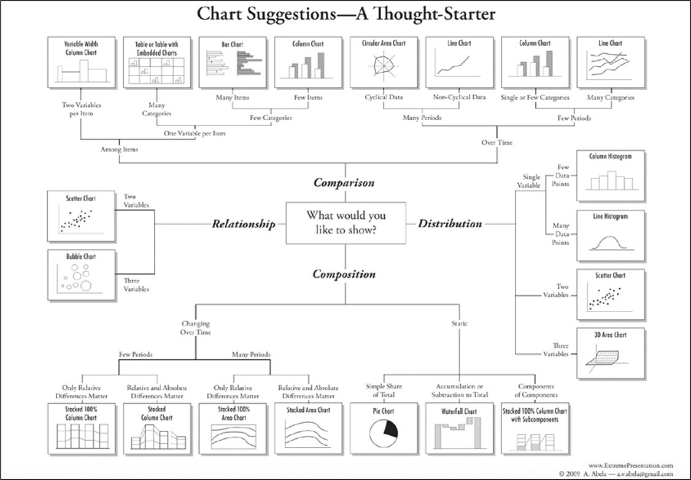 选择正确的图表有时候很困难，但学者和图形编辑已经开发了许多指南。其中一个是："Chart
Suggestions---A
Thought-Starter"，里面是一些最常见的数据可视化图形的对比（图7-2）。

*图7-2：Andrew Abela开发的指南*

接下来讨论不同的图表类型及其用法。第一个是对不同的数据集进行比较，如：在上一章的分析中，比较了两个数据集：机器人和人类。

 常见用于比较数据的图是柱状图（图7-3），该图绘制了在图7-1中的数据。

*图7-3：用于比较机器人和人类活动的柱状图*

除了使用图表来比较各个数据点，还可以用图表来展示数据集的分布情况或值的范围。例如，把整个数据集划分为多个区（例如年龄段或等级A到A--、B+到B--等），然后计算每个区中有多少数量或占总体的百分比。

例如，在\@sunneversets100数据中可以查看每个推文被转发的分布情况。在图6-3所示的原始数据表格中，能够看到推文被转发数值的范围从0到1-100、101-200、201-300。

 把图7-2中的流程图作为参考，发现对于像类似小分布的数据可以使用简单柱状图（图7-4）。

*图7-4：每个推文转发数量的分布*

有时想要了解整个数据集的构成，而不考虑年龄范围或转发数量等细分。可能只想看看数据集的构成，那么可以使用图表来理解数据集的部分与整体之间的关系。在图7-4中，可以看到大多数推文都有1至100次的转发，表明这些机器人吸引推文方面可能有些有效效果，但不是非常明显。

 机器人经常被用来放大别人的信息，也就说明机器人不会发布太多原创内容。介于这个原因查看\@sunneversets100账户的推文被转发的比例就会感到很有趣。图7-5的饼图展示了\@sunneversets100账户的推文中有99.4%被转发。

*图7-5：饼图和环状图非常适合显示整体中类别的比例*

最后但并非最终，使用图表展示数据类别可以呈现不同的关系。例如，询问一个值如何与另一个值关联，并研究一个列值的行为特征是否会导致另一个列值的减少或增加，或者一个列值是否与另一个列值的行为相关，这些关系都可以通过图表说明。

尝试理解一条推文被发送的时间和它被转发的次数之间的关系。在一天中一篇推文在转发参与度方面表现得是否特别好？确定这种关系最合适的图形是散点图，散点图是每个数据点沿着x轴和y轴放置的图形。

 通常，研究人员感兴趣的是测量一个因变量或数据集如何受到一个无法控制的自变量或数据集的影响（比如降雨），这些因变量或数据集可能会由于外部因素而改变（雨伞的销售情况）。在某项研究中，研究人员想要找出降雨对雨伞销量的影响时，就可以使用散点图来观察两者之间的关系。散点图的惯例：自变量放在x轴上，因变量放在y轴上。同样的，给Tweet的推文数据提出如下问题：一天各个时间断对一条推文被转发的次数的有何影响？图7-6展示了一个图表，该图表给出了此问题的数据呈现。

*图7-6：一天的时间内\@sunneversets100被转发推文的散点图*

#### 时间序列的具体说明

在开始制作图表之前需要认识的最后一个方面就是使用数据集的时间序列。对数据集提出的问题通常要求指定一个特定的时间点或更长的时间段。要绘制时间序列的图表，必须把数据按照时间聚合为小块，例如：推文的时间戳，或者更小的时间单位(如一个月或一年)。

在前一章中，使用数据透视表记录了\@sunneversets100和\@nostarch的每日推文，从而为图表创建了一个时间序列。然后，根据两个数据集共有的时间范围使之合并。这就可以把两个账户放在一起并排对比了。

至此已经学习了选择正确数据可视化的方法，现在看看如何在Google
Sheets中制作这些图表。

#### 制作图表

制作一个图表的一般步骤如下：

> 1\. 提出一个问题。
>
> 2\. 进行数据分析来回答这个问题。
>
> 3\. 选择最好的图表格式和工具来回答的问题。
>
> 4\. 以所选图表工具能够理解的方式格式化和安排数据。
>
> 5\. 插入或选择数据，然后使用工具创建图表。

与Microsoft Excel一样，Google
Sheets提供了一套有用的绘图工具，可以直接在电子表格中添加快速图形。为了使这个练习简单，使用上一章中的数据制作一个图表。现在按照列出的步骤进行图表的制作过程。

通过分析试图回答的核心问题是：机器人的行为如何与人类的行为相比较？为回答这个问题所做的分析得出了一个大致三星期的时间序列。这就完成了步骤1和步骤2。

接下来是选择最佳的图表进行分析。正在尝试比较的是两个数据集------机器人和人类的日常推文活动------并且想要按照时间显示这种比较。图7-2中的流程图建议使用柱状图。

然后就是格式化数据。正如在上一章中讨论的，处理数据(无论是Google
Sheets还是python)的一个核心部分弄清楚是每个电子表格列包含的数据类型并将其格式化。此步骤有助于工具和编程语言正确解释数据。

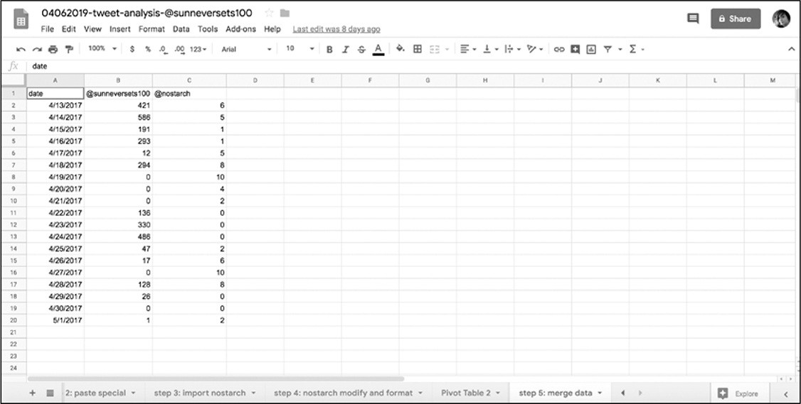 在柱状图中沿着x轴绘制时间值，并沿着y轴绘制数值(每个帐户每天发出的推文数量)。因此，应该确保Google
Sheets在一列中接收日期的值，在另外两列中接收数字的值（图7-7）。

*图7-7：包含了绘制随时间变化所需所有值的表格*

运用在第6章所学到的知识，选择含有日期的列数据，然后选择**Format ▸ Number
▸
Date**来格式化这些数据成为日期型数据。选择含有账户活动记录的列，然后选择**Format
▸ Number ▸ Number**把它们格式化为数值型数据。

下一步中需要选择使用哪种图表来绘制数据的图形。与之前一样，确保选择了所有要在图形中呈现的数据。选中含有日期和记录的数据列-然后选择**Insert**
▸ **Chart**。

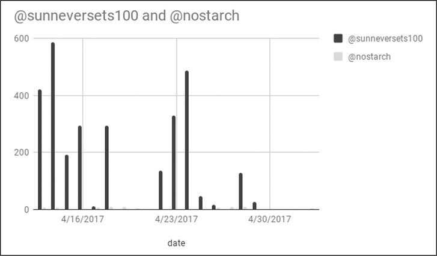 完成上述操作后Google
Sheets会把一个图表直接插入到表格中（图7-8），同时会打开一个称为图表编辑器（*Chart
Editor*）的窗口。

*图7-8：显示机器人和人类大约三周的Twitter活动的图表*

该图表编辑器可以让我们修改图表，其由两个选项卡组成：数据Data和自定义Customize。在Data选项卡中，可以调整或修改图表的内容，如：选择用来制作图表的单元格的范围、设置某一行中的值为图表标题。在本练习中，在**Chart
type**下拉菜单中选择**Column chart**（柱状图）。

在图表编辑器的自定义选项卡中，可以风格化我图表，例如：更改图表的标题、设置坐标轴的最小值或最大值、为图表文本选择不同的字体。现在使用选择菜单项**Series**更改表示机器人数据的颜色。通过鼠标的点击会展开一个下拉菜单，其中包含绘制的两个数据系列------机器人数据和人类数据。每个数据系列通常以列标题命名。在本练习中选择\@sunneversets100并使用桶（bucket）图标下的调色板（color
palette）更改该列的颜色。

最后但并非最终，通过单击图表右上角的三个点并选择"**Move to own
sheet...**"选项把刚刚生成的图表移动到属于它自己的工作表上。在用图表呈现数据时数据集的细微差别在更大的屏幕上更容易看到。

虽然没有探索由Google
Sheets提供的所有类型的图表，但是本章列出的原则应该有助于理解在深入研究数据可视化之前需要采取的那些步骤。**通过询问关于数据的问题，预先考虑想要探究的内容**。如果遵循本章所述的过程，那么可以更容易地确定可视化数据的正确方法。

#### 条件格式

到目前为止，讨论了如何将数据可视化为图表，以便读者更容易理解。虽然许多人在学校、工作或媒体中遇到图表和图形，但很少有人知道在电子表格中格式化数据的替代工具。这些工具允许您可视化地分析数据，而不需要经历创建图表的过程。

Google Sheets中一个特别有用的功能是条件格式（*conditional
formatting*），此工具根据条件为电子表格中的单元格上色。这个功能有点像在电子表格中编写if语句。例如，创建一个单元格中的值满足特定的条件则使用特定的颜色填充单元格的条件格式。可以把条件格式描述为一个机器人使用荧光笔遍历电子表格，根据设置的规则更改单元格的颜色。

###### 单色格式

通过在Twitter数据集上应用条件格式来理解其的工作原理。假设想要以一种快速的方法来判断Twitter数据集中账户活动的某个值是否高于数字法医研究实验室给出的阈值，通过条件格式设置让Google
Sheets对值等于或大于72（且小于144）的数字的任何单元格显示一种颜色，对于值等于或大于144的数字的任何单元格显示另一种颜色。

在使用条件格式之前，先要选中应用规则的单元格。然后，选择**Format ▸
Conditional Formatting**，这会在Google
Sheets中打开一个称为条件格式规则的窗口。

现在进行把单色格式应用于表格中数据的操作，单色格式是根据条件将一种颜色应用于一组单元格上。把所有包含从72到143的数字的单元格涂成黄色的步骤是：在"**Single
Color**"选项卡的窗口中，选择"**Format cells if...**"选项，在"**Add
another rule**"下选择"**Is
between**"。这时窗口应该显示两个输入框，可以在其中指定最小值和最大值。若要把符合条件的单元格染成黄色，则单元格必须包含符合指定范围的值。对于Twitter数据集，输入的最小值为72，最大值为143。然后在"格式样式"下选择黄色即可。

若要添加另一个条件格式规则，请在"**Single Color**"选项卡中选择"**Add
another rule**"，"**Format cells if...**"，但这里选择"**Is greater than
or equal
to**"，并把值设置为144。然后，在"格式样式"下，选择不同的颜色（如：红色）。

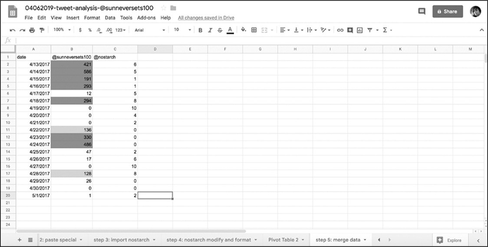 设置了这两个规则后，Google
Sheets应会把含有72到143的值的单元格涂成黄色，把等于或大于144的涂成红色（图7-9）。

*图7-9：根据条件格式规则着色的表格*

在Google
Sheets中不仅可以使用单色格式来为单元格设置单独的格式，而且还可以设置多种颜色的单元格格式。

###### 色阶格式

Google
Sheets可以使用色阶，而不仅仅单色来格式化单元格。如果使用色阶，Google
Sheets会检查所选中的所有单元格，找到其中的最小值和最大值，然后依据色阶为每个单元格进行着色。如果还没有想好采用哪种图表来呈现数据，那么可以采用色阶查看数据集分布。

打开色阶格式（color scale
formatting）后操作步骤和单色格式相同：选中数据，选择"**Format ▸
Conditional Formatting**"，然后在条件格式规则窗口选择"**Color
scale"**标签（图7-10）。

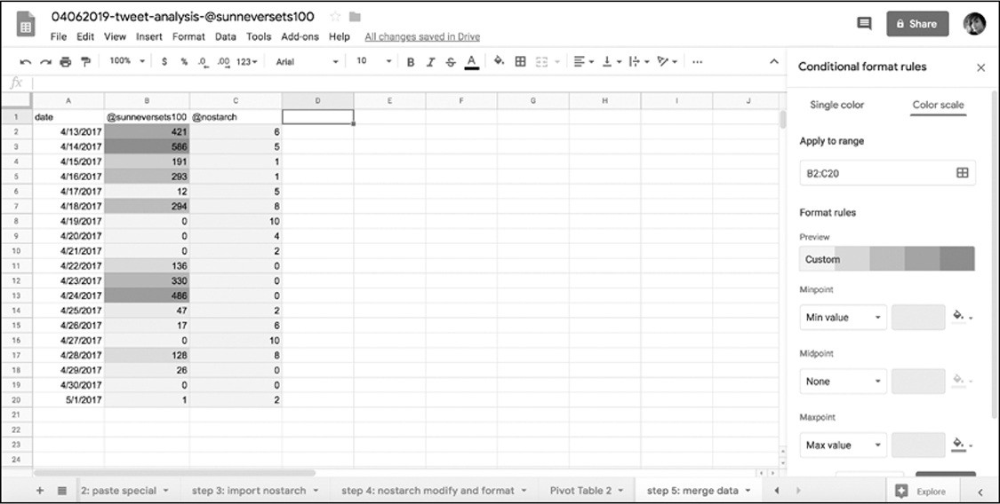 虽然色阶格式不像单色格式那样精确，但它是一种非常有用的可视化工具。色阶格式用于比较数据集的值。单色格式可以设置特定的阈值。之前例子中的问题是哪些日期揭示了\@sunneversets100账户是一个机器人账户，该问题需要一个正确或错误的答案：在任何一天，机器人是否发出144次或更多的推文？相比之下，色阶格式更多带有一种探索性目的：不太清楚阈值是多少，也不知道如何限定一个值，但是想了解手上数据的范围和分布。

*图7-10：应用色阶格式的表格*

#### 概要

经过本章的学习，了解了Google
Sheets提供的各种可视化工具。虽然没有查看每种图表类型工作原理，但现在应该对Google
Sheets可视化的工作方式有了大致的了解。

Google
Sheets易于导航的按钮和菜单是应用可视化来熟悉数据分析的好方法。当在下一章开始进行更多代码驱动的数据分析时，读者会发现可以应用从本章学到的概念------为正确的分析类型转换正确的数据进行可视化。

{width="2.5083333333333333in" height="2.5097222222222224in"}8 数据分析的高级工具
----------------------------------------------------------------------------------------------------------

在前一章中，了解了通过使用诸如Google
Sheets之类的简单工具，可以分析数千行来自机器人活动的数据。虽然Microsoft
Excel和Google
Sheets可以处理大量数据(Excel有超过100万行和16,000列，谷歌有400,000个单元格)，但这些工具可能不适合对数百万或数十亿行复杂的数据进行分析。

在网络上用户每天创建数十亿的帖子、推文、回复和其他类型的在线数据。处理如此体量的信息对于想要在更大范围内调查人类网络行为的数据侦探来非常重要。为此需要熟悉能够处理大型数据文件的编程分析工具。即使您不经常使用这些工具，在决定使用哪种工具时，了解这些工具的功能也是非常有用的。

本章中将会练习使用Python读取和研究数据。在此过程中，您将了解更多与编程相关的工具和概念，读者将学习如何设置虚拟环境，这是一种使用库的本地化方式。在此之后，将会展示如何使用应用程序Jupyter
Notebook，该界面可用于编写和修改代码、输出结果以及呈现文本和图表。最后会安装一个能够进行统计分析的Python库------Pandas。如同在前几章中的学习过程一样，读者将通过一个实际的练习来吸收所有这些新知识------提取和探索Reddit数据。

#### 使用Jupyter Notebook

在前面的章节中通过命令行接口（CLI）和脚本使用了Python。对于读者来说，这是一种快速且直接地熟悉编程语言的好方法。

但是，当使用Python技能并编辑更复杂的脚本时，应该尝试使那些更容易管理分析项目、结构化和可共享的工具。因为脚本越复杂，跟踪分析的每个步骤就越困难。

本节是学习如何使用Jupyter
Notebook的地方。Jupyter是一个开源Web应用程序，可在计算机上本地运行，并在Chrome之类的浏览器中呈现。Jupyter
Notebook可以一次运行多行代码，或以块的形式运行脚本，这样在迭代和改进代码时更容易调整部分代码。Jupyter
Notebook程序是从Web应用程序IPython
Notebooks演变而来的，其创建目的：容纳三种编程语言（Julia，Python和R（Ju-Pyt-R）），但此后演变为能够支持许多其他编程语言。

Jupyter
Notebook也被许多不同领域的数据科学家使用，包括：处理各种数字来提高网站性能的人、社会学家研究人口信息等等。使用Jupyter
Notebook的好处是：数据科学家和研究人员可以把他们的Jupyter Notebook
(通常以详细和注释性的分析为特色)放在像GitHub这样的代码共享平台上，让像您这样的初学者更容易地复制他们的研究。

###### 设置虚拟环境

想要使用Jupyter
Notebook，需要学习三个重要的概念，这些概念会让您的编码技能提升到一个新的水平。

首先要能够创建和理解虚拟环境。虚拟环境（Virtual
Environment）这个词可能很难让人理解，所以从虚拟环境的用途开始。

正如前几章中学习到的，每次要使用库时必须通过在命令行接口(CLI)中输入命令来导入。每个库都安装在计算机上，在卸载之前会一直停留在那里。

对于刚刚开始使用库的Python开发人员，他们的工作可能只需要一个或两个库就能完成。但随着您成为一个更成熟的研究人员时，就需要越来越多的库来处理不同的任务。例如：一些任务可能需要一个能够识别PDF图像文件中文本的库，而另一些任务可能需要一个能够对一个网站进行截屏的库。当提高技能并处理更多不同的项目时，可能需要在计算机上安装越来越多的库，库之间可能存在冲突。虚拟环境就是解决这种冲突的工具。

虚拟环境通过把库安装在指定的环境中来解决冲突的问题。可以把它想象成为每个项目创建的平行宇宙，可以在不影响计算机整体环境的情况下进行实验。虚拟环境就像计算机内部的另一台计算机，能够利用编程库的强大功能，而不必担心这些库与计算机的其他部分发生冲突。

尽管可以使用各种第三方工具来创建虚拟环境，但在本项目中使用Python
3的内置虚拟环境工具。不过，首先需要创建一个python_scripts项目文件夹来存储的Jupyter
Notebook。之后打开命令行接口并切换至该文件夹。例如：把python_scripts文件夹存在Mac系统的Documents文件夹中时可以在命令行接口中输入命令，然后回车：

在Windows系统则输入如下命令，注意其中的区别：

切换至该文件夹后就可以通过运行一个命令来创建虚拟环境，如果是Mac系统：

在Windows系统则输入：

对创建虚拟环境的命令进行分解：首先告知命令行接口在Mac上使用python3（PC上使用python）命令。接着是参数-m，告诉python3调用内置于Python中的模块。本命令中使用了虚拟环境模块venv。最后给虚拟环境起了一个名字myvenv。

运行该命令后应会在python_scripts文件夹中创建一个名称为myvenv的文件夹。在myvenv文件夹中会安装所有将要使用到的库。

至此虚拟环境设置完成了。但是想要进入该虚拟环境需要将其激活。可以通过在命令行接口中输入相关命令来激活和关闭虚拟环境。

如果命令行接口仍在python_scripts文件夹中，只需输入：

同样对该命令进行分解后分别理解。source是Mac系统一个内置的命令，目的是运行指定的路径中包含的源代码(source命令也可以用句点替换，所以代码".
myvenv/bin/activate"同样有效)。在此命令中，路径是myvenv/bin/activate，该路径告诉计算机切换至当前目录中myvenv文件夹，然后切换至myvenv中的bin文件夹，最后运行bin中的activate文件。activate文件包含一个用来激活虚拟环境的脚本。

命令运行完成后虚拟环境就被激活了！通过查看命令行接口来判断是否已激活：命令行接口的提示符应该以字符串（myvenv）开头。要停用或关闭虚拟环境，只需输入命令deactivate，命令行接口的提示符的字符串（myvenv）就会消失。

###### 组织Notebook

尽管不需要遵循特定的文件夹结构，但尽早组织输入数据、Notebook文件和输出数据，可以防止以后进行分析时出错。因为尽早养成良好的习惯比以后破坏习惯容易。

现在创建三个单独的文件夹，这些文件夹存储在python_scripts文件夹中，但不在myvenv文件夹中。首先创建一个名为data的文件夹来存储输入数据，其中包含已从API或网站接收，下载或抓取的数据文件。然后创建一个output文件夹，其中将包含分析过程中导出的任何电子表格。在本书中的例子中不会创建电子表格，但是对于数据分析师来说，拥有一个output文件夹是一种很好的常规做法。在"使用系列和数据框架"中介绍pandas库时使用一个名为.to_csv()的简单函数，该函数到处有关分析的csv文件。最后把Jupyter
Notebook创建的文件保存在一个名为notebooks的文件夹中。

可以在计算机上手动创建这些文件夹或目录，但也可以使用mkdir命令以编码的方式创建。在命令行接口中切换至python_scripts文件夹（如果仍位于myvenv文件夹中，请使用"cd
.."向上移动）并输入以下三行：

命令mkdir采用指定的名称创建目录。完成这三个命令会创建刚才描述的三个文件夹。或者，可以使用mkdir后跟所有三个用空格分隔文件夹名称，如下所示：

###### 安装Jupyter并创建第一个Notebook

Jupyter可以创建Notebook文档，此类文档可以读取不同种类的代码，如：Python和Markdown（用于格式化文档的语言）等。由于Notebook能够读取各种编程语言，因此Notebook可以将Python代码的结果与Markdown文本一起呈现，从而使程序员更易于注释其分析。

像其他Python库一样通过pip从网上下载Jupyter
Notebook并安装本地的计算机上。安装Jupyter Notebook的命令如下：

安装过程结束后，通过在命令行接口中输入以下命令打开Jupyter Notebook：

 输入此命令后，Jupyter
Notebook将启动本地服务器（该服务器仅在本地计算机上运行），并在默认的Web浏览器中打开一个窗口（作者的默认浏览器为Chrome，如[[图8-1](#_bookmark293)所示]{.ul}。读者打开的应该时自己经常使用的浏览器）。

*图8-1：Jupyter界面*

在这个界面里可以切换至工作文件夹并在其中创建文件。切换至notebooks文件夹中，从下拉菜单中选择"**New
▸
Python3**"。完成后就会在notebooks文件夹中创建一个新的notebook文件，并在一个新的浏览器选项卡中打开该notebook文件。

Jupyter
Notebook咋看起来很像普通的文本文档软件，具有编辑工具和完整的选项菜单。当然，这些都是根据Python开发人员的需要定制的。Jupyter
Notebook有一个特别棒的功能，使用单元（*cells*）一次运行不同的Python代码块。换句话说可以把Python代码分隔成多个单元并逐个运行。

###### 使用单元

默认情况下notebook文件打开后会创建一个单元，可在其中输入文本和代码：

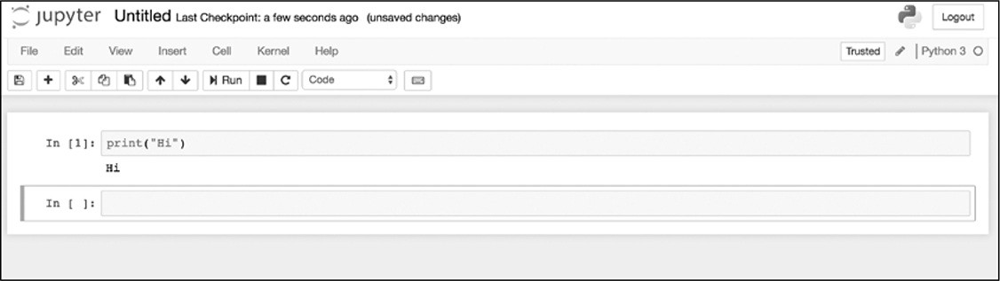 用鼠标选中包含此代码的单元，然后按"**Run**"按钮（或使用快捷键SHIFT-ENTER）来执行刚在单元中键入的Python代码。然后计算机应在单元格正下方打印出代码结果，同时创建第二个单元，如图8-2所示。

*图8-2：在Jupyter中两个单元*

这里需要注意：Jupyter运行了单元后，单元左侧的方括号将不再为空。由于刚刚在Notebook中运行的是第一个单元，因此左侧的方括号中应显示数字1。当使用不同的代码运行相同的单元时会发生什么情况呢？修改第一个单元格内的代码：

现在单击单元左侧的区域来选中该单元格（蓝色条应突出显示当前所选单元格的左侧），然后再次单击"**Run**"按钮。单元下应显示字符串"Hello！"，与之前的字符串"Hi"一样。但是现在单元左侧的方括号应该包含数字2。因此，Jupyter
Notebook不仅跟踪运行单元，还记录运行的单元顺序。

由于Jupyter
Notebook中的代码分为多个单元，因此这种跟踪方式在后续的分析过程中会让查找错误变得非常方便。与从上到下运行脚本文件不同，单元可以不按照代码顺序运行该代码。跟踪可以准确告诉您Notebook已经运行了哪些代码，以及仍需要运行哪些代码。这可以帮助避免在使用Jupyter时发生的常见错误，如：当一个单元中的代码引用尚未运行的单元中定义的变量。

与Microsoft Word或TextEdit等文本编辑软件类似，Jupyter
Notebook在可视界面中提供了许多出色的工具。可以使用工具栏执行以下操作：例如保存（软盘图标），剪切单元（剪刀图标），添加单元（加号）以及向上（向上箭头）或向下（向下箭头）移动单元。

至此了解了如何在Jupyter
Notebook中运行Python代码单元的基础知识。但是，随着通过重写、重新运行、删除或移动单元来改进Notebook代码来进行更多的试验时，可能会发现在Notebook的内存中存储了很多"垃圾"。例如，创建一些变量后最终决定删除它，或者存储以后不再使用的数据。这些垃圾会使Notebook运行速度变慢。那么，如何在不破坏在单元中编写的代码的情况下，清除在Notebook运行中产生的所有Python代码的内存？

有一个不错的技巧：转到菜单并按照顺序点击"**Kernel** ▸
**Restart**"后，就能清除所有先前运行代码时产生的"垃圾"以及单元左边方括号内的所有数字。如果再次运行一个单元，就应该呈现该段代码的结果，并在方括号重新显示数字1。

还有一个可以按顺序运行多个单元的技巧。为了说明技巧，先把另一个单元添加到笔记本中（选中第一个单元后，点击加号（+）按钮）。然后在第二个单元中输入以下代码：

再添加另外两个单元，并在里面分别输入如下代码：

若要依次运行所有四个单元格，选中第一个单元格（其中包含代码：print（"Hello！"）），然后在菜单中依次点击"**Cell
▸ Run All
Below**"。此操作会自动运行被开的Notebook文件中选中的单元与之下的所有单。如果其中某个单元格包含错误，Jupyter
Notebook会在错误的单元处停止运行并显示出错误代码。

Jupyter Notebook可用于多种任务，以上讨论的基本步骤应能让您把Jupyter
Notebook作为数据分析工具。Jupyter
Notebook可以运行在脚本文件中编写的所有代码。通过把代码分成多个单元，然后一次运行一个代码块，就可以直接运行本书之前编写的脚本了。

现在完成了解如何使用Jupyter
Notebook后，接下来就是如何使用pandas查看Reddit数据。

#### PANDAS是什么？

在之前的章节中学习了如何使用各种Python库来收集数据。现在需要了解一个可以帮助分析数据的库。

尽管可能已经猜到：Pandas库与可爱的熊猫毫无关系。这个库的名字实际上来源于面板数据的概念------由创建者Wes
McKinney建立的用来处理大型跨时间跨度测量的数据集。Pandas允许Python从各种数据源(包括csv、tsv、json甚至Excel文件)获取数据，并能轻松地合并数据集。

与Jupyter和其他Python库一样，使用之前先要安装Pandas（pip install
pandas）。若已按照之前的所有说明操作并打开了Jupyter
Notebook，就说明已经在命令行接口中运行了本地服务器。要在不中断本地服务器的情况下安装Pandas，可以在终端中打开一个新窗口或命令提示符，然后切换至相同的项目文件夹，再次激活虚拟环境，最后安装Pandas库。

完成安装之后就需要导入Pandas库。在Jupyter
Notebook中最传统的方法是在单元中输入一个import命令并运行：

该命令运行之后就完成了导入pandas库的步骤，然后就能够在之后的代码中使用缩写**pd**访问pandas库的函数。例如，可以写pd.Series(\[12,53,57\])而不是pandas.Series(\[12,53,57\])。这个导入命令是许多使用pandas的数据分析人员的一种默认约定，这有助于保持代码整洁和易于阅读。现在开始创建、读取和操作一些数据结构！

###### 使用序列（Series）和数据框（DataFrame）

可以加载到pandas中的最简单的数据结构是一个序列（series），序列有点类似于列表（List）或数组（Array）。通过series()函数在panda中生成一个序列。

在Jupyter Notebook新单元中输入如下代码来生成一个序列：

代码➊把列表(12，53，57)存储在变量numbers中。在代码➋中调用导入Pandas时的缩写**pd**，紧随其后的是Series()函数以及在函数内输入的参数numbers。该段代码的功能是：使用Series()函数来创建类型为Series的数据对象，并将列表numbers放入这个Series中。这与在第4章中访问另一个库Beautiful
Soup中函数的方法相同：首先通过分配给一个缩写来引用这个库，然后通过缩写访问其提供的函数。完成输入后运行该单元的结果如下：

这就是pandas表示一个简单数据序列的方式，也可以称其为一维数据集。在输出的左侧显示了一个列，该列表示每个数据的索引（或称其为：位置）。按照Python的惯例，索引从0开始每一行递增1。输出的右侧是实际的数据值。在序列的最后还会看到用冒号分隔的单词：dtype(数据类型)和int64(整型)。

 序列可能是最简单的一种数据集，因它只有一列数据，而且每一行只包含一个值。但在pandas中使用更多的是多列多行的二位数据集：数据框（DataFrame）。可以把数据框视为是比起Excel和Google
Sheets容纳更多数据且由Python读取的电子表格。与电子表格不同，数据框有索引*index*(行标签)和列*columns*
(列标签)组成。

通过pandas的内置DataFrame()函数就能创建数据框。在一个新单元中，输入以下代码行：

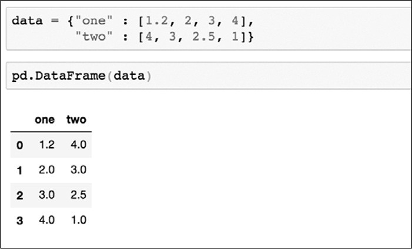 使用变量numbers2➊来存储数据，然后该变量numbers被赋予一个字典（*dictionary*），该字典"one"被赋予一个list（\[1.2,
2, 3,
4\]），"two"被赋予另一个list（\[4,3,2.5,-1\]）。此处为了便于阅读，两个字典项中添加了换行符，但其不会影响代码的运行。运行此单元后的输出图8-3所示。

*图8-3：数据框显示为一个表*

与序列相同，该数据框具有一个索引（*index*），以列的形式出现在最左边。数据框中还有两个列（*columns*）数据，分别命名为"one"和"two"，其中包含字典中的数据。

###### 读取和探索大型数据文件

数据集的大小和详细程度各不相同------有些数据集非常容易理解，而另一些数据集则非常复杂、庞大而且难以处理。社交媒体数据尤其难于处理：在线用户生成大量数据和内容，而这些数据和内容反过来又会产生许多反响、评论和其他响应。

当处理来自社交媒体公司、学者或其他数据存档人员的原始数据时，这种复杂性可能会变得更加严重。通常，研究人员收集的数据比他们进行单独分析所需要的数据要多，因为对一个大数据集提出各种问题要比为可能在目标和范围上发生变化的项目反复收集较小的数据集要容易得多。

由于API的限制，研究人员、记者和其他分析人员很难跟踪媒体操纵活动、恶意攻击或其他短期在线现象。在网上这种例子很多，在本书中就不再一一累述了。

作为对策，各种机构和个人已经开始收集和存储这些社交媒体数据。例如，互联网档案馆(Internet
Archive)每月进行一次数据提取，并在其服务器上托管数百万条推文。研究人员就能将这些推文用于语言或其他分析。学者们收集并存档了Facebook上的信息，试图理解一些社会现象。

虽然这些努力对实证研究非常有帮助，但产生的数据可能对如我们这样的数据侦探构成挑战。通常，在对数据进行有意义的分析之前，必须花费大量的时间来研究、探索和"了解"这些数据。

在接下来的几页中，将要学习如何阅读和浏览一个大型数据文件。在本章及以后的章节中，还将介绍数据档案管理员Jason
Baumgartner提供的Reddit数据集，他认为将社交媒体数据提供给学者和其他类型的研究人员至关重要。该数据集包含2014年至2017年之间r/askscience提交在Reddit论坛或subreddit上的所有数据，人们可以对该数据集提出与科学有关的问题。在本章的其余部分，还将通过Pandas来了解数据集的结构和大小。该数据集的下载地址：https://pan.baidu.com/s/1IjnXCkAdKgpbXczjh2UpMA。

当完成下载Reddit数据集后，将其解压至python_scripts文件夹的data文件夹中，然后返回至Jupyter
Notebook的界面中。按照惯例，Notebook中的第一个单元包含import pandas as
pd命令，因为所有import语句应首先运行。在第二个单元中通过输入如下所示的代码加载data文件夹中的csv文件：

 指定名称为ask_science_data的变量用于存储Reddit数据集。然后，使用等号（=）为该变量分配一个Pandas函数read_csv()创建的数据框。read_csv()函数需要将数据文件的路径作为参数（通常是csv文件，但read_csv()也可以处理tsv和txt文件，只要这些文件包含用逗号、制表符或其他一致的分隔符分隔的数据即可）。如果采用非逗号分隔符，则必须在read_csv()函数中指定第二个参数，该参数应是代表这些分隔符的字符串。由于在Jupyter
Notebook中运行该命令，因此第一个参数中的路径反映的是数据文件相对于Notebook文件的相对位置。使用两个点和正斜杠可以让命令切换到当前文件夹上一层的文件夹，在本例中为项目文件夹（python_scripts）。然后命令会自动按照输入的路径参数切换至包含名称为askscience_subsmissions.csv文件的data文件夹中。

###### 考察数据集

不同于Microsoft Excel或Google
Sheets之类的程序（这些程序是为用户通过可视界面操作数据而构造的），Pandas实际上不会一次显示整个数据框。在上述的代码运行完成后Pandas并没有显示任何数据。这是因为把read_csv()的输出分配给了一个变量，而不是输出或打印该变量。如果在未分配变量的情况下运行该函数，或者在其中运行了含有ask_science_data变量的单元，则会看到一小段数据。虽然这种截断会让人刚赶到困惑，但这种设置也节省了许多计算机的计算能力。当打开包含几十万行数据的文件时，某些软件可能会崩溃或运行变慢，这种情况取决于软件的复杂程度。因此，通过不显示完整的数据框Pandas可以更有效地处理大数据集。

这种特性表明需要找到一种方法来读取数据集的不同部分。Pandas的开发者已经考虑到这种情况，只需要通过Pandas中一些便捷的功能就能轻松完成此任务。

若要查看数据集的前几行，可以使用一个head()的函数。此函数接收整数作为唯一参数，如果不输入任何内容，则参数的默认值为5。因此，如果想查看数据集的前10行，则可以在Notebook的单元中运行一下命令：

执行这个命令时，首先调用ask_science_data变量，该变量保存通过csv文件读取的数据。然后对变量包含的数据调用head()函数，在Jupyter
Notebook中的输出应如图8-4所示的数据框。如果想要查看数据集最后10行，可以使用ask_science_data.tail(10)代码，其输出与图8-4中类似。

 

*图8-4：显示数据框中的前10行*

虽然不能一次看到全部数据，但这不是很重要。现在的需求是：考察数据集。这代表想知道的是，每个列中值的类型以及列名是什么？通过查看数据的前10行或后10行会有所帮助。

但可能已经注意到由于数据集的列比较多，必须往侧边滚动才能显示数据集的每一列。这种操作可能有点麻烦。Pandas中的一些内置工具可以显示数据集的部分概要。

可以对数据集进行转置（*transpose*），把列转为行，把数据转为列。转置可以翻转整个数据框------这种操作看起来有点像逆时针旋转了90度的表。通过调用Pandas中的T属性实现转置的功能：

若要查看数据框的所有列名（可以作为一个list输出），可以使用一下代码：

想要获得数据框重所有数据类型的摘要，可以使用dtypes属性：

最后，可以使用Python内置的函数显示数据框的行数。是否记的在第一章中使用的print()函数在交互式shell中显示信息？在第一章使用print()结合len()来显示的字符串或列表的长度。在这里也可以使用这些函数来查看数据框包含的数据有多少：

这段代码看起来有点复杂。首先，使用len()函数通过传递参数ask_science_data(数据集)来测量数据框的长度(即：数据框包含的行数)。换句话说，首先通过函数获取的是ask_science_data数据框的长度。当单独使用len()时仅在Jupyter
Notebook单元中没有其他语句跟随的情况下才显示结果，所以最好将它放在print()函数中，这样就可以确保单元显示len()所测量的结果。

如果使用的是与本书相同的数据集，那么Jupyter
Notebook的输出应该是618576。这个数字就是数据框包含的数据量。

如果通过传递ask_science_data.columns作为len()的参数，可以得到数据框的列数：

ask_science_data数据框应包含65个不同的列。因此，把65列乘以618,576行就能够得出ask_science_data数据框还有的数据值超过4,000万个。

这里译者还要介绍一个更加方便查看查看数据框大小的属性shape()，这个属性能够直接以元组（一个不能修改其中值的列表）的形势输出数据框的大小：

###### 查看特定的行和列

知道如何获取数据框的结构意味着明白如何鸟瞰手中的数据。但如果想更仔细地查看数据的特定部分，该怎么办呢？

在方括号中加入包含在数据框的变量后，可以选择或索引该数据框不同的数据子集。例如，要查看特定的列时可以在方括号内指定该列名称的字符串：

上述代码可以显示Reddit数据集中title列。也可以使把显示的数据储存在变量中：

还可以同时查看多个列，通过把需要查看的列名称储存在一个list中，然后将这个list传递给数据框：

Pandas还提供了其他方法来实现比上述更加复杂的查询功能。正如在本章前面提到的，数据框中的每一行都有一个索引，索引的作用有点像一个标签。默认情况下，Pandas为每一行分配一个整数作为索引(也可以为每一行分配自定义索引，但在本练习中不进行这样的操作)。Pandas提供了iloc\[\]方法调用任何给定行，方法是将行索引号放在方括号内(在编程术语中，这称为基于整数位置的索引)：

如果在Jupyter
Notebook的单元中运行该代码，就会在输出的位置显示Reddit数据集的第5行（编程通常从0开始计数，Pandas也沿袭了这种业内的默认设定）。

还可以把上面提到的两种方法结合起来。例如，如要调出名为title列第5行中的值：

由于要处理的数据是包含数百万个值的大型电子表格，通过以上一些方法可以更好地了解该数据集。到这里相信读者已经掌握了所有的基础知识，接下来就可以开始学习如何使用数据进行计算了。

#### 概要

本章带领读者了解了如何探索大型数据集，此过程是任何数据分析重要的第一步。只有在理解了数据的本质------内容、格式和结构之后，才能找到最佳策略来分析数据中包含的意义。

在下一章中将继续研究Jupyter Notebook，并使用Jupyter
Notebook探索对数据集提出问题的方法。

{width="2.508462379702537in" height="2.51in"}9 在REDDIT数据中寻找趋势
-----------------------------------------------------------------------------------------------

社交媒体数据中的部分数据以定量的方式列举人类行为，而另一部分则是定性的方式。例如，可以通过计算Reddit帖子"点赞"来衡量它的受欢迎程度，这就可以对其进行简单的聚合，如：在特定时间段内帖子获得点赞数的平均或中位数。然而，Reddit上相类似数据的其他部分可能很难用定量的方式进行处理，如：帖子的评论在内容和风格上可能大相径庭。

比起计算像"点赞"这样的参与度指标（如：平均值），想要总结（或者说量化）人们讨论的话题及其讨论方式是非常困难的。但不可避免的，对社交网络上的数据进行有意义的分析需要同时观察这两种信息。然而，学习如何做到这一点对于我们非常有用，因为可以探索真实人的行为、思想和反应(也可能是机器人！)。

在本章中，将会学习如何浏览定性和定量信息。我们将通过分析第8章中的r/askscience数据，探讨人们如何与社交媒体中的疫苗接种主题互动，并从数据集中提出针对性的问题。首先，将通过搜索subreddit中带有词干vaccin（例如：*vaccinate*和*vaccination*）一词的提交内容，来尝试更好地理解如何处理基于文本的信息。然后会比较疫苗贴与非疫苗贴的参与度，即：评论和点赞的总数。

#### 明确研究目标

在这一章中使用来自r/askscience的subreddit在线帖子来衡量疫苗接种在网络上讨论的热度。

虽然Reddit用户并不能代表所有人，但仍可以通过对比论坛上的其他帖子来了解这个帖子在论坛上的热度。此过程的技术关键是：就像其他任何对社交网络的研究一样，需要承认和理解被研究的每个数据集的特殊性。

首先，提出一个最基本的问题：r/askscience在Reddit上提交的含有"vaccine"、"vaccinate"等vaccination词变体的帖子，是否比不含这些词的帖子更活跃？

#### 方法略述

回答问题的分析过程包含如下步骤：

> 1\.
> 筛选数据并将其分组到两个数据框中。第一个数据框架包含所有使用单词vaccine、vaccinate或vaccination的帖子。第二个数据框包含没有提到这些词的帖子。
>
> 2\.
> 在每个数据框上运行简单的计算。通过寻找平均或中位数的参与度指标来获得汇总数据(在本分析中，参与度指标由评论和点赞的组合数量表示)，可以让我们更好地理解r/askscience数据的每个子集，同时为提出的问题给出答案。

在开始分析之前需要理解一些统计学术语。均值*mean*是将数据的所有值相加，并将和除以数据总个数的结果。中位数*median*是数据中所有值从小到大排序后，位于最大值和最小值之间的数。如果数据个数是偶数则取中间两个数的均值。均值和中位数都是集中趋势的度量（*measures
of central
tendency）*，这些度量让我们可以通过查看某个中心点来评估数据集。当一个数据集含有非常多的数据且相对于数据集的总个数异常值*outlier*占比较小时，均值是度量其集中趋势的一个很好的方法。如果数据集中离群值的数量占比较大时可以通过中位数度量其集中趋势。

#### 缩小数据范围

Reddit数据集本身相当大，即使只看其中的一个子集subreddit其规模也超乎想象。虽然尽可能从包含全部数据的数据集开始对于分析非常重要，但是根据特定项目筛选数据可以更好地、更整洁地对其进行概述。筛选还能减少运行每个计算所需的时间。

本章还介绍了总体*population*和样本*sample*数据的概念，总体数据描述了包含指定组整体的数据集。此处的指定组包含了r/askscience在Reddit上2014年到2017年之间的所有帖子。样本数据是数据集的子集或样本。在本练习中会生成两个子集：一个包含与疫苗相关的帖子，另一个包含所有其他帖子。通过对这两个子集进行分析来比较它们之间的不同点。

本练习使用第8章中设置的虚拟环境和Jupyter
Notebook。该练习在原有的Notebook文件上进行扩展，并且使用与之前练习的相同变量名称。

###### 从特定列中选择数据

为了获取练习所需的数据，先Reddit数据集缩减到只包含与分析相关的列。然后删除那些包含不相关样本的行，如：空值null。

在本练习中，我们对两种不同的数据特别感兴趣------帖子的标题和评论，包括：提交给r/askscience的文本，以及获得的反馈。如上一章所述，通过运行以下代码行可以把数据集的所有列名以列表的形式输出：

输出的结果是一个字符串列表，每个字符串代表一个列名：

以上显示了数据集有62个列。对于练习来说，只需要保留title列，ups列以及num_comments列。

使用在上一张中提到的方法（"查看特定的行和列"），使用方括号在数据集中选中特定的列。现在确保已经打开了第8章的Notebook文件，并且已经运行了文件中的每个单元（**Kernel**
▸ **Restart & Run
ALL**）。然后，使用加号(+)在最底部的单元下面添加一个单元，并将清单9-1中代码输入其中：

*清单9-1：从数据集中选择感兴趣的列*

首先创建一个名为columns的变量，并为其分配一个字符串列表，该字符串列表\[\"title\",
\"ups\",
\"num_comments\"\]包含想要储存在筛选后数据集的列。应确保每个列名的字符串与原数据集中的列名完全匹配，如果不匹配，无论是标点符号、大小写等拼写错误都可以导致Python脚本运行错误。

清单9-1的第二行代码创建了一个名为ask_science_reduce的变量，用于储存一个筛选后的数据框。此处应可以看到，改代码没有如之前那样在方括号中添加单个字符串，而是将包含列名的列表变量放在其中。将整个列表放在方括号中可以同时选择多个列。

至此，已经把数据集缩减到感兴趣的特定列，接下来筛选后数据集中删除包含与分析不相关值的数据行。

###### 处理空值

在一个很大且不一致的数据集中，某些行或单元格可能不包含任何信息。这些"空（*Null*）"单元格可能完全不包含任何值，也可能仅包含占位符（*placeholder*），即：设计数据结构的机构或人员指派的任意字符串。如果可能的话，占位符会在数据字典（*data
dictionary*）中被描述。数据字典是解释数据集内容、结构和格式的文档。一般情况下，必须自己通过研究数据集来了解。在最坏的情况是通过通过列名来猜测。还有一种简单的方法，就是通过询问收集数据的人来获取相关的信息。

在对数据进行解析的过程中，把这些空单元格称为空值。当在Python中试图在交互式shell或其他Python接口中打印空值时会返回None。在pandas中空值被称为NaN值(not
a number的缩写)，数据框把NaN作为缺失数据单元格的占位符。

空值在收集到的社交媒体用户信息中特别常见。例如，收集到发布到Facebook视频链接的列数据仅包含用户实际发布视频的帖子的值。对于任何不包含视频的帖子，数据集都将没有该项的值，而且可能使用占位符（例如字符串"
no video"），也可能把该项留空，这意味着该项数据会是一个具有空值。

占位符，Null和NaN值会导致分析发生错误。在应用函数或计算时，脚本会按照代码设定的步骤进行操作，当发现空值时都会发生错误并停止运行。本节中将介绍两种处理空值的方法，每种方法的目的不尽相同：一种是完全从数据中删除这些null值，另一种是保留整个数据集并将空值计数为零。

######## 删除空值

如果数据集中的某列包含空值，则删除包含空值的整行数据。在Pandas中使用dropna()函数进行相关的操作。清单9-2显示了依据列是否包含NaN值删除整行数据的代码。

*清单9-2：删除列中包含NaN值的行*

在没有特别规定的情况下，dropna()函数告诉Pandas从数据框中删除整行。但是dropna()函数还有一些其他的参数，如：subset参数。在此示例中，使用subset参数告诉Pandas在ups和num_comments列中删除包含NaN值的行。如果不给dropna()函数传递任何参数，则Pandas默认删除具有任何null值的行。

######## 填充空值

为了标识NaN值但想要保留数据框的每一行数据，可以使用fillna()函数。该函数用字符串或数字填充每个空值。清单9-3显示了如何使用fillna()函数采用数字0填充num_comments列中的空值：

*清单9-3：用0填充空值*

在清单9-3的代码中把0赋给value参数。此代把num_comments列中的空值替换为数字0。

确定用删除空值的方式还是填充空值的方式，取决于数据集以及想要如何回答研究问题。例如，如果想要获取整个数据集评论数的中位数时是否可以确定地认为缺失值仅表示提交内容中没有相关的评论。如果能够确定，则可以用0填充这些值并进行相应的计算。

依据包含缺失值或"空单元格"的行数，评论数的中位数可能会发生显著变化。但由于此数据集有时把注释或注释的数量记录为零，有时也记录为空值，因此假定包含这些列的空值的行应视为0（如果空值表示0，可以假设数据集将不包含任何实际的0，这是因为把0视为了一种符号而不是数字）。相反，认为这些缺失值是档案管理员无法捕获的数据，其原因：也许帖子在他收集这些信息之前就被删除了；也许这些指标是在某些年份中引入的而其他年份则没有。因此为了便于练习，应处理现有的数据并删除包含缺失值的ups或num_comments列的数据行，如清单9-2所示。

###### 分类数据

下一步是根据关于疫苗接种的具体研究问题筛选数据。在进行筛选之前，需要对Reddit数据中关于疫苗接种的内容进行分类。

此处的分类方式是简化的。在处理大型数据集时简化分类是必经步骤，因为阅读每一篇文章并逐个对其解释是不可能实现的劳动密集型工作。即使可以雇佣一大群人阅读每个帖子并解释（在一些prose-driven项目中这种情况并不少见），但很难确保每个人都使用相同的标准来解释，这样做可能会使数据难以用标准的、可识别的方式分类。

在本章的示例中，把样本限制为包含单词vaccination及其变体的帖子，寻找title列中包含"vaccine"（在语言学中通常被称为词干，词干是一个词语去掉表示语法意义的词尾剩余的部分）的数据。该数据子集可能不能捕捉到关于疫苗接种的每一个帖子，但可以让我们定性地理解手头的问题。

通过在数据集中创建一个新列来依据帖子的标题title中是否包含字符串"vaccin"对数据集进行分类。新建列使用布尔值(也就是二进制值，True=1或False=0)填充。清单9-4显示了创建这个列所需的代码：

*清单9-4：根据某列是否包含某个字符串对新建列进行填充*

在清单9-4中代码的等号左侧，使用方括号创建了一个名为contains_vaccin的新列。在等号右侧，使用了一个链式函数：首先使用方括号表示法从数据中选择title列，然后在该列上使用str()函数将值转换为字符串，转换成字符串后就可以使用contains()来确定列值是否包含"*vaccin*"。

这个链式函数的结果是一个布尔值：如果帖子的标题包含vaccin，就返回True；否则返回False。代码运行后就会在ask_science_dropped_rows数据框生成一个新列contains_vaccin，其值只有True（1）或False（0）。（译者注：清单9-4的代码再运行的时候会发生一个警告，但是不影响运行的结果。）

现在有了用于分类数据的列，就可以用这个列来筛选数据了。在Jupyter
Notebook的新单元中运行清单9-5中的代码：

*清单9-5：根据条件筛选数据*

清单9-5中代码是否感觉很熟悉？在这里需要注意：在等号右侧的括号中使用了条件ask_science_data_dropped_rows
\[\" contains_vaccin
\"\]==True。这段代码告诉Pandas检查contains_vaccin列中的值是否等于True，这样就筛选到了一个数据集的子集，其中只包括词干中包含vaccin的数据。也可以设置条件等于False，生成词干中不包含vaccin的子集：

至此已经生成了按照需求筛选的数据，现在可以查询一些有趣的见解。

#### 汇总数据

 为了确定r/askscience在Reddit上提交的包含"vaccine(接种)"、"vaccine(疫苗)"、"vaccinate(疫苗)"等不同单词的帖子是否比不包含这些词的帖子获得了更大的反响，可以查看这些帖子收到的被点赞和评论数的总和。

###### 对数据进行排序

首先创建另一个新列，该列中的值是每行点赞和评论数量的和。该步骤在Pandas中是非常简单的操作（清单9-6）。

*清单9-6：将多个列值合并在一列中*

 在清单9-6中，在之前两个数据框中分别创建一个称为combined_reactions的列，并为其分配等于num_comments和ups列之和的值。运行此代码时可能会遇到SettingWithCopyWarning警告，SettingWithCopyWarning是一个警告Warning，而不是错误Error。错误和警告之间的区别：错误使您的代码无法运行，而警告只是促使您仔细检查正在运行的代码是否在执行所需的操作。对于这本书，这里显示的代码可以完成想要做的事情：在注释数上添加点赞数。如果对发出此警告的开发人员希望进行何种调查感到好奇，请参阅<http://pandas.pydata.org/pandas-docs/stable/user_guide/indexing.html>（该链接中的大致意思：Pandas中的某些操作会返回数据的视图View，某些操作会返回数据的副本Copy。当对视图进行操作时就会发生SettingWithCopyWarning，由于链式赋值Chained
Assignment以及隐蔽链式操作Hidden
Chaining也是对于视图的操作，所以也会发生SettingWithCopyWarning。想要避免警告出现，建议如清单9-1以及9-2中在最后加上".copy()"。）

在新列中获得了num_comments和ups列之和的值之后，使用sort_values()函数对该值进行排序，如清单9-7所示。

*清单9-7：使用sort_values()对数据框进行排序*

顾名思义，sort_values()函数是依据值的顺序对数据框进行排序。在清单9-7中给sort_values()函数传递给了两个参数：by------告诉Pandas需要被排序的列；ascending------告诉Pandas排序的顺序（正向True：从小到大/反向False：从大到小）。在此处的代码中把False传递给ascending参数，数据会按照从大到小的顺序进行排序。

图9-1显示了对ask_science_data_vaccinations列进行排序后的数据框样子。

 *图9-1：Jupyter
Notebook屏幕上ask_science_data_vaccinations的部分数据框按合并的参与总数排序*

 图9-2显示了ask_science_data_no_vaccinations列的一些结果。

*图9-2：Jupyter
Notebook屏幕上ask_science_data_no_vaccinations的部分数据框按合并的参与总数排序*

如图所示，ask_science_data_no_vaccinations数据框中combined_reactions比与ask_science_data_vaccinations数据框中combined_reactions的值更大。对于这两个数据集中的前十大参与数据也是如此。ask_science_data_no_vaccinations的前十帖子的合并参与总数要远远高于ask_science_data_vaccinations。因此，以r/askscience数据的每个子集的前10帖子的参与总数衡量可以得出结论，与疫苗接种相关的帖子没有像其他主题那样获得了足够的关注。

但这里有个很大的问题：只看了前十名的帖子。对数据集进行筛选和排序可以帮助更好地理解数据集，但是只展示了大量数据集的极值。在下一节中，将进一步研究分析数据的一些不同方法。

###### 对数据进行描述

一种常见的数据汇总方法是使用mean()函数（清单9-8）。

*清单9-8：mean()函数*

在此使用mean()函数来查找选中列(combined_reac)的平均值。当在一个单元中运行此代码后，应能得到以下数字：

对ask_science_data_no_vaccates数据框运行相同的代码及其输出，如下所示：

这些数字表明，不包含vaccin帖子的平均合并参与总数高于包含vaccin的帖子。换句话说，之前的结论---包含vaccin的帖子合并参与总数更少，因此这些帖子没有从Reddit其他用户那里获得更多的注意力，与对合并参与总数排名前10的帖子进行观察得出的结论相同。

平均值只是汇总的一种方法。可以使用describe()函数在Pandas中一次查看多个指标(清单9-9)。

*清单9-9：describe()函数*

该函数的输出结果如下：

此摘要包括行数count、均值mean、标准差std、最小值min、25%分位数、50%分位数（中位数）和、最大值max。

让在另一个单元中运行与ask_science_data_no_vaccates相同的代码：

该代码的输出结果如下：

以上输出展示了两个数据框的中位数是相同的，中位数是衡量一个帖子参与度的另一种方法。然而，这里的平均值可能是比较帖子数据的最佳方式，因为两个数据集的中位数都是1，不能在一个数据集与另一个数据集之间的使用中位数做出明确的区分。

最后但并非最终，当展示对于数据的发现时，给刚刚运行的各种分析提供上下文环境非常重要。虽然向受众展示中位数和均值可能会有所帮助，但对数据所做的一切保持透明也至关重要。数据分析需要理解上下文环境：不仅要展示信息数据的范围，还须概括如何对数据进行分和任何其他有用的观察。

其中一个观察结果可能是观察数据子集的分布。如前所述，均值和中位数均旨在帮助度量数据集的集中趋势，但是在这种情况下它们的差异很大：两个数据子集中点赞和评论总数的中位数均为1，而与疫苗接种相关与不相关子集的平均值为13和16。通常，这种差异应促使进一步检查数据集的分布（在第7章中简要介绍了数据集分布的概念），其中可能包含了一些不寻常的特征。例如，考虑到数据的两个子集的中位数都是1，可以认定至少有一半的帖子获得了1或更少的点赞和评论，这一事实是值得关注的。

无论最终在演示文稿，论文或文章中写什么，重要的是要描述数据本身、使用的过程、找到的结果以及任何可能有助于受众充分了解分析的上下文环境。

#### 概要

在本章中学习了如何使用处理、筛选和分析数据等各种步骤来思考研究问题。介绍了根据列中的潜在值对社交媒体数据进行分类和筛选的步骤。然后学习了如何对这些筛选后的数据集进行简单的数学计算。

重要的是：了解到有不止一种方法来处理这样的分析。这点可以从技术上体现出来：某些数据分析人员可能选择使用不同的功能来执行在本章中所做的各种筛选和汇总。在其他情况下，研究人员可能会尝试使用不同的方法论方法并思考不同的方法来对数据进行分类和汇总。例如，另一位开发人员可能使用了另一种方法来对有关疫苗接种的帖子进行分类，他们可能已根据多个词对数据进行了筛选。尽管一些固执己见的在线用户可能会这么想，但用数据来回答问题并没有万无一失的方法，但用我们拥有的数据做更多的实验并尝试用不同的方法来回答相同的研究问题还是很有帮助的。

在本章中，我们使用分类驱动的细分来汇总数据集，而在下一章中将研究如何汇总不同时间段的数据。

{width="2.508462379702537in" height="2.51in"}10 测量公众人物的Twitter活动
---------------------------------------------------------------------------------------------------

在第9章中，我们用一个大数据集进行了第一次数据分析，并了解了如何基于简单的分类回答一个问题。虽然这个过程产生了良好的结果，但这种分析非常有限：仅在一个时间点查看数据。另一方面，跨时间分析数据可以寻找趋势，能够更好地理解遇到的异常情况。通过研究数据中的变化和分离特定事件，可以在它们之间建立有意义的联系。

在本章中，我们将研究数据随时间的变化。具体来说，我们将研究2018年发布的一组Twitter数据，其中包括公众人物在2016年美国总统大选之前、期间和之后发布的推文，以影响美国和其他地方的公众舆论。数据转储是Twitter平台正在进行的一部分，该工作允许研究人员分析由虚假和雇佣的Twitter帐户运行的媒体操纵活动。我们想要查看使用与唐纳德·特朗普(Donald
Trump)和/或希拉里·克林顿(Hillary
Clinton)有关的标签的推文，并确定这些推文在一段时间内的表现。这些推文是否对美国的总统选举有影响？这些推文的关注度是在2016年大选之后是下跌，还是继续上升？

在此过程中，会学习到如何使用一种称为lambda的函数来筛选数据。将了解如何格式化原始数据并将其转换为时间序列以及如何对其进行重采样。还将学到一个与Pandas一起使用的新库，称为matplotlib（https://matplotlib.org/）。matplotlib库将通过在Jupyter
Notebook环境中可视化数据（使用简单的图形来说明数据波动）来帮助理解数据。在该项目结束时，就能够对Pandas和它可以做的事情有更好的了解。

#### 新手入门

在2017年和2018年中，Twitter、Facebook和Google因为允许国际代理传播虚假或误导性的内容来影响美国和国外的公众舆论而受到严厉批评。这种公众监督最终导致了两大数据包的发布：一个是俄罗斯的推文------据Twitter、国会和各种媒体报道------被用来操纵美国媒体格局；另一个是伊朗的推文，也做了同样的事情。

比起伊朗的数据集，俄罗斯的数据集要大很多，可能会减慢分析的进度。因此，把重点放在伊朗数据中（iranian_tweets_csv_hashed.csv），可以从https://pan.baidu.com/s/1AYbjOq2NxzUps10I3XecBA中直接下载。

该案例研究问题很简单：随着时间的变化，伊朗人员在Twitter上发布了几条与特朗普和克林顿相关的推文？把与特朗普和克林顿相关的推文定义为使用包含字符串trump或clinton（忽略大小写）的主题标签的推文。如第9章所述，这种分类可能会遗漏一些推文，但出于教学目的仍然采用这种方法。在实际数据分析中，就需要更广泛、更加细致的分类。

#### 设置环境

正如前一章所做的，先要为项目建立一个新的文件夹。然后，在该文件夹中创建三个子文件夹:data、notebooks和output。完成之后把下载数据解压后放到data文件夹中。

接着在命令行接口中切换至项目目录，并输入python3 -m venv
myvenv（Mac）用以在项目的目录中创建一个虚拟环境，然后使用source
myvenv/bin/activate激活该环境（如若不清楚，可返回第8章）。

激活虚拟环境后，就开始安装要使用的所有库。这个项目中需要Jupyter、Pandas和Matplotlib，所有这些都可以使用pip安装，如下所示:

安装完库之后，在命令行接口中输入Jupyter
Notebook启动Jupyter，然后在Jupyter中切换至notebooks文件夹并通过选择**New
▸ Python
3**创建一个新notebook。最后重命名新笔记本：单击title（显示为：*Untitled*），在弹出窗口中将其重命名为twitter_analysis。

#### 把数据加载至Notebook

使用import语句加载Pandas和Matplotlib。在名为twitter_analysis的Notebook的第一个单元中键入以下内容：

 在第一行中，导入Pandas并以pd作为缩写，在之后的代码中只需引用pd即可访问Pandas的所有功能。在第二行中执行相同的操作之外，应注意导入的是Matplotlib的一个名为pyplot的子集，以plt作为快缩写。

然后运行此单元后就能够访问导入的库了。接下来就是加载数据，创建一个名为tweets的变量来保存导入的数据。在下一个单元中输入以下内容并运行：

此行使用Pandas的read_csv()函数把Twitter数据加载至到Notebook中，该函数输入csv文件的路径并返回可以使用的数据框。

数据被读取后，考虑下一步该做什么？这个数据集包括涵盖广泛话题的推文，但我们只对唐纳德·特朗普(Donald
Trump)和希拉里·克林顿(Hillary
Clinton)的推文感兴趣。这表明需要筛选数据，与在第9章筛选r/askscience数据一样。

在筛选数据范围之前，应对数据进行一定的了解。既然数据已经加载到Notebook中，那么使用head()函数来研究一下，在单元中输入以下内容并运行：

 其输出结果应如图10-1所示。

*图10-1：加载的数据框*

如图所示，该数据集包含与推文相关的大量元数据。每一行代表一条推文，包括推文本身和推文用户的信息。应仍记得在第8章中，如何把数据框所有的列名作为一个列表输出：

运行该命令后的输出如下：

 出于我们的目的判断，在这个数据集中想要的列是hashtags和tweet_time。hashtags列以单词列表的形式显示每个推文中使用的所有推文话题（hashtag），话题的单词之间用逗号分隔，以开方括号开始和闭方括号结束。尽管遵循列表list的模式，但Python将其解释为一个长字符串。例如，图10-2显示在第359行中的hashtags是"Impeachment"和"MuellerMonday"，其被存储为一个长字符串"\[Impeachment，MuellerMonday\]"。请注意并非每条推文都有hashtags，分析中将只考虑那些有hashtags的推文。

*图10-2：使用.iloc\[\]方法显示数据框中的第359行推文*

然后，hashtags列可以让我们用字符串trump或clinton对推文进行标识。tweet_time列包含发送推文的时间戳。在筛选数据之后，将使用tweet_time列来计算与特朗普和克林顿相关推文的月度统计数据。

为了筛选数据，会重复前面关于疫苗相关数据分析中的一些相同步骤。创建了一个新列，并通过选择另一列并使用contains()函数查看是否包含字符串vaccin来用True或False填充它。对于这个项目也将创建一个True或False列，但是不使用contains()函数，而是使用一个更强大的Pandas特性：lambda函数。

#### LAMBDA函数

lambda函数是一个匿名函数，可以把它应用于Pandas数据框中列的每个值。可以使用定制的lambdas来修改数据，而不是局限于Pandas或者Python开发人员已编写的函数（如：contains()函数）。

在使用lambda函数之前，先看看其结构。假设想要给一个数字加上1并返回新的数字，用于此目的的常规Python函数可能如下所示：

在上述代码中使用def关键字创建一个函数并将其命名为add_one()，并将x定义为惟一的参数。然后看看等价于add_one()函数的lambda用法：

与缩进的Python函数不同，lambda主要是为一行程序而编写的，并可在apply()函数内部使用。Lambda函数代码显示：没有定义一个新函数，而是使用lambda，后面跟着参数x，然后指定要对x做什么------在本例中是对x加1。lambda函数没有定义名称，这就是为什么称lambda为匿名函数了。

将lambda函数本身作为参数传递给Pandas的apply()函数来把需要实现的功能应用数据框的列（清单10-1）。

*清单10-1：给apply()函数传递一个lambda*

此例中，从一个名为dataframe的假想数据框架中选择名为column_name的列，并对该列应用lambda
x +
1。(在此例子中，要使该功能能够实现，column_name中的值必须是数字，而不是字符串。)这行代码将返回一系列结果，这些结果是把column_name列中每一行的值加1得到的。换句话说，此行代码将显示column_name列中加1后的每个值。

如果您需要对列应用更复杂的操作，则还可以将传统的Python函数传递给apply()。例如，使用之前定义的add_one()函数重写清单10-1中的代码，只需将名称传递给apply()函数，如下所示：

lambda可能是修改整个列的数据最有效的方法。匿名函数由于易于编写，因此非常适合一次性任务。

#### 筛选数据集

本章的项目只想要一个仅包含与2016年总统候选人相关推文的数据框。为此使用一种启发式方法思考该问题：hashtags仅包含字符串trump，clinton或两者都包含在内的推文。也许这样操作无法涵盖有关唐纳德·特朗普或希拉里·克林顿的所有推文，这是一种清晰而容易理解的方式来看待这些产生错误信息代理的活动。

依据推文中是否包含字符串trump或clinton创建一个包含布尔值True或False的列，使用清单10-2中的代码来实现。

*清单10-2：在推文数据集中创建一个包含的True或False列*

这段代码看上去非常稠密，所以把其分成几部分解释。在等号的左边，创建了一个名为includes_trump_or_clinton的新列，用于存储lambda函数的结果。在等号的右侧，选中hashtags列应用以下lambda函数：

此lambda函数做的第一件事是：
str(x).lower()方法先把字符串全部转换成小写。整行代码接收hashtags列中每一行传递出来的值x，使用str()函数将x转换为字符串，使用lower()函数使字符串中的每个字母都变成小写，最后检查字符串"trump"/\"clinton\"是否在该小写字符串中。如果是则函数返回True；如果不是则返回False。在这里使用str()函数是一种非常有用的方式，先把需要处理的任何值(甚至是空值和NaN值)转换为可以查询的字符串；如果没有str()，空值可能会导致代码中的错误，还可以跳过包含空值的行。

当生成了包含True或False的列，就可以开始筛选推文了。使用清单10-3中的代码实现该过程。

*清单10-3：筛选出只包含"trump"和"Clinton"的推文*

该代码会创建一个名为tweets_subset的新变量，该变量存储筛选后的数据框，其只原数据集的\"hashtags\"中含有特朗普或克林顿的推文。然后，使用方括号一句条件筛选原数据集的子集------在本例中，tweets\[\"
includes es_trump_or_clinton \"\]值是否为真。

通过这些代码已经把原数据集缩减至感兴趣的推文部分。在一个单独的单元中使用代码len(tweets_subset)查看tweets_subset的行数，其结果应是15264。接下来就是查看包含特朗普或克林顿相关话题的推文数量是如何随时间变化的。

#### 把数据格式化为DATETIMES

通过对数据集的筛选，计算在特定时间段内包含特朗普或克林顿相关标签的推文的数量------这种计数方式通常被称为时间序列。为了回答上述问题，先要把数据列格式化为时间戳，并使用Pandas中的函数根据时间戳创建记录。

与第6章中Google Sheets相同，须在代码中指定要处理的数据类型。虽然Google
Sheets和Pandas可以自动检测数据类型，但自动检测也会出错，所以最好的方式是手动指定。在Pandas中的方法是选中包含时间戳的列，然后把其转换成datetime数据类型。

在转换数据类型之前，先使用Pandas的dtypes属性查看目前的数据类型：

在Jupyter Notebook中运行后显示的结果如下：

可以看到，有两列含有与时间相关的数据：account_creation_date和tweet_time。在本项目中感兴趣的是理解推文，因此把关注重点放在tweet_time上。目前，Pandas把tweet_time列解释为object数据类型，在Pandas中object数据类型通常表示字符串。但Pandas有一个专门为时间戳设计的数据类型：datetime64\[ns\]。要把tweet_time列数据格式化为datetime64\[ns\]，使用Pandas的astype()函数。该函会将用包含相同数据但解释为datetime对象的数据列替换原tweet_time列中的数据（清单10-4）。

*清单10-4：使用asytype()函数格式化tweet_time列的数据类型*

> 上述代码中，把tweet_time列放在方括号内将其选中，然后通过对其应用astype()函数来替换其中的数据。在Jupyter
> Notebook的新单元中输入tweets_subset.dtypes查看转换是否成功。检查输出可以发现已经把tweet_time列的数据类型由object转换为datetime64\[ns\]了。
>
> 数据类型转换完成后，就可以基于tweet_time列对includes_trump_or_clinton列进行统计了。

#### 对数据进行重采样

回想之前的问题：想要找到每个时间段包含特朗普或克林顿相关标签的推文数量。为了回答该问题，在这里使用一个称为重采样*resampling*的过程，此过程会在指定的时间间隔内聚合数据；把此概念映射到分析，就要是计算每天、每周或每月推文的数量。在本章的项目中将使用月进行采样，如果想要更细粒度的分析时可以按周甚至按天进行重采样。

重采样的第一步是把tweet_time设置为索引index。设置成索引后就能让Pandas依据tweet_time值选择和定位条目，然后对其应用不同种类的数学操作。通过使用set_index()函数把tweet_time列设置为索引。创建一个新的变量tweets_over_time，该变量用于存储set_index()函数返回的更新索引的数据框(清单10-5)。

*清单10-5：设置新索引并存储返回结果*

 在进行下一步操作之前，通过tweets_over_time.head()先看看新索引是什么样子的（图10-3）。

*图10-3：把tweet_time列作为索引的数据框*

图10-3中显示了一个细微但重要的变化：tweet_time列中的值取代了数据左侧基于整数的索引号并以粗体显示。这说明已经用tweet_time列中的时间戳替换了基于数字的索引。

应用新索引后就可以使用resample()函数对数据进行分组和聚合（清单10-6）。

*清单10-6：使用resample()对数据框中的数据进行分组和聚合*

在resample()函数的括号中指定想要聚合数据的频率(每天、每周或每月)。在本例中以月作为时间间隔进行统计，故传入了字符串"M"(即month的缩写)。接着就需要指定想要以何种方式随时间聚合数据，因为本例中需要每个月统计一次推文的数量，所以这里使用count()函数。

 运行了包含清单10-6代码的单元后，就可以在新单元中运行tweet_tally.head()来查看数据。输出应该是一个包含每月每个列中的所有值的计数数据框（图10-4）。

*图10-4：重采样的数据框架，包含每个列值的月计数。请注意2015-01-31索引行数据的计数差异。*

如上图中所示，代码计算了每个月每个列中包含值的数量。从tweet_time的开始日期起，在tweet_tally数据框中每一行代表一个月。但是此结果并不理想，因为这些计数值散布在大约30个列中，除此之外在给定月份的每个列中的计数也可能不同。以图10-4中标记为2015-01-31的行为例，在user_profile_url列中计算得0，但tweet_id列中的计数是3。这说明在2015-01里伊朗特工发布了三条带有包含特朗普或克林顿的字符串标签的推文，但没有一条包含user_profile_url。

基于此发现，应谨慎选择最能确定每月推文总数的依据，应谨慎计算哪些值？如果通过、user_profile_url列机选推文的数量，只能捕获具有user_profile_url的推文，就不会捕获没有这些url的推文，而且会低估数据框架中所有推文的数量。

因此在重采样数据集之前，应先查看数据列中包含的值，然后通过计算对列中值的计算进行评估是否可用于重采样。这是一步骤非常重要：当使用head()或tai()函数显示部分数据时，似乎数据框中每一行都应有值存在，但是不能仅仅通过相对看一下数据集的一小部分就确定海量数据的存在。这一思考有助于考虑哪个列能够最可靠地代表了一个独特的实体，该实体在数据集中不能被忽略（例如，一条推文可能并不总是包含标签，但它必须具有唯一的标识符或ID）。在清单10-5中存储在tweets_over_time变量的数据集中tweetid列的每一行都有一个值。

由于本例仅需要每月推文的总数，因此只需使用tweetid列的计数值，把该列存储在变量monthly_tweet_count中，如下所示：

通过head()函数检查monthly_tweet_count可看到一个更清晰且含有每月计数值的数据框：

用前述代码创建的数据框让我们可以随着时间的推移更好地了解数据，但是用眼睛逐行浏览不是最佳的选中。本例中的目标是想要观察整个数据集的主要趋势。

#### 绘制数据

通过使用Matplotlib可以更全面地了解手上的数据。Matplotlib库可以绘制和可视化Pandas数据框------特别是用于可视化时时间序列。

在这个绘图开始前，把Matplotlib库的pyplot函数作为plt导入，并缩写plt访问其下的绘图函数：

在本例中，把数据框monthly_tweet_count作为参数导入plot()函数，该函数会在x轴上绘制数据框的日期，在y轴上绘制每月的推文数量，如图10-5所示。

*图10-5：在Jupyter
Notebook中用Matplotlib创建的图表*  

图10-5表显示了与特朗普或克林顿相关标签的推文数量按照时间变化的形态。从图中可以看到从2016年底开始每月的推文数量急剧增加，这表明在2016年美国总统大选之前和之后，这个账户变得非常活跃，显然在选举几个月后活动发生了变化。虽然无法完成所有必要的研究来解释此活动，但数字取证研究实验室的研究人员已在https://web.archive.org/web/20190504181644/上发布了对伊朗帐户的更深入分析。

#### 概要

本章的项目展示了用Python进行数据分析的强大功能。只需几行代码就可以打开一个庞大的数据集，根据其内容进行筛选，并将其汇总为每月计数，通过可视化以便更好地理解。在此过程中了解了lambda函数以及如何基于datetime对象对数据进行重采样。

本章是本书实践练习的总结。在下一章也就是最后一章中，我们将讨论您如何进一步自学这些入门课程，从而成为一个活跃的、自给自足的Python学习者。

{width="2.508462379702537in" height="2.51in"}11 何去何从
----------------------------------------------------------------------------------

在前面10章中学习大量的新工具来帮助读者调查社交网络。读者应该已经大致了解了社交媒体生态系统，并为收集和分析数据打下了坚实的技术基础。在最后一章中还需了解一些其他资源，这些资源可以帮助读者加深知识，增强编码能力，并成为更好的数据科学家。

#### 编码风格

与写散文一样，每个人都有自己的代码编写风格。例如，在本书中编写的代码旨在传达概念并帮助读者浏览Python和所需的库。这表明这些代码虽然功能强大，但也很冗长：把分析代码分解为步骤，并详细说明了每一步，比如使用变量在不同时间点存储数据框，或者创建新列来筛选的数据。这种风格的代码非常好，因为可以帮助读者（和其他协同工作的人）理解分析过程的每个阶段。但是当开始编写更长的、更复杂的脚本或Jupyter
Notebook时，读者可能希望使用比本书前10章中的代码风格更加紧凑的语法。

当转向更复杂的分析并开始使用越来越多的库时，将不得不学习如何阅读各种各样的编码风格。在第5章重写维基百科抓取脚本时，我们简要地接触了编写可重用代码的思想。但是要编写干净、智能和有效的代码，还需要进行很多处理。编码是一个远比媒体所展示的孤立，反社会的编程者更具有协作性的过程。例如，库的作者可以从数百(有时数千)其他使用他们库的编码人员的反馈中获益。程序员总是使用别人的工作来增强自己的程序，而使用别人的代码的第一步就是要能够理解它！

以下是一些有用的资源，这些资源关于如何用Python和Pandas编写清洁的代码，以及如何在Jupyter
Notebook中生成可重复的数据分析。虽然不是一个全面的指南，但是一个很好的开始：

●通用Python样式指南（https：//docs.python-
guide.org/writing/style/）和数据科学家样式指南（http://columbia-applied-data-science.github.io/pages/lowclass
-python- style-guide.html）。

●《Think Python，2nd Edition》（第二版），由Allen
B.Downey撰写（O\'Reilly，2015年），可根据作者网站（https://greenteapress.com/wp/think-python-2e/上的Creative
Commons许可免费获得）

●索非亚·海斯勒（Sofia
Heisler）撰写的文章"优化Pandas代码的快速入门指南"（<https://engineering.upside.com/a-beginners-guide-to-optimize-pandas-code-for-speed-c09ef2c6a4d6/>）

●Jeremy
Singer-Vine的文章"我们在共享数据分析方面学到的知识"（<https://www.opennews.org/articles/what-weve-learned-about-sharing-our-data-analysis/>）

在本书中使用的库和工具已经在Python用户中经受住了时间的考验，但是新的库总会不断出现，并且其功能可能比现有的库更好。开源编程语言的本质是根据用户的需要不断发展。当读者继续旅程时，可以通过查找由所在行业的人维护的博客和论坛来了解Python的最新趋势。作为一个动态学习Python的人，作者可以证明查找有关Python和特定库(如：Pandas)资源的价值。

#### 统计分析

在本书数据分析过程中使用到统计分析领域的一些基本概念。但是，对原社交数据进行像均值和中位数分析、聚合和重采样这样的概念，仅代表了在社交网络可用的数据集上运行的统计分析中的一小部分。

以下资源可以帮助读者发展统计分析技能：

●《统计会犯错》，Alex Reinhart的书（No Starch
Press，2015年），涵盖了统计分析中的一些主要失误以及如何从中学习（<https://nostarch.com/statsdonewrong/>）

●查尔斯·惠兰（Charles
Wheelan）所著的《赤裸裸的统计学》，通过相关示例通常是有趣的介绍了统计学（https://books.wwnorton.com/books/Naked-
Statistics /）

●Hadley Wickham的学术论文"Tidy
Data"，提出了"整理"数据或重组数据以进行更有效的数据分析的有用方法（<https://www.jstatsoft.org/article/view/v059i10>）

#### 其他类型的分析

还有一些更先进的分析方法。这些方法尤其适用于社交网络数据，在过去几年里产生了极好的研究成果。

其中一个领域是自然语言处理（NLP）。自然语言处理是把文本转换为数据进行分析的过程。通过Python获得许多自然语言处理方法，包括自然语言工具包NLTK（https://www.nltk.org/）和spaCy（https://spacy.io/）。这些库让我们可以把文本分解成较小的部分，例如单词，词干，句子或短语，然后进行进一步的分析。例如，读者能会计算给定数据集中特定单词的出现次数，并研究它们与其他关键短语的关系，来了解人们如何在社交网络上讨论特定主题，其语音在特定社区内和每个新闻事件周围的演变。什么单词与特定新闻现象有关？各个团体的词汇差异如何？每个社区是否使用不同的语言讨论同一件事？基于身份类别，共同的政治和其他文化因素，越来越多的团体正在网上形成，这些团体最终形成了通用的词汇，节奏和意识形态。自然语言处理可以帮助我们更好地了解这些团体的成员如何聚集在一起，如何用自己的语言形成一个新的信息世界。

另一个蓬勃发展的领域是机器学习，是人工智能（artificial
intelligence）的一个子集。机器学习已部署在从Google搜索栏的自动完成文本到保险估算的所有内容中。在科学研究中，机器学习也可以成为对社交网络进行"分类"的强大工具。简而言之，机器学习通过将一堆数据导入程序并让其从该数据中找到模式来进行工作。例如，如果把第10章中有关Twitter上的虚假代理的某些数据提供给机器学习算法，然后可以向该算法提供新数据来查看新数据是否可以根据第一个数据集中的模式把某些帐户归类为虚假代理。虽然这不是发现虚假公众人物的必经之路，但可能有助于缩小查阅大量推文的范围。

以下是有关自然语言处理和机器学习的一些建议资源：

●Steven Bird，Ewan Klein和Edward Loper撰写的《Natural Language
Processing with
Python》是NLP的出色在线入门文章（https://www.nltk.org/book /）

●"spaCy 101：Everything You Need to
Know"，spaCy的有用入门教程（<https://spacy.io/usage/spacy-101>）

●"An Introduction to Machine Learning with
scikit-learn"，为刚开始使用机器学习的人提供了有关scikit-learn库的教程（https://scikit-learn.org/stable/tutorial/basic/tutorial.html）

#### 总结

在10章的课程中，读者只能学到很多东西。与任何技能一样还需发展和磨练技能的空间，使这些技能适应所从事的特定领域。本书旨在为读者提供扎实的基础，以便在此基础上对社交媒体生态系统进行分析。
最重要的是：作者希望能激发读者对于社交媒体世界及更好地了解在线人类行为的好奇心。本书只展示了在很短的时间内观察到的社交媒体的影响，希望本书能使读者能够了解未来几年的影响。

附 录[^1]
=========

1 编写程序通过API获取网站的信息
-------------------------------

与第2章中提到的FaceBook
API不同，我国国内的视频网站已经不开放官方的数据API了，但是仍可通过对其网页进行解析得到相关信息。比如：国内大型在线视屏网站之一的哔哩哔哩，想要知道其中一个视频播主在B站上总共发了多少视频、播放量是多少等问题。在回答这些问题前，首先需要进行以下步骤来弄清楚从哪里获取这些数据。

#### 解析网页获取数据API链接

用Chrome打开哔哩哔哩某个播主的主页，然后点击按键F12开启Chrome的Web
Inspector。在弹出的Web
Inspector窗口中点击*Sources*进入该页面的源码视图（图F1-1）。

 

*图F1-1：Web Inspector的Sources界面*

 在Sources界面中可以看到*[api.bilibili.com]{.ul}*，用鼠标点击左侧的小三角将其内容展开（图F1-2）。

*图F1-2:展开后的api.bilibili.com中的内容*

从图F1-2中可以看到：api.bilibili.com中包含一个文件夹x，内容全部在x文件夹中，其中包含了playlist、relation以及space三个主要的文件夹。space文件夹中还包含了acc、album和channel文件夹。

通过对比bilibili中该播主的主页，可以猜测这些文件夹所代表的含义：

1.  playlist ： 该播主可播放视频列表；

2.  relation ： 与播主的关系；

3.  space ： 播主在哔哩哔哩上的主页空间；

4.  acc ： 浏览该播主主页的账号与播主的关系；

5.  album ： 播主的相册；

6.  channel ： 播主的视频频道。

从这些含义的字面上可以得出一些基本的判断：relation以及acc两文件夹中包含的信息不是想要的。逐个代开其他4个文件夹的内容后发现，以下API链接返回了我们想要的关于该播主的统计信息（图F1-3展示了在Chrome的Web
Inspector中显示的API内容）：

A.  [https://api.bilibili.com/x/relation/stat?vmid=xxxxxxx](https://api.bilibili.com/x/relation/stat?vmid=382666849)，含有：关注数、私信数、拉黑以及粉丝数的信息；

B.  [https://api.bilibili.com/x/space/navnum?mid=xxxxxxx](https://api.bilibili.com/x/space/navnum?mid=382666849)，含有：视频数、相册数等统计信息；

C.  [https://api.bilibili.com/x/space/upstat?mid=xxxxxxx](https://api.bilibili.com/x/space/upstat?mid=382666849)，含有：视频播放数、视频点赞数等统计信息。

 

*图F1-3：API链接返回的内容示例*

至此，我们掌握了一些该播主的统计信息，下一步就是把获取这些信息的步骤改由Python来完成。

**此处有些非常重要的提示：**

1.  读者的浏览器如果安装了某些广告屏蔽的软件，建议禁用；

2.  某些网站需要登陆后才能在API里面显示相关信息；

3.  某些网站对于加载其内容的浏览器有限制，在某些浏览器中不显示API信息。

#### 编写脚本完成自动化抓取

参考本书第2章和上一节中的内容，可以通过以下代码来获取播主的相关统计信息：

> *注：涉及到隐私以及可能的广告涉嫌，隐藏了该播主在B战上的ID编号。读者获取信息时可把代码中的"xxxxxxx"替换成想要抓取的播主ID（即:API链接后的mid对应的编号）。*

打开Jupyter
Notebook，在一个单元内输入以上代码后运行（Shfit+Enter），其输出如下：

然后，在Jupyter
Notebook的另一个单元中导入json并解析该输出为Python字典格式（代码及输出如清单F1-1）：

*清单F1-1：把API的输出转换为Python字典格式*

从列表F-1中可以看出，需要的数据主要保存在字典的data键中，通过创建一个名为summaries_data的Python字典来存储这些信息（见清单：F1-2）。

*清单F1-2：把数据存储在一个Python字典中*

接下来对在上一节中提及的另外两个API链接采用相同的方式把数据存储在一个字典中，为了叙述的简便以及对应本书中关于代码重复使用的原则，给读者呈现的是已封装为getBiLi_Data的函数（见清单F1-3）。

*清单F1-3：自定义函数getBiLi_Data*

清单F1-3中getBiLi_Data函数有3个参数：url_Lists，Id和headers。其中url_Lists是在上一节中通过解析网页获得的3个API链接中不含"xxxxxxx"的部分，以文本的数据类型保存在url_Lists（Python的list列表）中。Id是3个API链接中的"xxxxxxx"的部分，是某个播主在哔哩哔哩中的账号ID，该参数输入的是一串数字。headers是requests使用get()函数时导入的*请求头部信息*，如果不设置这个参数，则在获取3个API链接中的最后一个时会发生错误。把getBiLi_Data函数的运行结果赋予变量datA后的输出见列表F1-4所示：

*清单F1-4：在哔哩哔哩上获取的一个播主的统计信息*

仔细研究清单F1-4中的信息后，可以看到id为xxxxxxx的播主：40人关注（following）；0个私信（whisper）；0次拉黑（black）等等。还可以看到datA字典中嵌套着另一个字典（共两层结构），在把datA字典中的信息写入文件前需要把datA字典碾平（即：字典里面不要嵌套字典）。

*清单F1-5：碾平datA字典中的数据*

清单F1-5中代码是已经一个已经封装在名为Panel_Data()中的函数，该函数接收一个字典作为参数，输出一个碾平后的字典。接下来的任务是：从哔哩哔哩网站上通过随机生成的用户ID获取该用户的统计信息，并把获得的信息写入csv文件中，完整的代码如下：

*清单F1-6：完整的代码*

*清单F1-6：完整的代码（续）*

清单F1-6中完整代码的解析交给读者自我领会，如果有哪里不清楚的可以参考第2/3章的内容。

2 通过解析网页直接获取哔哩某播主的详细信息
------------------------------------------

在附录1中通过API链接直接获取了哔哩一些播主的统计信息，但是在这些信息非常有限，比如：仅知道播主的ID号，而不知道播主在哔哩的具体名称；获取到视频的数量但是不知道这些视频的名称等。接下来就是结合本书第4、5章的内容，通过直接解析网页的HTML代码获取缺失的信息。

#### 使用本书代码尝试抓取

 按照第5章中5-3的代码把其中的url替换成想要抓取的哔哩哔哩播主主页。我们先看看能不能直接获取到附录1中提到的播主的统计信息，仍然用浏览器打开该播主的主页，按F12调出"网页调试页面"（在附录2中译者采用了Firefox作为浏览器，读者可以按照自己的喜好来选择使用的浏览器，F12按照后弹出的界面都大同小异），如图F2-1所示。

*图F2-1：Firefox中类似Chrome中的Web Inspector界面*

从图F2-1中可以看到，浏览器载入了很多的内容，图中高亮的部分（class="s-space"）就是B站上某播主的主页空间的内容。接下来使用第5章中的代码抓取该播主的部分统计信息（class="n-statistics"），见图F2-2。

 

*图F2-2：某播主的统计信息在HTML代码中的体现*

> *清单F2-1：第5章中代码的修改版*
>
> 在Jupyter
> Norebook中运行以上代码后，可以发现content变量没有储存任何信息。为什么呢？我们来比较一下浏览器中的HTML代码（图F2-1）与requests获得的HTML代码（清单F2-2）之间的区别。

*清单F2-2：requests获得的HTML代码*

对比图F2-1可以确认清单F2-2中requests获得的代码在\
(红线标准的地方)之后少了很多，图F2-3中的HTML代码缺少了"\
\...\</div\>"中的内容，也没有了\<script
type=\"text/javascript\"\>\...\</script\>的部分等内容。

这是什么原因呢？因为哔哩哔哩网站采用的是动态网页[^2]，所以requests仅仅获得了网页的开始部分，剩下的大部分需要浏览器依据开始部分HTML代码继续加载其他的剩余部分（包括：Javascript等等）。也就说使用第5章中的代码没有办法抓取附录1中获取的到的相同信息。

#### 动态网页抓取准备

这个时候就要使用到动态网页的抓取框架（亦称：爬虫框架）了。抓取框架有很多种组合，对于初学者来说最好的学习方式是能够所见所得，所以本附录采用Selenium+WebDriver+
BeautifulSoup的组合，这个组合是利用Python的Selenium模块加载用于控制浏览器的WebDriver并通过它启动浏览器后，解析浏览器加载的信息来获取动态网页上需要的数据。

首先，还是需要在计计算机上安装Selenium和WebDriver。按照本书第8章中的步骤建立"虚拟环境"并切换至虚拟环境中，然后使用pip安装Selenium（清单F2-3）。

*清单F2-3：使用pip安装Selenium*

清单F2-3中代码会根据读者计算机中的情况，自动安装Selenium及其依赖的库。Selenium安装完成后还不能直接使用，因为还缺少一个用于在计算机上控制浏览器的程序WebDriver。WebDriver需要另外下载并把其复制至虚拟环境的文件夹中才能使用。不同的浏览器对应不同的WebDriver，以下是其的下载地址：

1.  Chromedriver （Chrome浏览器）：

> http://npm.taobao.org/mirrors/chromedriver/

 

2.  geckodriver（FireFox浏览器）：

> https://github.com/mozilla/geckodriver/releases

 

3.  Microsoft WebDriver（Edge浏览器）：

> <https://developer.microsoft.com/en-us/microsoft-edge/tools/webdriver/>

 

此处需要说明一点：由于微软的Edge分为两个版本（Chromium和EdgeHTML），所以在下载之前需要知道Edge是哪个版本，步骤是：打开Edge
\> 点击... \> 设置 \> 关于Microsoft Edge 。

由于苹果为了加强macOS系统的安全性，以致原来许多Safari的扩展插件都不能使用，建议读者使用与译者相同的FireFox浏览器。在Jupyter
Notebook中输入如下代码尝试打开一个由程序控制的浏览器（清单F2-4）：

*清单F2-4：加载WebDriver错误的提示*

清单F2-4中给出了一个由于WebDriver放置的位置不对导致的错误提示。这是因为没有把WebDriver放置在正确的目录中，应放置到读者的虚拟环境目录的bin文件夹中（Anaconda也一样）。然后重新运行F2-4中的代码后，就会弹出一个如图F2-3的浏览器窗口。代码中的browser是WebDirver生成的一个实例，采用Selenium库中的webdriver模块通过geckodriver程序启动了FireFox浏览器。

 

*图F2-3：由程序控制的浏览器*

在图F2-3中红圈中可以看到一个机器人的图标，表明该浏览器正被程序控制着（本书中是Python，还可以使用其他程序，译者不建议读者现在深入）。现在浏览器还没有载入任何页面，因为还没有给浏览器任何指令。

*清单F2-5：使用程序控制浏览器打开指定的页面*

清单F2-5使用实例browser的get()函数给浏览器指定Web页面，在Jupyter
NoteBook的新单元中输入该行代码就可以看到浏览器中打开了百度搜索的首页（图F2-4）。

 

*图F2-4：采用程序代码通过浏览器打开的百度首页*

#### 开始抓取动态网页

在使用浏览器抓取动态页面的数据之前，请读者回顾本书第5章"从实时网站抓取数据"。然后才接着看如下的代码：

清单F2-6：抓取播主的统计信息

在清单F2-6中首先导入需要的库，第一个导入的是Selenium中的webdriver。在第三行中导入了re模块，该字母re是*regular
expression*正则表达式的缩写，用来在字符串中搜索匹配要求的字符。

在圈记处用re模块生成了一个用于匹配字符串中数字字符的匹配器，在圈记中用这个匹配器搜索HTML代码（如：\<a
title="秒杀价3999",href="<https://www.xxxx.com>"\>秒杀\</a\>）中的数字。由于在字符串中匹配出来的数据类型还是字符，所以用（
''.join()
）的方法把搜到的数字连接起来，最后对这个数字使用Python内置的int()函数转换成整数类型。在圈记中使用了两个HTML
tag（标记）通过BeautifulSoup来搜索内容，因为\
中包含的数据存在于\<\"a\"\>和\<\"div\"\>的两个子标记中。

在通过获取的统计信息验证所编写的代码没有错误后，采用类似的方式在该播主的哔哩哔哩空间中获取其他信息。

*清单F2-7：使用代码获取播主空间中的信息*

在清单F2-7中可以看到，在圈记和使用了两种不同的BeautifulSoup属性"string"和"text"来获取HTML代码中的信息。因为如\\<li
contents="hill"\>\</li\>09:37\</span\>的HTML代码中用"string"属性无法直接获得其中的"09:37"，而用"text"属性绕过其中\<li\>\</li\>直接提取\<span\>\</span\>中包含的文本部分。在圈记中为了在未来数据收集的够多的时候减少数据处理的繁琐步骤，使用Python内置的strip()方法对字符串进行预先处理，strip()方法在不添加任何参数时默认去除字符串头部以及尾部的空格或换行符，也通过通过制定参数去除制定的字符，如圈记中用于去除URL连接头部的"//"字符。

在圈记中使用了split()方法，该方法通过指定的字符来分割字符串，如：使用代码\'https://www.baidu.com\'.split(\'.\')，把百度首页分割成如\[\'https://www\',\'baidu\',\'com\'\]的Python列表。当分析的数据量小的时候读者不会感觉到计算机运行的问题，但是一旦数据量非常大时如果对导入分析的数据能够预处理，如只取\'https://www\',\'baidu\',\'com\'中的\'baidu\'，那么内存的占用就会大大的减少。

通过对动态网页的抓取，我们有了一个播主的统计信息字典和主页空间视频信息字典，如何把两个字典合并以及如何写入csv文件就交给读者作为练习题来完成。

3 在离线表格软件中打开和处理csv文件
-----------------------------------

由于在本书中提到的在线表格软件无法使用，本附录旨在通过离线表格软件------Microsoft
Excel给读者演示书中第6章和第7章中的步骤。关于Excel的界面特征与高级应用不是本附录的主要介绍的对象，读者如果对Excel不是很熟悉，建议在网上快速浏览一些相关的教程。

#### Excel文本导入步骤

首先，新建一个Excel文件（扩展名为：xls、xlsx），并将其重命名为"数据透视表演示"。然后打开这个文件，点击菜单"数据"中的"从文本"图标（图F3-1），此时会弹出Excel的安全警告，只要点击"确定"即刻。

 

*图F3-1：从文本获取数据*

在弹出窗口中选中文件sunneversets100_tweets.csv并打开，此时就会跳出一个"文本导入向导"的窗口（图F3-2）。在该窗口中选中"分隔符号"并在"文件原始格式"中选中UTF-8，然后点击"下一步"按钮。

 

*图F3-2：文本导入向导*

在"文本导入向导"窗口的步骤2中，依据csv文件中的分隔符选中"逗号"（图F3-3），然后点击"下一步"按钮进入步骤3。

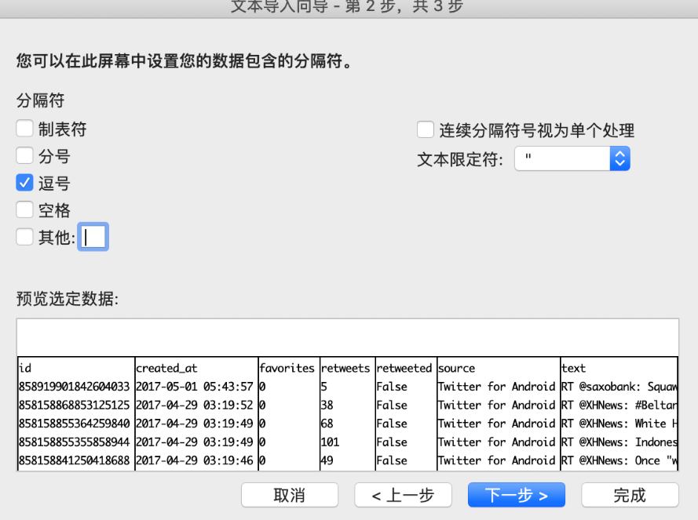 

*图F3-3：依据文本文件中的内容选择分隔符*

在文本导入步骤的最后一步，可以简单的对每一列的数据类型进行设置（图F3-4）。在这个步骤中把"id"数据列设置成"文本"类型，其余的保持"常规"，最后点击"完成"按钮并在另一个弹出框中点击"确定"完成文本导入步骤。如果读者想要在另一个工作表中保存导入的数据，则在弹出框中选择"新工作表"并"确定"即可。

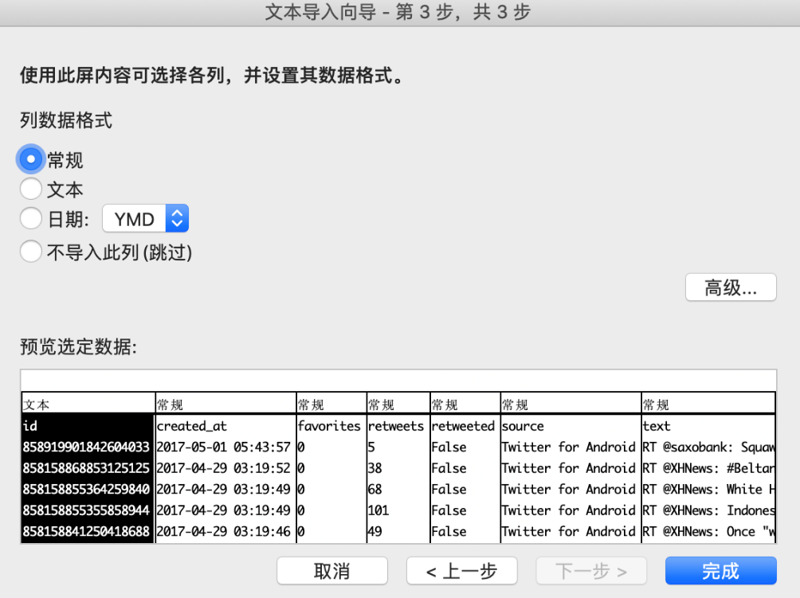 

*图F3-4：简单设置数据类型*

#### Excel数据处理（初步）

在进行对数据的处理之前，应先大致浏览一下导入的数据，确认这些数据呈现的样子是不是与心中所想的一样？

 

*图F3-5：导入数据的部分截图*

在图F3-5中可以看到数据中有很多空行，也有很多行于每列的标题没有关联的信息。我们首先把这些无关的数据删除，但是在删除之前应该把这些原始数据保存，方法是：通过新建另一个工作表（图F3-6），拷贝原始数据至新建的工作表并保存，可以把新建的工作表重命名为"原始数据"。

 

*图F3-6：在Excel中点击图中的"+"号新建工作表*

###### 删除无关数据

回到需要处理数据的工作表中（Sheet1，请原谅译者的懒惰！），通过鼠标点击"id"所在的A列（列标）来选中整个"id"列（图F3-7，在之后文中采用"选中"来表示选择一行或者一列）。

 

*图F3-7：在Excel中选中整列数据*

在"数据"菜单中找到"升序"按钮并点击（图F3-8），在弹出窗口中选择"扩展选定区域"并点击"排序按钮"（图F3-9）后就完成了通过"id"数据列对整个数据集在Excel中的排序。

{width="5.0in" height="1.0065015310586176in"}

*图F3-8：排序按钮*

 

*图F3-9：排序警告*

在图F3-9的两个选项中："扩展选定区域"是保证每行数据不会发生错位；"以当前选定区域排序"会不考虑同一行中的其他数据，只会把选定的数据列进行排序，其他列中的数据保持原样，这样就打乱了数据中每一行的关联，所以一般不会使用这个选项。

"升序"排序后的结果如图F3-10所示，读者也可以尝试"降序"排序的方式。这两个排序的方式并不是一尘不变的，需要按照被用于排序列的数据类型改变。比如把"id"数据列设置成"数字"类型，那么就要使用"降序"排序了。在图3-10中可以看到有13行无关的数据，在这里我们把其全部删除。但在其他的数据集处理中，有时需要认真的思考这些看上去无关的数据是否在之后的分析步骤中有用并是否应该保留。

 

*图F3-10：排序结果*

通过用鼠标连续选择（选中第一个需要删除的行标（Excel左侧：1、2、3...），按住Shift后点击需要删除的最后一行）来选中需要删除的行，然后右击鼠标在弹出菜单（图F3-11）中点击"删除"就能在表格中去除这些无用的数据了。

 

*图F3-11：删除无用的数据*

通过删除无用数据保证了数据的一致性，我们还可以在其他的数据列中（如："created_at"）进行相同的操作。这里介绍一个更加快捷的方式来检查数据在某一列中是否存在"空"或者"不一致"的情况，选中包含列名称的第一行（一般第一行是标题行），在Excel中点击"开始"菜单，并在其中找到"筛选"按钮并点击。然后就会发现在"id"等列名单元格的右侧多了一个向下的三角按钮（图F3-12），该按钮就是这一列的筛选按钮。

 

*图F3-12：开启标题行"筛选"功能*

点击"id"所在单元格的筛选按钮后，会弹出一个窗口（图F3-13）。点击这个窗口的"搜索"栏下部，然后滚动鼠标至底部。我们发现"id"列中还有一些无关的数据，之前已经删除了排序后在"头部"的部分，那么剩下的无用的数据应该是在"尾部"。快速移动至"尾部"：鼠标选中"id"列的任何一个单元格，然后同时按"Ctrl+方向键中的向下按键"（在macOS中用Command替换Ctrl），我们还能发现一些无用的数据，选中它们并删除。

 

*图F3-13："id"列的筛选*

读者可能会想看上去无用的数据是哪里来的呢？经过检查csv文件中的数据，发现这些对于我们现在无用的数据是一些推文的主题，可以直接删除。然后，使用单元格的"筛选"功能逐一查看其他数据列中是否存在不相关的数据，如有则删除整行数据。

###### 数据分列

在初步清除了一些无用的数据之后，观察"created_at"列发现其中即包含了日期信息的同时也包含了时间信息。我们需要把这些合并在一起的数据分开，这里就要使用到Excel的"分列"功能。在使用"分列"功能前，需要在"created_at"列后插入一个空白列，鼠标选中包含"favorites"的D列（列标）并右击，在弹出窗口中点击"插入"后会在"favorites"列前"created_at"列后插入一个空白列。然后选中"created_at"列，在"数据"菜单中找到"分列"按钮并点击，此时会弹出一个"文本分列向导"窗口。文本分列的操作在这个弹出窗口中的分成三个步骤，在这三个步骤中需要分别如何操作请看图F3-14。

   

*图F3-14：文本分列的操作步骤*

当点击完成后会弹出一个警告窗口，里面提示会有数据被覆盖（此时，点击窗口中的"取消"按钮）。重新检查图F3-14的最后一步发现"created_at"列被分隔成为3列，而不是预想中的两列。所以需要在"created_at"列后添加两个空白列后在进行上述的分列操作，其结果如图F3-15所示。

 

*图F3-15："created_at"列的分列结果*

小提示：如果在数据的分析过程中仅仅想要使用的时间中的日期部分，我们可以直接把"created_at"列设置成为"日期"类别（Excel中称之为"类别"，在其他软件中称之为"数据类型"或"字符类型"）。

###### Excel数据类别（格式）

在前面的小节中，通过筛选和分列处理了部分数据列，但任然还有部分操作需要完成------对每列的数据设置数据各式类别（格式）。在前文中提到："文本导入向导"的最后一步以及"分列"的最后一步中可以简单的设置数据列的类别，但其中能够选择的类别有时并不能满足分析过程的需要。这个时候就需要对每列数据进行单独的类别设置：鼠标右击列标（如：A）▸"设置单元格格式"，在弹出窗口中选择"数字"选项卡（图F3-16）。

 

*图F3-16：设置单元格格式*

可以观察到在"设置单元格格式"弹出窗口的"数字"选项卡中的数据类别比"文本导入向导"和"分列"中能够选择的选项多了许多，甚至可以设置"自定义"的数据类别。删除在分列时多出来的包含"AM"字符的列，给分列时分出的时间列一个"time"的标题（"created_at"右侧的空白单元格中），然后按照表F3-1的要求设置每一列的数据类别。

  数据列名称   数据类别（括号内是具体的类型）
  ------------ --------------------------------
  id           文本
  created_at   日期（\*2012/03/14）
  time         时间（13:30:55）
  favorites    数值（小数位数：0）
  retweets     数值（小数位数：0）
  retweeted    文本
  source       文本
  text         文本

*表F3-1：数据列的数据类别*

至此，我们完成了在使用数据透视表之前对现有数据的处理，但这样的处理仅仅是一种初步的结果。在使用Excel分析的后续过程中，依据不同的需求可能还需进一步对数据进行设置。

#### Excel数据透视表（初步）

###### 创建数据透视表

经过对数据的初步处理后，就可以进入对数据进行汇总的过程，此过程在Excel中可以采用图形化的方式进行------"数据透视表"。

选中包含数据的任何一个单元格，然后依次点击"插入"菜单▸"数据透视表"图标（图F3-17），之后就会弹出"创建数据透视表"窗口（图F3-18）。

 

*图F3-17：插入数据透视表*

 

*图F3-18：创建数据透视表窗口*

在"创建数据透视表"窗口中选择"选择一个表或区域"，从图F3-18可以看到Excel已经自动帮助我们选择了想要导入数据透视表的区域，当然也可以直接"使用外部数据源"（包括：文本文件，数据库等等）。在"选择要放数据透视表的位置"中选中"新工作表"，这里不建议在"现有工作表"的某个位置中添加数据透视表，因为如果读者的数据每天都在增加，那么增加的数据可能会覆盖到数据透视表的位置，从而导致混乱。在点击"确定"后，Excel就会自动添加一个新工作表，里面已经创建了一个数据透视表，把这个新的工作表重命名为"数据透视1"（图F3-19）。

 

*图F3-19：数据透表样例*

在右侧的"数据透视表字段"中显示了哪些数据可应用于该数据透视表中。通过用鼠标把这些字段拖入"行"、"列"以及"值"中就可以对数据进行汇总。现在，把"created_at"拖入"行"中并把"retweets"拖入"值"中，就会显示如图F3-20所示的表格。

 

*图F3-20：简单的数据透视表*

从上图中可以看到"行"中的"created_at"被显示为按照月份以及日期自动排序（这就是按照表F3-1设置数据类别的好处），"retweets"的前面多三个字"求和项"，这三个表明"retweets"中的数据被按照日期计算每天的"retweets"（即：转发）量。通过鼠标右击"值"中的字段并点击"字段设置"（图F3-21）来更改是"求和"还是"计数"等

 

*图F3-21：字段设置*

###### 创建数据透视图

在上一节中，我们创建了一个简单的数据透表，接下来就可以使用这个透视表来创建一个"数据透视图"。鼠标选中数据透视表的任意位置，Excel会在菜单栏中多出两个："数据透视表分析"和"设计"。（图F3-22）

 

*图F3-22：数据透视表分析*

通过点击"数据透视表分析"菜单中的"数据透视图"就可以非常简单的创建一个透视图了（图F3-23）。

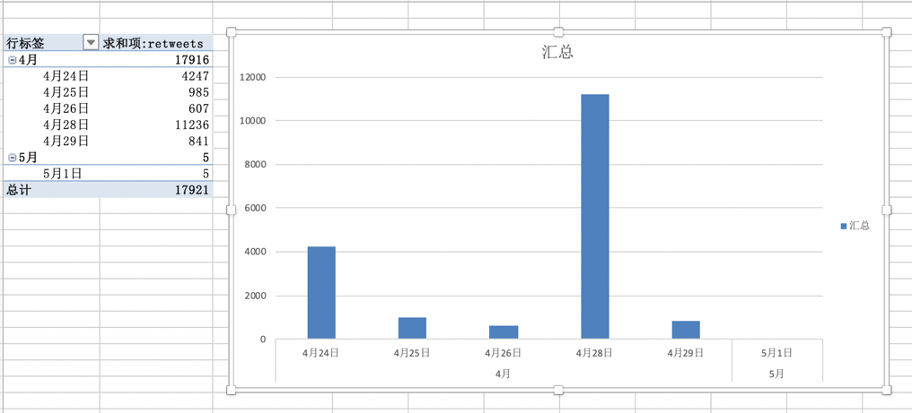 

*图F3-23：数据透视图*

是不是很简单！如果没有对数据进行认真的处理并不能够这么简单的创建一个汇总图形。读者可以尝试不对数据进行处理是不是能够创建与图F3-20/23一样的透视表和透视图。这个要求就留给读者作为练习题完成。

#### 概要

正如本附录开头所述，本附录仅仅展示了Excel中部分的基础功能。如果读者并不喜欢编程，Excel也是非常强大的处理和分析工具。仅通过点点鼠标就完成了复杂的分析工作是谁都喜欢的，但这个过程仍然需要人的参与。如果在每天工作量不大的情况下，点点鼠标是非常开心且具有成就感的，但是每天有成千上万的表要与本附录中的例子一样处理，就是读者24小时不睡觉也不能完成。所以学习编程，然后让计算机按照设定处理才是解放自己最好的方法（按照经济学的原理：扩展我们自己的生产者曲线）。

索 引
=====

aggregating data聚合数据, 110angle brackets尖括号(\<\>), 13anonymous
functions 匿名函数, 155APIs (Application Programming Interface), 32API
keys API密钥, 34, 35, 62append() 函数, 75apply() 函数, 155archives 归档,
66arguments 参数, 26artificial intelligence 人工智能, 164ascending order
升序排序, 115assignment operator 赋值操作符(=), 24Atom, 45attributes
属性, 15backend languages 后端语言, 21Baumgartner，Jason,
136beautifulsoup4库, 50Bird，Steven, 164Boolean values 布尔值, 145bots
机器人, 104browsers 浏览器, 17calling functions 调用函数, 26calling
调用, 26Cascading Style Sheets 层叠样式表, 14causation 因果关系, 116cd
command cd命令, 47cells 单元, 131chaining 链接, 73change directory
改变操作目录, 47charts 图表, 120Chrome, 17classes 类, 15clients 客户,
32closing tags 结束标记, 13code-sharing platforms 代码共享平台, 35coding
resources 编程资源, 163color property 颜色属性, 14color scale formatting
色阶格式, 127column chart柱状图, 125command line interfaces 命令行接口,
128Command Prompt命令提示符, 21comma-separated values 逗号分隔的值,
49comments 注释, 49comparison charts 图形对比, 121composition构成,
123concatenation拼接, 22conditional formatting 条件格式, 126conditionals
条件语句, 29Cooper，Katherine, 78correlation 相关关系, 116Cox, Amanda,
104crawlers 爬虫, 80credentials 证书, 34csv库, 49data analysis 数据分析,
102data dictionary数据字典, 144data types 数据类型, 22DataFrame 数据框,
133datetime库, 49declaring functions 声明函数, 27declaring loops
声明循环, 28defining functions 定义函数, 27descending order 降序排序,
115describe() 函数, 149developer tools 开发工具, 17dictionary 字典,
53DictWriter() 函数, 75Digital Forensic Research Lab 数字法医研究实验室,
104distribution 分布, 122div元素, 14documentation 文档, 33donut charts
环状图, 123Downey，Allen B., 163dropna() 函数, 144elements 元素,
13encode 编码, 64engagement metrics 参与度指标, 141error messages
错误消息, 34ethics 伦理, 80expressions 表达式, 22Facebook, 6filepaths
文件路径, 47filtering data 筛选数据, 145find() 函数, 72floats 浮点数,
22for 循环, 28formatting data格式化数据, 104formulas 公式, 112functions
函数, 26General Data Protection Regulation（GDPR）, 66get_text() 函数,
73GOOGLE SHEETS, 105head() 函数, 138Heisler, Sofia, 163hexadecimal
colors 十六进制颜色, 15home pages 主页, 13HTML (HyperText Markup
Language) 超文本标记语言, 13if clauses（if子句）, 29iferror()公式,
118iloc\[\] 方法, 139indentation 缩进, 14inheritance of styles 风格继承,
15inline 内联, 15integer-location-based indexing 基于整数位置的索引,
133integers 整数, 10internal style sheets 内部样式表, 15Internet Archive
互联网档案馆, 136IPython Notebooks, 128iteration 迭代, 28Java 脚本,
20JavaScript对象标记(JSON), 34joining data sets 联接数据集, 116JSON
objects JSON对象, 35json 库, 49json.load() 函数, 53Jupyter Notebook,
128keys 密钥, 35key-value pairs 键-值对, 38Klein, Ewan, 164len() 函数,
26libraries 库, 49Linder, Lindsey, 78list 列表, 25logical operators
逻辑运算符, 29loop循环, 28Loper, Edward, 164Lytvynenko, Jane, 42machine
learning 机器学习, 164macOS, 9make_csv() 函数, 62matplotlib 库,
151McKinney, Wes, 133mean 均值, 142mean() 函数, 149measures of central
tendency 集中趋势的度量, 142median 中位数, 142merging data sets
合并数据集, 116minified 最小化, 88modifying and formatting data
修改和格式化数据, 108NaN values NaN值, 144Natural Language Processing
自然语言处理, 164Natural Language Toolkit 自然语言工具包NLTK, 164nested
elements 嵌套元素, 14nextPageToken键, 58null values 空值,
144one-dimensional data sets 一维数据集, 133open() 函数, 52overloading a
server 超载网站的服务器, 80pagination分页, 58pandas库, 133panel
data面板数据, 133parameters 参数, 33parsing 解析, 71paste special
选择性粘贴, 114pie charts 饼图, 123pip 库, 50pivot tables 数据透视表,
110placeholders 占位符, 144plotting data 绘制数据, 161prcoess 过程,
102print() 函数, 24prompts 提示符, 22properties 属性, 15pseudocoding
伪代码, 49PyPI, 50Quealy, Kevin, 104rate limit 速率极限, 64raw data
原始数据, 102Reddit, 128Reinhart, Alex, 164rendering 渲染，呈现,
12requests 库, 50resampling data 对数据进行重采样, 159research questions
研究问题, 40resources 资源, 164reusable 重用, 26robots exclusion
protocol 机器人排除协议, 80Rocha, Roberto, 80scatterplots 散点图,
123scikit-learn 库, 165series 序列, 133set_index() 函数, 159Sheets,
102Silverman, Craig, 42Singer-Vine, Jeremy, 42single-color formatting
单色格式, 126sleep() 函数, 100sort_values() 函数, 147sorting and
filtering data 排序和筛选数据, 114spaCy, 164spiders 蜘蛛, 80spreadsheets
电子表格, 106standard library 标准库, 49statistical analysis 统计分析,
164*Statistics Done Wrong* 统计会犯错, 164string concatenation operator
字符串拼接操作符, 23style attribute 样式属性, 15style sheets 样式表,
15summarizing data 汇总数据, 146summary data 汇总数据, 102syntax
highlighting 语法高亮, 45tail() 函数, 138templates 模板, 61third-party
第三方, 49time periods 时间段, 115time series 时间序列, 124timestamp
时间戳, 74transposing data 转置数据, 138Unicode 转换格式, 64unminified
非最小化, 88unordered lists 无序列表, 90URL-based API calls
基于URL的API请求, 33URLs (uniform resource locators) 统一资源定位器,
13User-agent用户代理, 80virtual environments 虚拟环境, 129visualizations
可视化, 120void elements 空元素, 13Web Inspector, 17web robots
web机器人, 80websites 网站, 12Wheelan, Charles, 164Wickham, Hadley,
164Wikipedia 维基百科, 83writeheader() 函数, 75writer() 函数,
52writerow() 函数, 52YouTube, 32

{width="2.316666666666667in" height="2.0388888888888888in"}记者和调查人员的数据分析
===============================================================================================================

虚假的推特账户是否有助于左右总统选举？Facebook和Reddit档案能告诉我们什么是人类行为？在挖掘社交媒体方面，BuzzFeed新闻高级记者Lam
Thuy
Vo向您展示了如何使用Python和关键数据分析工具来查找隐藏在社交媒体中的故事。

无论您是专业记者、学术研究人员还是公民调查人员，都将学习如何使用技术工具从社交媒体收集和分析数据，用以构建引人注目的、数据驱动的故事。

学习如何：

● 编写Python脚本并使用API从社交网站收集数据

● 下载可以挖掘见解的数据存档

● 检查从网站下载的HTML以获取有用的内容

● 使用Google Sheets格式化、聚合、排序和筛选数据

● 创建数据可视化以演示您的发现

● 使用Python、Jupyter Notebook和Pandas库执行高级数据分析

● 把所学的运用到自己的研究中去

社交媒体充斥着成千上万的等待被讲述的隐藏故事。学习使用专业人士用来编写自己的数据驱动故事的数据侦查工具。

关于作者
========

 Lam Thuy
Vo是BuzzFeed的一名高级记者，其专业领域处于技术、社会和社交媒体数据的交汇点。曾领导团队为华尔街日报、美国半岛电视台和美国国家公共电台的金钱星球进行新闻报道，这些报道讲述了美国和整个亚洲的经济故事。她还担任了10年的教育工作者，在此期间开发了新闻编辑室内容的培训项目，为世界各地的记者举办了讲习班，并为克雷格·纽马克·纽约市立大学新闻研究生院(Craig
Newmark CUNY Graduate School of Journalism)开设了长达一个学期的课程。

***THE FINEST IN GEEK ENTERTAINMENT™***

[[www.nostarch.com]{.ul}](http://www.nostarch.com/)

[^1]: 附录中代码的下载地址：https://github.com/xushengun/SheJiaoMeiTiWaJue

[^2]: 静态网页，随着html代码的生成，页面的内容和显示效果就基本上不会发生变化了------除非你修改页面代码。而动态网页则不然，页面代码虽然没有变，但是显示的内容却是可以随着时间、环境或者数据库操作的结果而发生改变的。（源自：百度百科）
