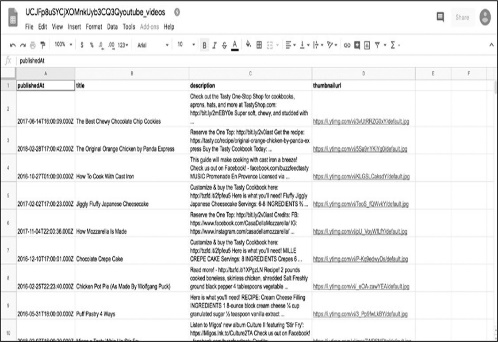

# 3 用代码获取数据
---------------------------------------------------------------------------------------

在第2章中了解了如何通过浏览器调用API来访问特定的数据。接下来学习如何通过Python脚本进行这些调用，以及如何读取数据、存储数据并将其写入文件。

在之前的Python的shell交互模式有助理解Python是如何工作的。但是，随着向更复杂的Python应用发展，需要改变方向并开始使用文本编辑器来编写Python脚本。

可以在预装在电脑上的免费文本编辑器中编写脚本，比如Mac上的TextEdit或Windows上的WordPad，但最好是在为开发人员设计的文本编辑器中编写和编辑代码。这些文本编辑器有语法高亮显示。作者推荐的一个很好的免费文本编辑器是Atom（[*[https://atom.io]{.ul}*](https://atom.io/)）。

#### 编写第一个脚本

现在可以写脚本了！从整理文件开始。在一个容易记住的地方创建一个文件夹，将其命名为python_scripts。对于Mac和Windows，建议将其保存在"文档"文件夹中。然后打开文本编辑器，创建一个空白文件(在Atom的菜单中选择File
▸ New file)。

将该文件保存到python_scripts文件夹(在Atom的菜单中选择File
▸)，文件名为youtube_script.py。文件扩展名.py告诉文本编辑器文本文件中的语言是Python。

在为文件命名时，有一个好的经验法则：使用所有小写字母，并确保该名称描述了脚本的实际功能。不应在脚本的文件名中使用空格或以数字开头。所以，如果文件名很长，可以使用下划线或破折号来分隔单个单词，而不是空格(就像youtube_script.py)。Python语言是大小写敏感的，所以使用不同的大小写或拼写错误来引用同一个文件会导致错误。

在youtube_script.py中输入以下代码，然后保存：

接下来，打开一个命令行接口，如同在第1章中使用它来访问Python交互式shell。命令行接口允许使用代码行来浏览计算机的文件，可以将文件从一个文件夹移动到另一个文件夹，创建和删除文件，甚至通过它们访问internet。命令行接口也可以运行脚本。

###### 运行脚本

像第1章那样打开命令行接口，使用Mac终端或Windows命令提示符,然后在命令行接口中切换至包含脚本的目录或文件夹。在Mac电脑上，可以运行ls命令(list的缩写)来查看你在硬盘上的位置。在Windows上，您可以运行dir（directory的缩写）命令。当运行这些命令时，命令行接口就会列出它当前所在目录中的文件和/或文件夹，如图3-1所示。

现在需要切换至前面创建的文件夹python_scripts中。如果习惯于使用图标来切换文件夹，那么一开始可能会遇到一些问题。要在命令行接口中访问文件夹，不是通过单击图标来完成，需要指定一个filepath（文件路径），文件路径是指向想要访问的文件的文件夹路径。在Mac上通常是用斜线分隔的文件夹的名称；在Windows上通常是硬盘驱动器的名称，后面跟着用斜线分隔的文件夹名称。例如，如果将python_scripts文件夹保存在Mac或Windows的Documents文件夹中，那么者个文件夹的路径应该分别是Documents/python_scripts和C:\\Documents\\python_scripts。如果文件夹保存在其他位置，还可以在Finder
(Mac)或File Explorer
(Windows)中导航到的目标文件夹并复制窗口中显示的路径至命令行接口中。

 

*图3-1：当前目录的清单*

通过命令行接口切换至一个文件夹，可以使用cd命令(代表change
directory)，然后是文件夹的路径。例如，如果文件夹存储在Mac上的Documents文件夹中，请运行以下命令：

在Windows中请运行如下命令：

进入包含Python脚本的文件夹后，需要使用另一个命令来运行脚本。在Mac的命令行接口中输入以下命令：

在Windows中输入：

在Mac上，命令python3告诉命令行接口，要运行一个用Python(版本3)编写的脚本，而youtube_script.py是希望命令行接口运行的文件的名称和扩展名。

在命令行接口运行脚本后应该看到：

该脚本执行了在前一节中输入的print()函数。既然已经了解了如何运行脚本，那么编写一个可以完成想做事情的脚本。

#### 规划脚本

无论是使用Python还是其他程序语言编写的脚本都将执行一系列任务。第一次开始写脚本的时候，通过列出这些任务的描述来帮助组织想法，这种做法被称为伪代码。伪代码使用脚本的注释来完成，注释是脚本中一些为您或其他阅读代码的人编写且计算机是不会运行的文本。也可以把伪代码看作一个待办事项列表，在之后的编码中提醒自己在编写代码的每个部分时应该做什么。这些注释还可以当作描述性的注释，帮助其他人理解脚本的功能。

编写一个脚本的开始步骤是在脚本中列出一个待办事项列表。在youtube_script.py文件中使用hashtag(\#，井号)创建注释，如清单3-1所示。

*清单3-1：在脚本中执行的步骤的伪代码*

每个hashtag都告诉Python该行中的文本解释为注释，清单3-1在三行中有三个注释。编写一个脚本时，需要导入一些库，这些库是预先打包好的代码文件。然后打开一个基于url的API调用，并像在第2章中那样读取响应。最后，在电子表格中存储返回的数据，以便进行分析。

经过编写伪代码的步骤就生成了一个大纲，接着就是在每个注释后面添加执行注释功能的代码。

#### 库和PIP

作为一名数据侦探，在漫长而肯定成功的职业生涯中，不必编写所有用到的函数。如前所述，Python属于开放项目，意味着许多开发人员编写的函数可以免费使用。大多数(如果不是全部的话)程序员依赖于其他人编写和发布的供其他人使用的代码，这就是所谓的编程库。使用Python处理更复杂的任务时，需要安装和使用这些编程库。

Python中一共有两种库：

> ●
> Python标准库：其中包含Python附带的一组工具，在计算机上安装Python时默认包含这些工具。

● 第三方库：只有在我们的计算机上安装了它们之后才能使用。

首先讨论Python中自动安装的库，这些库是由Python开发人员编写的。下面是一些最常用的库示例：

**csv库**
允许我们读写csv文件，可以作为Excel电子表格或谷歌工作表打开。CSV表示逗号分隔的值，这是格式化数据的常用方法。

**json库** 让Python能够读取json格式的数据。

**datetime库**
使得计算机能够理解及转换日期格式，并可以根据需要重新格式化日期格式。

在使用库之前需要导入，就像阅读电子书之前先要下载到平板电脑上一样。在Python中加载一个库，使用关键字import，然后指定库的名称，比如csv。例如，要将csv库加载到交互式shell中，需要输入以下内容：

使用自更广泛的Python社区的Python库有点棘手。这些库中的大多数都可以在PyPI（Python软件包索引Python
Package
Index；https：//pypi.python.org/pypi）上找到，在该站点上可以浏览其他人上载的供公众使用的库的描述和代码。

获得这些库的最简单方法是通过pip，pip库旨在帮助开发人员管理其他库。您可以按照https://pip.pypa.io/en/stable/installing/上的说明安装pip。

完成安装pip后就可以使用它安装PyPI上列出的任何库。若要安装一个库需在命令行接口中输入如下命令（用PyPI上列出的名称替换library_name）：

以下是在本书中使用的一些PyPI库：

> **requests：**使用URL打开网站；
>
> **beautifulsoup4：**阅读网站的HTML和CSS代码；
>
> **pandas：**能够解析数百万行数据、修改数据、应用数学并导出分析结果。

通过在命令行接口中一个接一个地运行以下命令来安装这些库，每个命令后面都按回车(在安装库时，确保已经连网了)。

在阅读本书的练习时会研究到这些库的使用方式。

经过以上的步骤眼睛明确了如何访问库，接下来就是需要在脚本中部署这些库。回到之前的Python脚本youtube_script。进入伪代码的一部分，其包含了关于导入所有需要的库的注释。使用前面提到的包含在Python安装包中的两个库json和csv，还要使用刚刚安装的requests库。将清单3-2中的代码输入到youtube_script.py中。

*清单3-2：导入脚本中需要的库*

可以看到代码中使用了关键字import来加载每个库。现在进入任务列表中的下一个任务：打开URL进行API调用。

#### 创建基于URL的API调用

通过刚导入的requests库进行API调用，如清单3-3所示。

*清单3-3：使用请求库进行API调用*

首先创建一个URL,通过创建变量api_url并将它分配给一个类似于第二章我们使用的URL➊。设置URL后，可以使用requests库连接到internet，进行API调用，并接收API的响应。

要从库中访问函数，通过使用库的名称来引用它------在本例中是requests。然后，通过在函数前面加上一个句点，将函数链接到库名。在本例中使用的是函数get()，该函数接受一个URL字符串作为参数，并向该URL发出请求。在Python中，通过输入库的名称后跟句点，最后是函数名来调用属于某个库的函数。例如，get()函数是请求库的一部分，因此编写requests.get()来调用它。

因为把要访问的URL字符串存储在变量api_url中，所以把变量api_url直接传递给get()函数。requests库为提供了许多接收响应的选项，这里仅仅使用了默认的参数（即：除了必要的参数外，其他都采用函数内置的默认值）。接下来把API响应存储在api_response➋变量中。

最后但并非最终，从json库调用load()➌函数,通过json.loads()➌把纯api_response文本翻译成json键和值对。load()函数的默认输入是文本格式。但在默认情况下，requests库返回的是一个HTTP状态编码，该状态编码通常是一个编号的响应，比如200表示一个正在运行的网站，404表示一个没有找到的网站。本列中需要访问的是API响应文本，是响应数据的JSON呈现，因此可以在api_response变量后面加上一个句点，然后是选项.text。整个结构就成为:json.loads➌(api_response.text)。这就把API调用的响应转换为Python脚本的文本，就可以把文本解释为JSON键和值对了。在本章的下一节中会更加仔细地研究这行代码，并讨论它的作用。

在上述脚本中使用了很多描述性变量。这样处理有助于把脚本分解成能够清晰理解的部分。

#### 把数据存储在表格中

伪代码待办事项列表中的第1项和第2项已经完成。现在进入下一个步骤：从JSON中检索要放入表格中的数据点。此步骤会使用csv库，在这之前需要明确如何创建.csv文件并把信息写入其中。在youtube_script脚本中输入清单3-4中的代码。

*清单3-4：在.csv文件中输入的代码*

此段代码中通过open()函数➊创建csv文件，该函数在Python中通过给定的参数打开或创建一个csv文件。open()函数接受两个字符串作为参数，每个字符串之间用逗号分隔。第一个参数是要创建或打开的csv文件的名称，在本例中为"youtube_videos_posts.csv"。第二个参数指定是要读取文件("r")、写入文件并删除文件中之前的所有内容("w")，还是只是向文件添加更多内容("a")。在本例中创建了一个全新的文件，所以采用的是("w")参数。虽然open()函数中open的本意是打开文件，但是该函数可以检查需要创建的文件名称与第一个参数匹配的文件是否已经存在。如果open()函数找不到，Python会知道创建一个新的csv文件。接下来给该文件分配给一个变量名，以便在代码中引用该文件。

从代码中可以看到在with语句使用open()函数，而不是使用等号（=）将文件直接赋值给变量。因为with语句打开一个文件，并在完成修改后自动会关闭该文件。通过编写关键字with，然后是open()函数来构造with语句。然后在变量名后面使用这个单词，如：csv_file，在后面的代码中使用它来引用打开的文件。与其他Python语句一样，with语句以冒号结束。在冒号之后应用缩进对代码进行编辑形成Python能够理解的代码段，该代码段详细描述了要在文件上执行的操作。当Python执行了这些操作，with语句将关闭文件。

接下来使用csv库的writer()函数打开csv文件,gai函数允许将数据写入文件中➋。为了简单起见本例中从只写一行数据开始。writer()函数需要一个csv文件作为参数，所以传递给它csv_file。将所有这些都存储在csv_writer变量中后，使用csv_writer.writerow()函数写入数据行，该函数接受一个字符串作为参数列表➌。第一行数据应该是表格的标题列表，描述每行包含内容的类型。

至此就生成了一个带标题的表格，接下来可以从API响应中获取数据并将其写入csv文件了。

对于这个任务，通过第一章中提到的for循环。JSON数据以包含各种数据点的大括号的形式出现，而每个数据点以键和值对的形式出现。之前使用了for循环来遍历列表中的数据，现在使用一个循环遍历与每个post相关联的数据，同时使用每个数据点的键访问数据值。

为此，需要了解JSON数据在Python中是如何组织的。回到代码的前面，加载的JSON数据如清单3-5所示。

*清单3-5：加载的JSON数据*

因循环需要遍历项目列表。在本例中把所有YouTube视频的列表作为JSON对象。之前在脚本中存储这些帖子到变量videos➊中，那么使用for循环来选择videos中的数据，但是为了访问想要的post信息，需要浏览JSON对象的结构并查看load()函数的作用。

###### 把JSON数据转换为字典形式

当Python使用json.load()函数加载JSON数据时，把JSON数据转换成Python字典。字典（dictionary）类似于列表（list），但字典不是简单地存储多个值，而是以键-值对的形式存储值。通过一个例子来观察字典是如何存储数据的。

打开交互式Python shell，然后输入以下内容：

上面的代码显示，现在使用变量的名为cat_dictionary。然后创建了一个包含键名cat_name和location的字典，并分别将它们与值Maru和Japan配对。按下ENTER之后交互式shell就会将此字典分配给变量cat_dictionary。到目前为止，一切顺利。但是如何访问每个数据项呢?

应明确一点：在Python字典中每个键都与一个值相关联。因此，要访问用键存储的数据值，首先需要键入字典的变量的名称，然后键入键名作为方括号内的字符串。例如，要访问存储在关键字"cat_name"中的字符串"Maru"，需要输入以下内容：

通过以上的例子所表达的方式可以使用脚本访问存储的JSON数据。

###### 回到Python脚本中

每个网站都有被处理成键值对的JSON对象，但不是每个网站都使用相同的键名或整个JSON结构。在第2章中，看到YouTube的JSON组织如清单3-6所示。

*清单3-6：YouTube的JSON数据结构*

在YouTube的项目中,所有数据都包含键"item"➊中。通过导航到键"items"的值访问视频信息，方法是使用方括号和引号选择：videos\[\'
items
\'\]。可以对Python字典使用双引号或单引号，因此"items"与'items'相同。

将清单3-7中的循环添加到的脚本中。

*清单3-7：使用for循环把数据写入csv文件*

首先创建一个if语句，指示代码仅在API调用确实返回视频项时才收集信息。如果API调用不返回JSON结构的键"items"，则get()函数将返回None(可以在达到YouTube允许收集数据的极限时中断脚本的运行，防止发生错误)➊。然后缩进代码并创建一个for循环访问post数据，使用videos.get("items")➋。循环创建完毕后就可以遍历每个视频并将其数据点存储为列表。有了数据点列表后，就可以将完整列表写入csv文件中。应将每个数据点精确地匹配在脚本前面创建的表格标题的顺序，不然数据无法正确设置。也就是说列表需要按之前定义的顺序排列视频的发布日期、标题、描述和缩略图URL。

由于每个post也被组织到一个字典中，可以通过它的键选择每个值来创建列表：video\[\"snippet\"\]\[\"publishedAt\"\]。然后把值放在列表➌中。最后但并非最终，使用writerow()➍函数把每一行写表格中➍,是当我们写表格标题。运行脚本时，for循环将为JSON对象中的每个post运行以上程序。

#### 运行完成的脚本

完成的脚本应类似于清单3-8所示。

*清单3-8：功能脚本*

恭喜！您已经完成了一个从API中获取数据的正式脚本。

保存此脚本，然后按照第46页中"运行脚本"的方式运行。完成运行脚本后，应该在与脚本相同的文件夹中找到一个名为youtube_videos.csv文件。在表格程序中打开该文件时，表格程序应该显示类似于图3-2的YouTube视频数据。

 *图3-2：将表格文件上传到类似于谷歌Sheets的电子表格程序后的效果*

虽然这个脚本只适用于YouTube
API，但演示了编写可从其他平台获取数据脚本所需的基本概念。进行基于URL的API调用、读取和访问JSON并将其写入csv文件是许多数据收集和web开发任务重复使用的核心技能。

#### 处理API分页

之前的章节讨论了通过一个API调用收集数据的一些基本知识，但是查看刚刚创建的电子表格，就会注意到csv文件中只包含少量文章的数据。

这就是无处不在的社交媒体数据带来的问题！如果一次请求所有想要的数据，会造成YouTube网站的服务器不堪重负，甚至可能导致页面或服务器崩溃。为了防止这种情况发生，许多API提供者都采用了减慢数据抓取过程的方法。

YouTube限制了通过分页请求的数据，分页将数据划分为多个JSON对象。可以把分页想象成电话簿，里面有成千上万条记录。当通过API分页请求数据时，就好像翻阅电话薄。

在本练习中，需要进一步研究YouTube的JSON对象。之前通过使用posts\[\"data\"\]来使用键\"data\"访问。如果更仔细地查看JSON对象，会发现在所有post数据之后的第二个键，称为"paging（分页）"，如清单3-9所示。

运行脚本时，只检索键"items"中页面上的内容，因此要访问更多结果，需要打开下一页。如清单3-9所示，API响应呈现了更多的JSON数据，可以通过键"nextPageToken"访问这些数据，并包含了另外两个字典。

通过使用"nextPageToken"密钥提供的令牌来访问下一个页面。如何使用这个值？每个API处理分页的方式不同，因此应该参考YouTube
API文档。从文档中了解到要跳转到下一页，需要向API
URL添加一个名为"pageToken"的新参数，并将"nextPageToken"键提供的值分配给它。修改原先的脚本后如清单3-10所示。

*清单3-9：JSON对象中的分页数据*

首先介绍一个名为has_another_page的变量,其分配的值为True➊。使用这个变量来检查是否有另一个可以获取数据的页面。这是许多开发人员在条件语句中使用的技巧，就像在第1章中学习的if子句一样。好像if语句一样，使用while➋循环需要一个条件。While循环直到给条件是为False才能退出。在while语句中使用has_another_page变量，当到达数据流的末尾并且没有页面时，将其切换为False➎。脚本的前几行与我们在清单3-8中编写的代码相同，不同之处在于现在将它们嵌套在while循环中。当while循环第一次运行时，它在第一个JSON页面上收集数据，这与之前代码产生的效果一样。

完成对第一个页面上JSON中每个数据对象的遍历后，就检查JSON是否包含键"nextPageToken"的值。如果不存在键"nextPageToken"，那么就不需要加载其他页面了。如果键"nextPageToken"存在,那么存储字符串("nextPageToken")的视频链接至变量next_page_url➌中。这对应于数据项"nextPageToken":"CAUQAA"（在清单3-9的"nextPageToken"中）。使用这个URL执行另一个API调用➍，并将响应存储在posts变量中。加载完下一页数据后，返回循环的开头并收集下一组数据。

这个循环将一直运行到JSON输出的末尾（也就是"电话簿"的末尾）。一旦API不再显示videos\["nextPageToken"\]的值，表示已经到达了最后一页。也就是说，应当把变量has_another_page赋给False➎并结束循环。

在本练习中介绍的内容对初学者来说是很有帮助的，所以如果需要重读的话不必太过担心。本列中需要记住的主要概念是：分页通常是如何工作的？以及作为开发人员如何处理它们？因为数据提供程序限制了使用每个API
URL可以获得的数据量，所以必须以编程方式"leaf（翻阅）"允许访问的不同数据页面。

*清单3-10：从其他页面收集数据的脚本*

#### 模板：如何使代码可重复使用

我们已经做了来这里的目的：获得了想要的数据------而且很多！但是现在需要采取额外的步骤，以可重用的方式清理代码。换句话说，就是对代码进行模块化，或者将脚本转换成可以反复使用的模块。

这是什么意思呢？我们希望脚本不仅可重复使用，而且应当足够灵活从而能够适应不同的场景。要模块化脚本，首先要看看在重复使用脚本时要改变哪些部分。

模块化需要更改的可能是凭证(比如：代码交给其他人使用)、也许是想要访问的YouTube频道以及想要收集的数据类型。在紧迫的期限内工作时经常进行重复的任务，或者倾向于大量试验我们想用于研究的信息时，模版化程序就变得极其有用。

###### 在变量中存储可变值

一种使代码更灵活的方法是将参数设置为在脚本开头定义的变量中。这样，所有可更改的代码片段都组织在一个容易找到的地方。一旦定义了每个变量，就可以将它们重新连接起来，形成API调用。请查看清单3-11，看看这是如何工作的。

*清单3-11：模块化脚本以供重用*

在脚本的顶部定义两个变量：channel_id➊存储感兴趣的YouTube频道，youtube_api_key存储API密钥➋。还可以看到脚本把API
URL分解为各个部分。第一，定义了API的基础部分，由于这部分都是相同的，所以将其存储在变量base➌中。然后把API的字段参数作为单独的字符串输入，并把它们存储在变量fields
➍中。接下来把youtube_api_key连接成一个字符串，该字符串存储在一个名为api_key
➎的变量中。

最后，把这些片段重新组合成一个长字符串，组成基于URL的API调用➏。这样就允许在将来修改部分API调用，以备我们想向查询添加其他参数或使用不同的凭据访问API。

###### 在可重用函数中存储代码

另一种模块化代码的方法是将代码包装成一个可以反复调用的函数，如清单3-12所示。

*清单3-12：将代码放入make_csv()函数*

在清单3-12中把所有代码封装到一个名为make_csv()的函数中，该函数接受参数page_id。正如在第1章中所提到的，函数是在代码中安排一系列步骤的一种方式，让我们可以在以后通过调用函数重复运行这些步骤。首先，声明make_csv()函数并指定想要的任何参数➊，然后在函数中输入包含想要功能的所有代码。想要包含在make_csv()中的所有内容都需要缩进到函数声明中，这样才能让Python知道哪些代码是函数的一部分。至此完成定义了make_csv()函数，就可以通过调用它的名称并在函数的括号中传递一个参数来执行它。

可重用的最终脚本应该如清单3-13所示。

import csv

import json

import requests

> channel_id = \"UCJFp8uSYCjXOMnkUyb3CQ3Q\"➊
>
> channel_id2 = \"UCpko\_-a4wgz2u_DgDgd9fqA\"➋
>
> youtube_api_key = \"*XXXXXXX*\"
>
> def make_csv(page_id):➌
>
> base =
> \"https://[www.googleapis.com/youtube/v3/search?](http://www.googleapis.com/youtube/v3/search)\"
> fields = \"&part=snippet&channelId=\"
>
> api_key = \"&key=\" + youtube_api_key
>
> api_url = base + fields + page_id + api_key
>
> api_response = requests.get(api_url)
>
> videos = json.loads(api_response.text)
>
> with open(\"%syoutube_videos.csv\" % page_id, \"w\") as csv_file:
>
> csv_writer = csv.writer(csv_file)
>
> csv_writer.writerow(\[\"publishedAt\",\"title\", \"description\",
> \"thumbnailurl\"\])
>
> has_another_page = True
>
> while has_another_page:
>
> if videos.get(\"items\") is not None:
>
> for video in videos.get(\"items\"):
>
> video_data_row = \[ video\[\"snippet\"\]\[\"publishedAt\"\],
> video\[\"snippet\"\]\[\"title\"\],
> video\[\"snippet\"\]\[\"description\"\],
> video\[\"snippet\"\]\[\"thumbnails\"\]\[\"default\"\]\[\"url\"\]\]
>
> csv_writer.writerow(video_data_row)
>
> if \"nextPageToken\" in videos.keys():
>
> next_page_url = api_url + \"&pageToken=\"+videos\[\"nextPageToken\"\]
>
> next_page_posts = requests.get(next_page_url)
>
> videos = json.loads(next_page_posts.text)
>
> else:
>
> print(\"no more videos!\")
>
> has_another_page = False
>
> make_csv(channel_id)➍
>
> make_csv(channel_id2)➎
>
> *清单3-13：完整的模板脚本*

使用变量channel_id➊和channel_id2➋存储脚本中最有可能改变的部分。然后定义make_csv()函数，其包含想要运行的代码➌。现在可以传递变量channel_id➍和channel_id2➎到make_csv()函数中并运行。

还有两件事需要注意。首先，YouTube限制了免费账户每天可以调用的API数量，这就是所谓的速率极限（rate
limit）。使用这种API调用，每个频道只能获得几百个视频，因此如果一个频道有比通过免费帐户获得的更多视频------可能需要使用不同的API凭证来获取第二个频道的数据。其次，在线生成的内容可能包含不同种类的特殊字符（例如：表情符号或不同语言的字符），这些字符可能很难被特定版本的Python所理解，或者如编程人员所说：难以编码。在这些场景中，Python可能会返回一个UnicodeEncodeError，这表明Python在读写方面发生了错误。

 

虽然在Mac电脑上运行脚本时没有遇到这样的错误，但Windows电脑似乎对通过API调用获取的内容进行了编码。由于API调用返回来自任何给定平台的一些最新可用数据，所以对API调用的每个响应都特定于来自API提供者的最新信息。也就说如果遇到与试图通过这个API访问内容相关的错误，那么需要找到与该特定内容紧密相关的解决方案。为了确保收到正确的结果，可以为要收集的数据指定编码方式。清单3-14显示了脚本的一个小修改，此修改可解决一些特定类型数据的问题。

*清单3-14：帮助检索正确结果的修正脚本*

在这段代码中，把encode()函数添加到通过不同键访问的三个值中：video\["snippet"\]\["title"\]➊，video\["snippet"\]\["description"\]➋和video\["snippet"\]\["thumbnails"\]
\["default"\]\["url"\]➌。在encode()函数的括号内，指定了要使用哪种编码方法来更好地处理数据。在本例中，使用一种称为utf-8的通用编码类型（utf代表*Unicode
Transformation
Format*（Unicode转换格式），其中8是指定使用8位值对信息进行编码）。应当注意的是，虽然此方法可能会解决一些编码问题，但由于每个错误都是针对您试图收集的内容，因此可能需要阅读其他潜在的解决方案。（在https://docs.python.org/3/howto/unicode.html上找到有用的教程。）

创建了模板代码后，就可以把它用于任何想要的YouTube频道。现在可以对多个页面或者使用不同的凭据（若使用API获取数据）运行make_csv()函数。在运行函数时唯一要做的就是更改与变量channel_id、channel_id2或变量youtube_api_key关联的字符串。

在完成实现目标的脚本之后，模块化代码是一个很好的编程实践。把代码模块化可以改进代码，重复运行所编写的任务，也可以与其他人共享脚本------因为我们使用了其他人的代码，所以为什么不做出回报呢？

#### 概要

本章展示了API是工作的过程，以及如何使用脚本从API中挖掘数据。API是收集数据的基本工具之一。知道如何利用API以及如何修改脚本比脚本本身更加重要，因为脚本可能很快就过时了。社交媒体公司提供数据的方式一直在变化------可能会实施新的政策来限制数据访问，就像Facebook在2015年关闭对朋友数据的访问一样。或者社交媒体公司可能会改变他们允许用户与API交互的方式，比如Instagram在2013年停止访问其照片流。

想要了解有关脚本的更多信息，请访问https://github.com/lamthuyvo/social-media-data-scripts，其中包含用于收集社交媒体数据的脚本、有关如何使用这些脚本的说明以及指向其他资源的链接。

在下一章中，读者将看到如何从Facebook获取数据并将其转换成计算机可以理解的格式。
